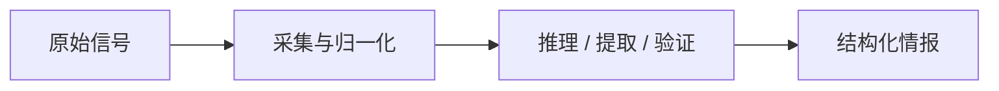
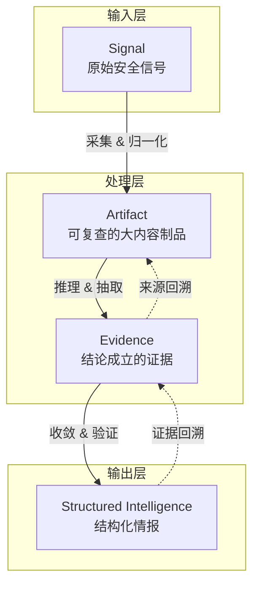
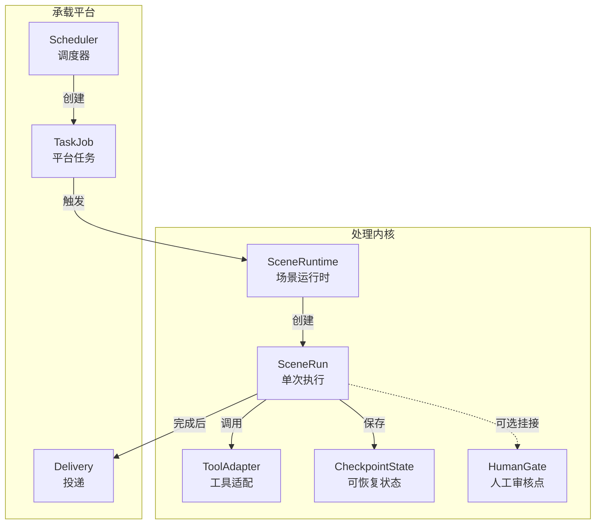
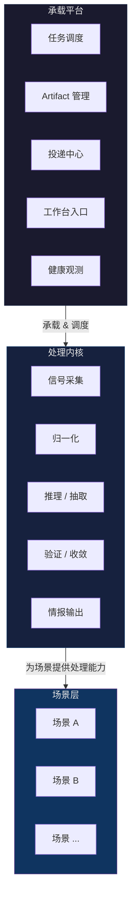
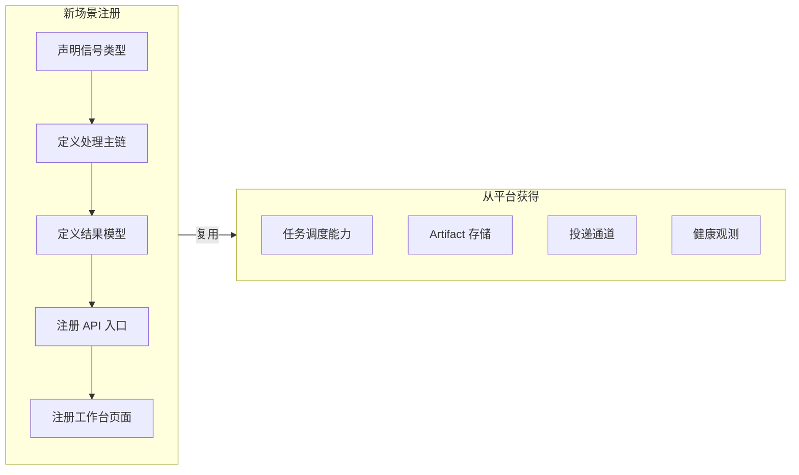
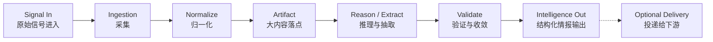
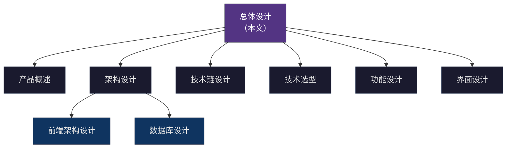

# AetherFlow 总体设计

> **AetherFlow 设计母文档 · v1.0**

---

## 1. 系统身份

AetherFlow 是一个**安全情报处理引擎**——它接收非结构化的原始安全信号，经过采集、归一化、推理、验证等处理后，输出可追溯的结构化情报。

核心表达式：



系统的核心目标止于**"把原始信号处理成可复查的结构化情报"**。资产匹配、影响计算、终端处置编排、外部运营面板等能力属于下游消费方，不属于情报引擎本身。

### AetherFlow 不是什么

- 不是一个只处理某种特定信号的单点工具
- 不是一个**无边界、无预算、无约束**的开放式网页浏览代理
- 不是一个下游运营平台或资产管理系统
- 不是一个只有前端壳、没有真实处理链路的展示框架

补充说明：

- 对特定场景，系统可以实现**受控、多跳、可审计的场景智能体**。
- 这种智能体必须运行在明确的工具边界、预算约束和证据回放机制内。
- 因此，“不是开放式网页浏览代理”不等于“不能做 Agent”，而是强调**不能失控地做通用浏览代理**。

---

## 2. 设计哲学

以下五条原则指导 AetherFlow 的所有设计决策：

### 2.1 信号无关性

引擎的核心抽象不绑定任何特定信号类型。无论输入是 CVE 编号、安全公告 URL、RSS 条目还是其他形态的安全信号，都应当能被统一抽象为 `Signal`，进入同一条处理链路。

### 2.2 场景即一等公民

每一种情报处理需求被抽象为一个**场景**。场景是系统扩展的基本单元——它拥有独立的处理主链、结果模型和工作台入口，但共享承载平台提供的任务调度、投递、文档采集等通用能力。系统的价值随场景数量增长而增长。

### 2.3 结论可追溯

任何结构化情报输出都必须能够回溯到原始信号、中间制品和证据链。"得出了某个结论"和"为什么得出这个结论"同等重要。

### 2.4 真实闭环优先

每个场景都必须形成从输入到结果的完整闭环。不为抽象而抽象——任何共享能力都必须被至少一个真实场景验证。

### 2.5 渐进式能力引入

高级能力（RAG、Multi-Agent、Human-in-the-loop 等）不要求所有场景从第一天起同时具备。场景可以从最简单的处理链路开始，按需引入更复杂的推理模式。

补充约束：

- 对需要跨页面、多来源、多步决策的场景，允许把 `LangGraph / Multi-Agent / HITL` 作为场景运行时的一部分，而不是仅作为附属增强层。
- 规则流水线和 Agent 图运行时都属于合法的场景实现范式，具体选择由场景目标、风险和预算共同决定。

---

## 3. 核心抽象模型

AetherFlow 的设计围绕四个核心抽象建立。它们是概念层对象，不要求在数据库中做成统一的表。



### Signal — 原始信号

系统的输入起点。代表任何进入处理链路的原始安全信号。

典型形态：

- CVE 编号
- 安全公告 URL
- 正文文本
- RSS 条目
- 第三方 API 返回体

### Artifact — 可复查制品

所有需要留存和复查的大内容与原始材料。Artifact 是 canonical source（权威来源），业务表只保留对它的引用和摘要。

典型内容：

- 原始 HTML
- 归一化正文
- patch / diff / debdiff
- 抓取快照
- 原始附件

### Evidence — 可追溯证据

某个结论为什么成立的证据记录。

要求：

- 能回溯到 Artifact
- 能定位到原文片段、规则命中或页面链路
- 能支持人工复核

### Structured Intelligence — 结构化情报

场景拥有的结构化输出。这是概念层对象，不强制统一数据结构——不同场景的情报输出形态不同。

---

## 4. 运行时模型

运行时模型描述系统在执行层面的协作关系：



### SceneRuntime — 场景运行时

代表某个场景的处理主链入口。每个场景注册一个 SceneRuntime，声明该场景的处理能力和结果模型。

补充说明：

- `SceneRuntime` 可以是线性阶段执行器，也可以是带 checkpoint 的图运行时。
- 当场景需要多轮搜索、节点级决策、预算控制或人工介入时，应优先考虑图运行时，而不是用越来越复杂的串行状态机硬撑。

### SceneRun — 单次执行

代表一次实际的场景执行实例。

约束：

- 每次执行都绑定一个唯一的平台 `TaskJob`
- 平台级重试只重跑同一个 Run
- 全新业务执行必须创建新的 `TaskJob + Run`

### ToolAdapter — 工具适配边界

引擎调用外部能力的统一适配层。

典型适配器：

- 页面抓取器
- 数据源解析器
- 模型调用器
- 下载器
- 校验器

### CheckpointState — 可恢复状态

长链路执行时的状态保存点。

支持：

- 断点续跑
- 中间态调试
- 高风险节点的人机接管
- Agent 图运行时中的 superstep 恢复

### HumanGate — 人工审核点

允许人工审核、确认或放行的关键节点。仅用于低置信度或高风险判断，不是全链路都要经过的审核流程。

补充说明：

- 在 Agent 模式下，`HumanGate` 通常出现在“预算即将耗尽但仍未收敛”“模型建议存在冲突”“规则与模型结论不一致”等场景。
- 对 CVE 浏览器 Agent 一类高链路复杂度场景，`HumanGate` 应与 validator、
  预算状态、acceptance baseline / regression gate 的解释链路协同，而不是脱离搜索图单独存在。

---

## 5. 系统层次

AetherFlow 在架构上分为两层：



### 处理内核

系统的核心定义层。负责：

- 接收原始信号
- 沉淀 Artifact
- 执行推理、抽取、候选选择、证据绑定和结果收敛
- 输出场景各自定义的结构化情报

### 承载平台

当前的运行形态层。负责：

- 任务创建、后台执行、重试与调度
- Artifact 管理与读取
- 工作台入口与结果页
- 投递目标管理与投递记录
- 系统健康观测

### 两层关系

- **处理内核**定义了 AetherFlow 的能力边界
- **承载平台**定义了当前版本的运行形态
- 内核的价值不依赖于某种特定的承载形态
- 承载平台提供的任何共用能力都必须被至少一个真实场景验证

---

## 6. 场景扩展模型

场景是系统扩展的基本单元。任何新的情报处理需求都应当被建模为一个新场景。

### 场景注册契约



一个场景需要声明的内容：

| 维度 | 说明 |
|------|------|
| **信号类型** | 该场景接受什么样的输入 |
| **处理主链** | 该场景的核心处理流程和节点 |
| **结果模型** | 该场景输出什么样的结构化情报 |
| **API 入口** | 该场景提供哪些后端接口 |
| **工作台页面** | 用户如何与该场景交互 |

### 场景的隔离与共享

- **隔离**：每个场景拥有独立的处理主链、结果模型（Run / Result schema）和工作台
- **共享**：所有场景共享任务调度、Artifact 管理、投递通道和首页入口
- **约束**：场景之间的结果模型不能被强制统一为同一种数据结构

---

## 7. 统一处理链路

所有场景都应遵循以下通用处理链路：



链路要点：

| 环节 | 职责 |
|------|------|
| Signal In | 接收原始安全信号 |
| Ingestion | 从外部数据源采集原始内容 |
| Normalize | 将不同来源的内容归一化为统一可处理的形态 |
| Artifact | 将大内容沉淀为可复查的 canonical source |
| Reason / Extract | 执行场景核心智能——推理、抽取、候选选择 |
| Validate | 证据绑定、结果收敛和置信度计算 |
| Intelligence Out | 输出场景各自定义的结构化情报 |
| Delivery | 按策略将结果投递给下游消费方（可选） |

承载平台在这条链路外层提供：

- 创建 `TaskJob` 和记录 `TaskAttempt`
- 绑定场景 `Run`
- 暴露工作台入口与结果页
- 按需触发投递

补充说明：

- 上述链路定义的是通用处理语义，不要求所有场景都以单次线性流水线实现。
- 对于需要多跳搜索、跨来源证据收敛或多轮决策的场景，可以把 `Reason / Extract` 与 `Validate` 两个环节展开为图运行时中的多个节点和循环。

---

## 8. 当前场景示例

以下是首批纳入的两个场景。它们是系统设计的验证基线，不代表系统的全部能力边界。

### 8.1 CVE 补丁检索

**定位**：输入 CVE 编号，主动检索多个权威数据源和可信页面，在有限预算内完成多跳 Patch 搜索、候选收敛、下载校验和证据回放。

**处理主链**：

```text
CVE ID
  → resolve_seeds（多源 seed 聚合）
  → build_initial_frontier（构建初始搜索 frontier）
  → fetch / extract（抓取页面并提取链接与候选）
  → agent_decide（模型决定扩展、下载、停止或转人工复核）
  → download_and_validate（下载与内容校验）
  → finalize_run（结果收敛与证据写回）
```

**运行原则**：

- 使用 `LangGraph` 作为受控图运行时
- 规则负责工具、约束与确定性验证
- 模型负责节点级搜索决策
- 全链路必须保留路径、预算、候选和决策证据
- 允许受控多跳与受控跨域，但不演化为无边界浏览代理

**结果表达**：

- `cve_runs` — 运行记录
- `cve_fix_families` — 修复族归并
- `cve_patch_artifacts` — 补丁证据
- Artifact 中的 patch / diff 原始内容

### 8.2 安全公告提取

**定位**：接收安全公告（URL 或正文），提取为结构化情报包。

**入口模式**：

- 手动提交：用户直接提供 URL 或正文
- 监控抓取：由调度器定时从配置的监控源拉取

> 两种入口共享同一处理链路，不是两个独立场景。

**结果表达**：

- `announcement_runs` — 运行记录
- `announcement_documents` — 归一化文档
- `announcement_intelligence_packages` — 结构化情报包
- Artifact 中的原文快照与归一化正文

**技术路线**：

- 可以从单文档提取链开始
- 按需引入 RAG / Tool-use / HITL 等更强能力
- 不要求从第一天起达到与 CVE 场景同等的 graph 复杂度

---

## 9. 当前项目约束

> 以上章节（1~8）定义了 AetherFlow 的长期系统身份与设计模型。本节锚定**当前仓库的实际状态与 v1 约束**，实现者必须以此为准。

### 当前阶段

当前仓库已完成**文档先行**，并已落地 **Phase 0 规范收口** 与
**Phase 1 工程骨架**。仓库内已有最小 FastAPI API、Alembic /
PostgreSQL 测试基础、Worker / Scheduler entrypoint、前端路由壳和统一
验证命令。在此基础上，当前 `main` 已继续落地 **Phase 2 平台底座 + CVE 主链**
以及一批平台与公告/投递最小切片：平台首页摘要、系统状态页、任务中心、安
全公告手动提取、监控批次查询与投递执行动作。当前仓库已经不再只是骨架验证，
但也还没有达到“所有场景全量闭环”的阶段。

### v1 边界

| 维度 | 当前约束 |
|------|---------|
| **首批场景** | 仅 CVE 补丁检索、安全公告提取两个 |
| **租户模型** | 单租户、无认证 |
| **数据库** | PostgreSQL 唯一后端 |
| **部署形态** | 单机/单实例优先，不依赖消息队列和外部调度基础设施 |
| **运行形态** | 承载平台 + 两个场景工作台；保留 API / Worker / Scheduler 三个逻辑角色，可同进程运行，也可按调试需要拆分为多个本地进程 |
| **早期闭环** | Phase 2 先验证 API + Worker 的真实闭环，scheduler 早期只保留 entrypoint 与 heartbeat |
| **技术实现** | 历史原型已验证的能力需要在当前仓库中重新实现 |

### 实施节奏

1. **先完成文档先行，并持续保持文档与实现同步** — 平台、CVE、安全公告
   三个层面的设计已经写清，后续实现必须继续回写文档
2. **再按平台 → 场景的顺序进入实现** — 当前已完成平台骨架，后续按既定
   Phase 推进公告、CVE、监控和投递能力；其中平台摘要、任务中心、系统状态、
   公告监控批次和投递执行最小能力已进入当前代码事实
3. **不为抽象先搭框架** — 任何平台能力都必须被至少一个真实场景驱动
4. **不误把目标架构当作既有事实** — 设计文档描述的是目标，不是当前代码

### 对实现者的要求

- 阅读本文时，请区分"系统身份与设计模型"（第 1~8 章）和"当前约束"（本章）
- 当前仓库已经不止有最小骨架，已具备平台摘要、任务查询、健康摘要、公告监控
  批次查询与投递执行动作等真实功能
- 历史原型中验证过的能力（CVE graph run 等）需要在当前仓库重写，不能直接搬运
- 不要把已落地的最小切片误写成长期目标已经全部完成，也不要反过来继续把真实
  页面和接口写成“只有路由壳”
- 如果某个设计概念在当前 v1 中不需要，不要提前实现

---

## 10. 技术哲学

AetherFlow 的技术选型遵循三条指导原则：

1. **编排框架为场景服务**：场景决定需要什么样的编排能力，而不是先选定编排框架再往里塞场景。
2. **模型调用必须受控**：LLM 可以是受限的辅助判断器，也可以在特定场景中承担节点级搜索决策，但不能脱离工具边界、预算约束和审计机制独立行动。
3. **能力按需引入**：RAG、Multi-Agent、MCP 等高级模式属于目标体系的一部分，但按场景真实需求分批引入。

补充说明：

- 对 CVE Patch 这类天然存在多跳页面探索和候选收敛需求的场景，模型不应永久停留在“失败后建议层”，而应在受控前提下进入主链决策。

关于每项技术（LangGraph / LangChain / LangSmith / RAG / MCP 等）在系统中的完整定位、职责和边界约束，参见：

→ [`技术链设计.md`](../03-系统架构/技术链设计.md)

---

## 11. 文档体系

从本文向下展开时，各文档承担如下职责：



| 文档 | 职责 |
|------|------|
| **本文** | 系统身份、设计哲学、核心抽象、系统层次、场景扩展模型 |
| [`产品概述`](../01-产品介绍/产品概述.md) | 项目信息、用户定义、核心价值与里程碑 |
| [`架构设计`](../03-系统架构/架构设计.md) | 承载平台的工程分层与部署形态 |
| [`技术链设计`](../03-系统架构/技术链设计.md) | LangGraph / LangChain / LangSmith / RAG / MCP 等技术的系统角色 |
| [`技术选型`](../03-系统架构/技术选型.md) | 具体技术栈选择与依赖方向 |
| [`前端架构设计`](../03-系统架构/前端架构设计.md) | 路由、状态管理、API 消费与组件分层 |
| [`数据库设计`](../03-系统架构/数据库设计.md) | 数据模型投影与持久化契约 |
| [`功能设计`](../04-功能设计/README.md) | 模块分解、依赖关系与实施顺序 |
| [`界面设计`](../13-界面设计/README.md) | 页面级信息架构、交互状态与 UI 规格 |

### 继承原则

1. 总定义、总边界、设计哲学和场景扩展规则，以本文为准。
2. 具体模块接口、数据表和页面行为由下位文档展开。
3. 如果下位文档与本文冲突，应优先修正文档体系，而不是各写各的。

---

## 12. 术语表

| 术语 | 定义 |
|------|------|
| **信号（Signal）** | 进入系统的原始安全输入 |
| **制品（Artifact）** | 可复查的大内容与原始材料 |
| **证据（Evidence）** | 结论成立的可追溯依据 |
| **情报（Intelligence）** | 场景输出的结构化结果 |
| **场景（Scene）** | 一种特定的情报处理需求及其完整实现 |
| **处理内核（Processing Core）** | 系统的核心处理能力层 |
| **承载平台（Hosting Platform）** | 当前版本的运行形态层 |
| **运行（Run）** | 一次场景执行实例 |

---

## 13. 变更记录

### v1.0 — 2026-04-10

- 建立 AetherFlow 总体设计文档
- 确立系统身份、设计哲学和核心抽象模型
- 建立场景扩展模型和统一处理链路
- 定义处理内核与承载平台的双层架构
- 将技术链描述独立为专项文档

### v1.1 — 2026-04-10

- 同步当前仓库已完成 Phase 0 / Phase 1 的真实状态
- 把“文档先行”更新为“文档与实现持续同步”的实施口径
- 明确最小工程骨架与业务闭环的边界

### v1.2 — 2026-04-17

- 同步 `main` 已继续落地平台首页摘要、系统状态页、任务中心、安全公告监控批次
  与投递执行动作。
- 修正“当前仓库仅用于骨架验证”的过时表述，改为“已有最小切片，但仍未达到长期
  规划全量闭环”。

---

**文档版本**：v1.2
**创建日期**：2026-04-10
**最后更新**：2026-04-17
**维护人**：AI + 开发团队
