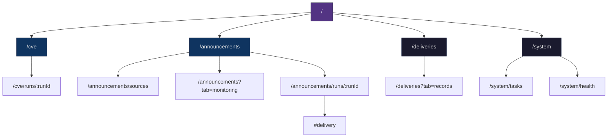
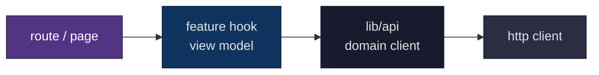

# 前端架构设计

> **当前 v1 承载平台的前端实现架构说明**

> 读前建议：先阅读 `../00-总设计/总体项目设计.md`、`架构设计.md` 和 `技术选型.md`。本文负责把页面规格和技术选型继续收口为可执行的前端工程边界。

---

## 🎯 文档目标

本文解决的问题不是“页面长什么样”，而是“这些页面如何在 React 工程里稳定落地”。

本文固定以下前端实现边界：

1. 路由与页面分组如何组织。
2. 页面壳、场景组件、共享组件如何分层。
3. API 调用、查询缓存、轮询与 URL 状态如何约束。
4. 表单、错误边界、降级态、移动端适配如何统一。

本文不解决的问题：

- 视觉高保真稿
- 数据库 schema
- 场景领域模型
- 完整组件库 token 与逐像素视觉规则

---

## 🧱 前端职责边界

当前 v1 前端只承载三类职责：

1. **工作台职责**：输入参数、触发任务、查看运行态。
2. **结果职责**：展示结构化结果、证据链和投递记录。
3. **平台承载职责**：展示首页摘要、投递中心、任务中心和系统状态。

前端不承担以下职责：

- 直接执行长任务
- 直接读取 Artifact 磁盘路径
- 重新拼装领域结果语义
- 在浏览器端持有敏感渠道密钥

---

## 🗺️ 路由结构



导航分层固定如下：

- 一级导航：`首页`、`CVE 补丁检索`、`安全公告提取`
- 工具导航：`投递中心`、`系统`

约束：

- 场景页是主路径。
- 平台工具页是辅助入口，不抢占场景主导航。
- 页面路由与 `13-界面设计/` 的 `Pxxx` 文档一一对应。

---

## 📁 目录结构

推荐的前端目录边界固定为：

```text
frontend/src/
  app/
    router.tsx
    providers.tsx
    query-client.ts
  routes/
    HomePage.tsx
    CVELookupPage.tsx
    CVERunDetailPage.tsx
    AnnouncementWorkbenchPage.tsx
    AnnouncementSourcesPage.tsx
    AnnouncementMonitorPage.tsx
    AnnouncementRunDetailPage.tsx
    DeliveryCenterPage.tsx
    TaskCenterPage.tsx
    SystemHealthPage.tsx
  features/
    home/
    cve/
    announcements/
    deliveries/
    system/
  components/
    layout/
    feedback/
    forms/
    data-display/
  lib/
    http/
    api/
    query/
    formatters/
    validators/
  styles/
  types/
```

职责固定：

- `routes/`：页面级路由组件，只做页面编排，不直接写复杂数据转换。
- `features/`：场景级和平台级业务组件、view model 与 query hook。
- `components/`：纯共享 UI 组件，不耦合具体场景语义。
- `lib/api/`：按领域分组的 API client，不允许页面内直接 `fetch`。
- `lib/query/`：Query key、轮询策略、公共查询辅助。

---

## 🔄 状态分层

### 1. 服务端状态

全部通过 TanStack Query 管理：

- 场景运行详情
- 首页聚合摘要
- 监控批次列表与详情
- 投递目标与投递记录
- 系统健康摘要

约束：

- 页面组件不直接持有服务端状态副本。
- Query key 必须包含领域前缀，例如：
  - `['home', 'summary']`
  - `['cve', 'run', runId]`
  - `['announcements', 'monitor-batch', fetchId]`
  - `['deliveries', 'records', filters]`

### 2. URL 状态

只把影响分享、回看和刷新恢复的状态放进 URL：

- 搜索条件
- tab 切换
- 当前批次或筛选条件

### 3. 本地 UI 状态

保留在页面或 feature 内部：

- 抽屉开关
- 表单草稿
- 当前选中的 patch
- 当前展开的 trace step

### 4. 全局状态

v1 明确不引入 Redux/Zustand 等全局状态库。

原因：

- 服务端状态已由 Query 承担。
- 当前产品主路径是工作台 + 详情页，不需要复杂全局共享业务状态。

---

## 🌐 API 调用约束

统一约束如下：

1. 页面不直接发 HTTP 请求，必须通过 `lib/api` 或 feature query hook。
2. API client 负责请求路径、参数序列化和统一错误对象。
3. 页面只消费 view model，不直接在 JSX 里拼装原始后端字段。
4. 轮询逻辑必须集中在 query hook 或公共 polling helper，不散落在页面事件里。

推荐分层：



---

## ⏱️ 轮询与实时策略

v1 统一采用“轮询优先”的前端策略，不预设 WebSocket。

轮询规则：

- `CVE` 工作台：非终态 1~2 秒轮询一次。
- 公告手动提取：非终态 1~2 秒轮询一次。
- 监控批次详情：试跑后短轮询，终态后停止。
- 首页摘要与系统健康：低频刷新或手动刷新。

停止条件：

- 进入终态
- 页面卸载
- 用户切换到其他 run 或批次

---

## 🧩 组件分层

组件只分三层，不再模糊：

### 1. 原子与共享组件

例如：

- 按钮、输入框、状态胶囊
- 卡片壳、抽屉壳、空态/错误态组件
- Diff 阅读区、证据片段块

要求：

- 不依赖具体场景字段名
- 只接收通用 props

### 2. 领域特征组件

例如：

- CVE 结论卡
- 公告情报包摘要
- 监控批次详情面板
- 投递目标编辑表单

要求：

- 允许依赖场景 view model
- 不承担路由和顶层布局职责

### 3. 页面编排组件

例如各 `routes/*Page.tsx`：

- 组合 Hero、表单区、结果区和详情区
- 绑定 URL 状态与页面级动作
- 处理页面级降级和错误边界

---

## 📝 表单策略

v1 表单统一采用“受控状态 + 统一校验 helper”模式，不额外引入重量级表单框架。

原因：

- 页面数量有限，复杂表单主要集中在监控源和投递目标。
- 统一校验 helper 足够支撑当前复杂度。
- 避免在文档阶段提前引入更多前端依赖和抽象。

表单规则：

- 字段级校验在输入阶段给出提示。
- 提交前做整表校验。
- 后端错误统一映射到表单级提示或字段级提示。

---

## 🚨 错误边界与降级策略

错误处理固定分三层：

1. **路由级错误**：页面不存在、核心查询失败，展示整页错误态。
2. **区块级错误**：某个区块失败，整页仍可继续，例如首页摘要局部降级。
3. **动作级错误**：提交失败、测试发送失败、重试失败，只影响当前动作区块。

统一要求：

- 不在主页面直接暴露原始异常堆栈。
- 每个页面必须有加载态、空态、失败态、部分失败态。
- 局部失败不能无条件升级为整页失败。

---

## 📱 响应式与可访问性

### 响应式

- 桌面端优先双栏或分区布局。
- 移动端退化为单栏堆叠。
- 监控源编辑、任务详情、投递目标编辑优先抽屉化，不保留密集多列表格。

### 可访问性

- 表单控件必须有 label。
- 状态胶囊颜色不能作为唯一信息来源。
- 关键动作按钮必须有明确文本，不只用图标。

---

## ✅ 前端测试与验收

最小测试集合固定为：

1. 路由级 smoke test：
   - `/`
   - `/cve`
   - `/announcements`
   - `/deliveries`
   - `/system/tasks`
2. 页面状态测试：
   - 加载态
   - 空态
   - 错误态
   - 终态
3. 关键交互测试：
   - CVE 输入校验
   - 公告双模式切换
   - 监控源试跑
   - 投递目标测试发送
   - 任务重试

验收标准：

- 页面实现必须能回到对应 `Pxxx` 文档。
- 页面视图对象必须能回到对应 `Mxxx` 文档。
- 不允许页面里直接出现与设计无关的临时调试面板。

---

## 🔗 相关文档

- `../00-总设计/总体项目设计.md`
- `架构设计.md`
- `技术选型.md`
- `../04-功能设计/README.md`
- `../13-界面设计/README.md`

---

## 🔄 变更记录

### v1.0 - 2026-04-10
- 新增前端架构设计文档
- 固定路由树、目录分层、状态分层和 API 调用约束
- 为页面规格进入前端实现建立工程边界

---

**文档版本**：v1.0  
**创建日期**：2026-04-10  
**最后更新**：2026-04-10  
**维护人**：AI + 开发团队
