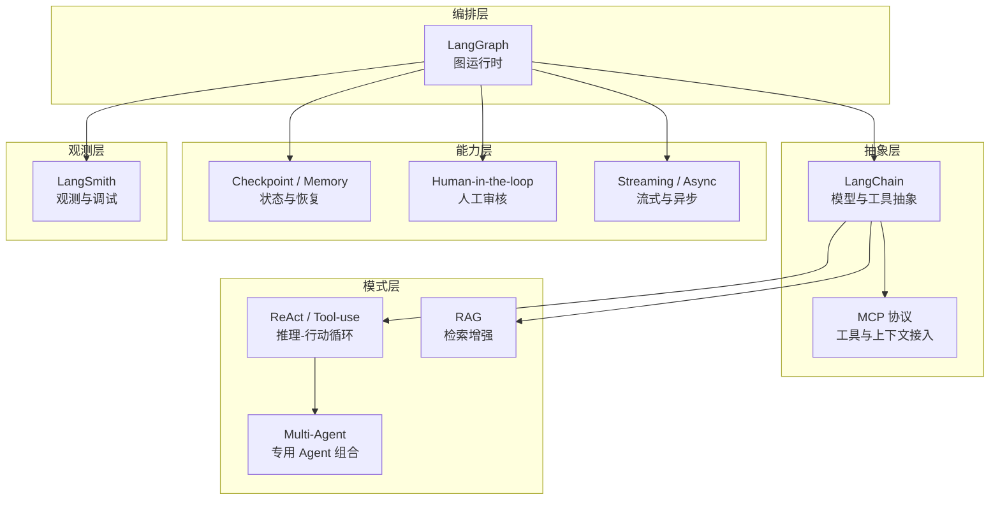

# 技术链设计

> **AetherFlow 技术分层与系统角色定义**

> 读前建议：先阅读 [`总体设计`](../00-总设计/总体项目设计.md)。本文负责展开总设计中「技术哲学」所涉及的每项技术在系统中的定位、职责和边界约束。

---

## 1. 技术哲学回顾

总设计确立了三条技术指导原则：

1. **编排框架为场景服务**
2. **模型调用必须受控**
3. **能力按需引入**

本文在此基础上，为每项技术定义系统角色。

---

## 2. 技术链全景

---

## 3. LangGraph

**定位**：默认的 stateful orchestration runtime。

**职责**：

- 表达场景处理主链的显式状态图
- 支持循环、分支、并发和节点级状态流转
- 提供 checkpoint 与状态恢复能力
- 让需要 frontier 探索的场景具备可解释、可恢复、可追踪的运行时

**结论**：

- 对 CVE Patch 场景，LangGraph 不是可选增强，而是主线编排框架

---

## 4. LangChain

**定位**：默认的模型与工具抽象层。

**职责**：

- 模型调用封装
- 工具绑定
- 提示模板管理
- 结构化输出约束

**边界约束**：

- 不承担业务编排主责
- 不把系统变成开放式对话代理

---

## 5. ReAct / Tool-use

**定位**：节点内的推理-行动循环模式。

**职责**：

- 在有限工具集合内做逐步判断与调用
- 支持“先看结果，再决定下一步操作”的局部策略

**对 CVE Patch 场景的作用**：

- 负责节点级页面角色判断
- 负责 frontier 扩展决策
- 负责候选下载前的选择动作

---

## 6. Checkpoint / Memory

**定位**：运行时能力，不是业务结果层。

**职责**：

- 保存执行状态
- 支持断点续跑和长任务恢复
- 保证图运行时中的 superstep 连续性

---

## 7. Human-in-the-loop

**定位**：治理能力。

**职责**：

- 在低置信度或高风险节点引入人工审核
- 处理预算将尽但仍未收敛、模型与规则结论冲突等情况

---

## 8. LangSmith

**定位**：观测、调试、评估与回放平面。

**职责**：

- 记录图运行时 trace
- 辅助调试和评估
- 为节点、决策和错误定位提供外部观测能力

---

## 9. RAG

**定位**：检索增强模式。

**职责**：

- 为需要背景补全、历史比对或同类内容检索的场景提供增强能力

**说明**：

- 不是所有场景默认必开

---

## 10. Multi-Agent

**定位**：复杂场景下的高级组合模式。

**职责**：

- 在确实有收益时，把采集、抽取、验证、总结等职责拆给专用 Agent

**说明**：

- 不是默认模式
- 但对复杂多源、多阶段搜索场景保留上行空间

---

## 11. MCP

**定位**：工具与上下文接入协议层。

**职责**：

- 标准化接入外部工具、上下文与能力源
- 降低工具调用实现和场景逻辑的耦合

---

## 12. 技术链与场景映射

| 技术 | CVE Patch 搜索 | 安全公告提取 | 说明 |
|------|:---:|:---:|------|
| LangGraph | ● | ○ | CVE Patch Agent 主线由 LangGraph 编排 |
| LangChain | ● | ○ | 模型调用与结构化输出抽象 |
| ReAct / Tool-use | ● | ○ | CVE 搜索节点使用受限工具调用 |
| Checkpoint | ● | ○ | 长链路状态保存与恢复 |
| Async | ● | ● | 所有场景后台执行 |
| LangSmith | ○ | ○ | 可选观测平面 |
| RAG | ○ | ○ | 视场景需要引入 |
| Multi-Agent | ○ | ○ | 复杂场景按需引入 |
| HITL | ○ | ○ | 高风险或低置信度时引入 |
| MCP | ○ | ○ | 工具协议层按需引入 |

---

## 13. 结论

1. CVE Patch 场景的正式技术路线是：`LangGraph + LangChain + ReAct/Tool-use + Checkpoint + HITL`
2. 平台文档、功能文档和页面文档都应围绕该技术链组织
3. 不再把规则流水线视为技术链主线
