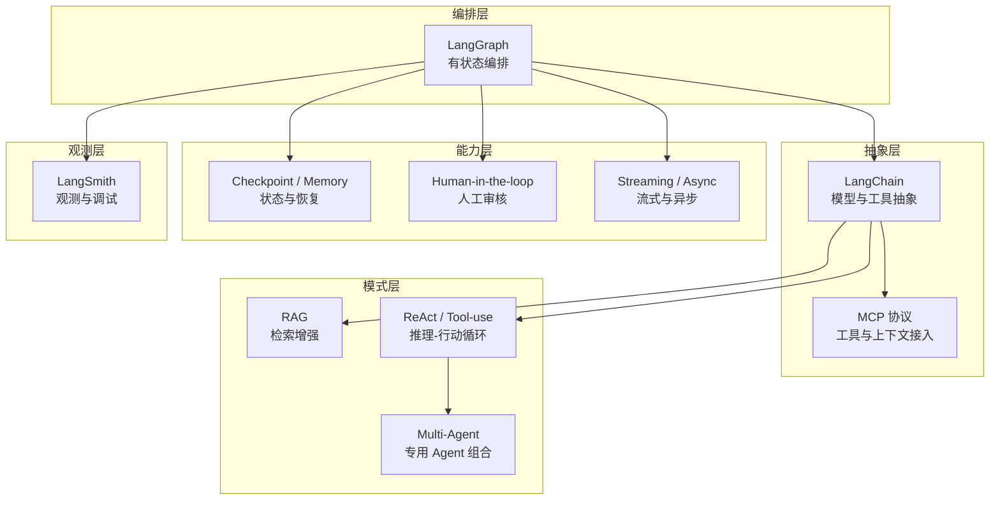

# 技术链设计

> **AetherFlow 技术分层与系统角色定义 · v1.0**

> 读前建议：先阅读 [`总体设计`](../00-总设计/总体项目设计.md)。本文负责展开总设计中「技术哲学」章节所涉及的每项技术在系统中的定位、职责和边界约束。

---

## 1. 技术哲学回顾

总设计确立了三条技术指导原则：

1. **编排框架为场景服务** — 场景决定编排需求，而非反之
2. **模型调用是工具、不是引擎** — LLM 是受限辅助，不是主线引擎
3. **能力按需引入** — 高级模式按场景需求分批落地

本文在此基础上，为每项技术定义系统角色。

---

## 2. 技术链全景

---

## 3. 有状态编排 — LangGraph

**定位**：默认的 stateful orchestration runtime。

**系统职责**：

- 承担场景处理主链的显式状态图表达
- 支持循环、分支、并发和节点级状态流转
- 提供 checkpoint 与状态恢复能力
- 让需要 frontier 探索类逻辑的场景可解释、可恢复、可追踪

**边界约束**：

- 不负责模型提供方选择
- 不负责业务结果表结构设计
- 不要求所有场景都必须从第一天起构建复杂 graph
- 简单场景可以从线性链路开始，按需引入分支和循环

---

## 4. 模型与工具抽象 — LangChain

**定位**：默认的 LLM 与工具调用抽象层。

**系统职责**：

- 模型调用封装（屏蔽具体模型提供方差异）
- 工具绑定
- 提示模板管理
- 结构化输出约束

**边界约束**：

- 不承担业务编排主责（编排归 LangGraph）
- 不把系统变成开放式对话代理或网页浏览器
- LLM 在系统中的角色始终是"受限的候选选择型辅助"

---

## 5. 观测与调试 — LangSmith

**定位**：观测、调试、评估与回放平面。

**系统职责**：

- 记录 run trace
- 辅助调试和评估
- 在需要时回填外部追踪链接

**边界约束**：

- 不是运行前提——系统可以在 LangSmith 不可用时正常运行
- 不应让业务逻辑依赖观测平台的可用性

---

## 6. 检索增强模式 — RAG

**定位**：检索增强生成模式。

**系统职责**：

- 先检索知识或历史材料，再进入生成、总结或抽取
- 为需要背景补全、历史比对或同类内容检索的场景预留能力

**边界约束**：

- 不是所有场景默认必开
- 当前阶段不要求引入向量召回和独立索引服务
- 按场景真实需求逐步引入

---

## 7. 推理-行动循环 — ReAct / Tool-use

**定位**：节点内的推理-行动循环模式。

**系统职责**：

- 在有限工具集合内做逐步判断与调用
- 支持"先看结果，再决定下一步操作"的局部策略

**边界约束**：

- 是一种运行模式，不是整个系统定义
- 工具集必须受限——不能放宽到任意网页漫游或无边界执行
- 超时、无效输出和调用失败都必须留下可追踪结果

---

## 8. 多智能体模式 — Multi-Agent

**定位**：复杂场景下的高级组合模式。

**系统职责**：

- 在确实有收益时，把采集、抽取、验证、总结等职责拆给专用 Agent

**边界约束**：

- 不作为当前默认组织模式
- 不允许为了"看起来先进"而把简单场景过度 Agent 化
- 只有场景复杂度真正需要时才引入

---

## 9. 检查点与记忆 — Checkpoint / Memory

**定位**：运行时能力，不是业务结果层。

**系统职责**：

- 保存执行状态
- 支持断点续跑和长任务恢复
- 支持人工接管前后的状态连续性

**边界约束**：

- 不能替代业务数据库
- checkpoint 数据不等于场景结果——两者的生命周期和用途完全不同

---

## 10. 人机协作 — Human-in-the-loop

**定位**：治理能力。

**系统职责**：

- 在低置信度或高风险节点引入人工审核
- 防止 Agent 在关键结论上误判

**边界约束**：

- 只挂关键节点
- 不把全链路重新写回完整人工审核台叙事
- 人工介入是例外处理，不是默认流程

---

## 11. 流式与异步 — Streaming / Async

**定位**：执行与交付语义。

**系统职责**：

- 长任务后台异步执行
- 中间态可流式输出或轮询读取
- 结果不阻塞在请求内一次性完成

**边界约束**：

- 流式展示是观察方式，不是业务模型本身

---

## 12. 工具协议层 — MCP

**定位**：工具与上下文接入协议层。

**系统职责**：

- 标准化接入外部工具、上下文与能力源
- 降低工具调用实现和场景逻辑的耦合

**边界约束**：

- 不是场景业务逻辑本身
- 不与平台 API 或数据库 schema 混写

---

## 13. 技术链与场景的映射

> **重要区分**：本节描述的是 **目标架构选型**，不是当前仓库的已落地代码。当前仓库仍处于文档与设计阶段，尚未进入实现。

### 目标选型

下表列出每个首批场景 **计划使用** 的技术能力：

| 技术 | CVE 补丁检索 | 安全公告提取 | 说明 |
|------|:---:|:---:|------|
| LangGraph | ● | ○ | CVE 场景的处理主链计划用 LangGraph 编排 |
| LangChain | ● | ○ | 模型调用与结构化输出抽象 |
| ReAct / Tool-use | ● | ○ | CVE 场景的页面探索计划采用 |
| Checkpoint | ● | ○ | 长链路状态保存与恢复 |
| Async | ● | ● | 所有场景的后台执行模式 |
| LangSmith | ○ | ○ | 可选观测平面 |
| RAG | — | ○ | 公告场景按需引入 |
| Multi-Agent | — | — | 当前不作为默认模式 |
| HITL | — | ○ | 公告场景低置信度时按需引入 |
| MCP | — | — | 工具协议层，按需引入 |

- ● = 目标架构中计划使用
- ○ = 根据场景需求按需引入
- — = 当前不计划使用

### 参考验证来源

以上选型的信心来自历史验证：

- CVE 场景的 LangGraph / LangChain / ReAct 组合已在早期原型中跑通过完整闭环
- 安全公告的多源抓取与 AI 分析链路已在独立项目中验证过可行性

**但这些验证发生在当前仓库之外。当前仓库的全部场景实现均为待开发状态。**

### 当前仓库实现状态

| 场景 | 后端实现 | 前端实现 | 数据库 |
|------|:---:|:---:|:---:|
| CVE 补丁检索 | ⚪ 待实现 | ⚪ 待实现 | ⚪ 待迁移 |
| 安全公告提取 | ⚪ 待实现 | ⚪ 待实现 | ⚪ 待迁移 |

---

## 14. 变更记录

### v1.0 — 2026-04-10

- 从总体设计中独立出技术链分层文档
- 定义每项技术在系统中的角色、职责和边界约束
- 建立技术链与场景的映射关系

---

**文档版本**：v1.0
**创建日期**：2026-04-10
**维护人**：AI + 开发团队
