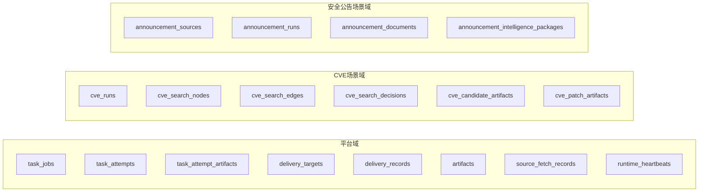

# 数据库设计

> **承载平台与场景的数据模型说明**

> 读前建议：先阅读 `../00-总设计/总体项目设计.md`。本文负责把总设计投影为持久化契约。

---

## 🎯 设计目标

数据库设计服务于三个目标：

1. 承载平台级任务、投递和 Artifact 复用能力
2. 承载 `CVE Patch Agent` 的搜索图、预算、候选收敛与补丁证据
3. 承载 `安全公告提取` 的手动提取、监控抓取和结构化情报包结果

---

## 🧱 设计原则

1. **平台表与场景表分层**
2. **结果可追溯**
3. **大内容外置**
4. **JSONB 承载弹性字段**
5. **只做 PostgreSQL**

---

## 🗂️ 数据域划分

---

## 📊 核心表设计

### 平台域

- `task_jobs`
- `task_attempts`
- `task_attempt_artifacts`
- `delivery_targets`
- `delivery_records`
- `artifacts`
- `source_fetch_records`
- `runtime_heartbeats`

### CVE 场景域

- `cve_runs`
- `cve_search_nodes`
- `cve_search_edges`
- `cve_search_decisions`
- `cve_candidate_artifacts`
- `cve_patch_artifacts`

### 公告场景域

- `announcement_sources`
- `announcement_runs`
- `announcement_documents`
- `announcement_intelligence_packages`

---

## 1. `cve_runs`

**用途**：CVE Patch Agent 运行主表

核心字段：

- `run_id`
- `job_id`
- `cve_id`
- `status`
- `phase`
- `stop_reason`
- `summary_json`
- `created_at`
- `updated_at`

---

## 2. `cve_search_nodes`

**用途**：表达搜索过程中访问过的页面节点

核心字段：

- `node_id`
- `run_id`
- `url`
- `depth`
- `host`
- `page_role`
- `fetch_status`
- `content_excerpt`
- `heuristic_features_json`
- `created_at`

---

## 3. `cve_search_edges`

**用途**：表达页面之间的跳转关系

核心字段：

- `edge_id`
- `run_id`
- `from_node_id`
- `to_node_id`
- `edge_type`
- `anchor_text`
- `link_context`
- `selected_by`
- `created_at`

---

## 4. `cve_search_decisions`

**用途**：审计 Agent 每一轮决策

核心字段：

- `decision_id`
- `run_id`
- `node_id`
- `decision_type`
- `model_name`
- `input_json`
- `output_json`
- `validated`
- `rejection_reason`
- `created_at`

---

## 5. `cve_candidate_artifacts`

**用途**：表达候选 patch 的发现、下载与校验结果

核心字段：

- `candidate_id`
- `run_id`
- `source_node_id`
- `candidate_url`
- `candidate_type`
- `canonical_key`
- `download_status`
- `validation_status`
- `artifact_id`
- `evidence_json`

---

## 6. `cve_patch_artifacts`

**用途**：表达最终 patch 视图与可消费 patch 记录

该表可以继续保留为详情页和前端消费友好的 patch 结果层。

---

## 7. `artifacts`

**用途**：统一存放 HTML、正文、patch、快照等外部内容

说明：

- `artifacts` 只描述内容对象本身
- 任务与 Artifact 的运行时归属通过 `task_attempt_artifacts` 表达

---

## 8. `source_fetch_records`

**用途**：记录一次外部抓取调用

说明：

- 这是工具级抓取日志
- 不替代 `search_nodes / edges / decisions`

---

## 9. 结论

数据库设计必须围绕：

- `run`
- `search_graph`
- `decision_history`
- `candidate_convergence`
- `artifact`

这五个层次展开，而不是围绕单次线性 `fast-first` 运行结果展开。
