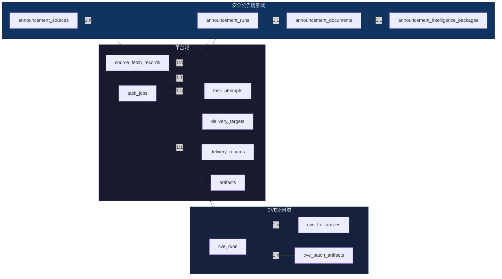
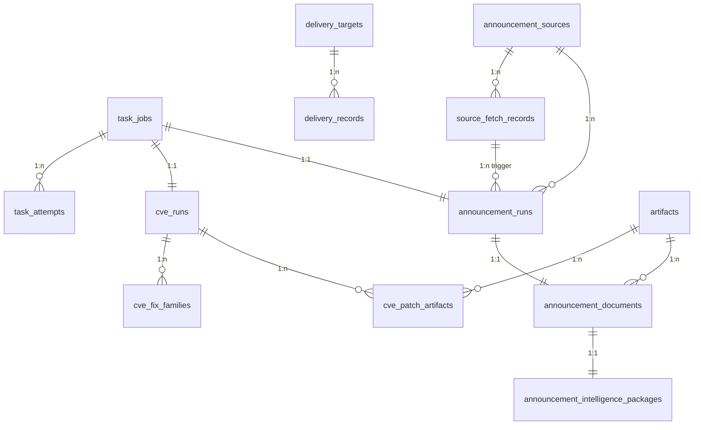

# 数据库设计

> **承载平台与场景的数据模型说明**

> 读前建议：先阅读 `../00-总设计/总体项目设计.md`。本文负责把总设计投影为当前持久化契约。

---

## 🎯 设计目标

数据库设计服务于三个目标：

1. 承载平台级任务、投递和 Artifact 复用能力。
2. 承载 `CVE 补丁检索` 的 graph run 结果与补丁证据。
3. 承载 `安全公告提取` 的手动提取、监控抓取和结构化情报包结果。

---

## 🧱 设计原则

1. **平台表与场景表分层**：平台只存共用底座，场景单独建表。
2. **结果可追溯**：任何结论都能回到文档、证据片段或下载产物。
3. **大内容外置**：原文、HTML、patch、归一化正文等大内容统一以 Artifact 为 canonical source，业务表只保留引用与摘要。
4. **JSONB 承载弹性字段**：对不稳定但需要复查的结果使用 JSONB。
5. **只做 PostgreSQL**：不再为 SQLite 保留兼容字段。

---

## 🗂️ 数据域划分

### 平台域
- `task_jobs`
- `task_attempts`
- `delivery_targets`
- `delivery_records`
- `artifacts`
- `source_fetch_records`

### CVE 场景域
- `cve_runs`
- `cve_fix_families`
- `cve_patch_artifacts`

### 安全公告场景域
- `announcement_sources`
- `announcement_runs`
- `announcement_documents`
- `announcement_intelligence_packages`

---

## 📊 核心表设计

### 1. `task_jobs`
**用途**：平台任务底座中的场景执行任务主表

| 字段名 | 类型 | 说明 |
|--------|------|------|
| `job_id` | UUID | 主键 |
| `scene_name` | VARCHAR(32) | v1 固定为 `cve/announcement` |
| `job_type` | VARCHAR(64) | 任务类型 |
| `trigger_kind` | VARCHAR(32) | `manual/schedule/retry/system` |
| `status` | VARCHAR(32) | `queued/running/succeeded/failed/cancelled` |
| `payload_json` | JSONB | 输入快照 |
| `scheduled_at` | TIMESTAMPTZ | 调度时间 |
| `started_at` | TIMESTAMPTZ | 开始时间 |
| `finished_at` | TIMESTAMPTZ | 结束时间 |
| `last_error` | TEXT | 最近错误 |
| `created_at` | TIMESTAMPTZ | 创建时间 |
| `updated_at` | TIMESTAMPTZ | 更新时间 |

**索引建议**：
- `idx_task_jobs_scene_status`
- `idx_task_jobs_created_at`
- `idx_task_jobs_trigger_kind`

**契约说明**：
- 一个 `task_job` 只对应一次场景执行。
- 一个 `task_job` 只绑定一个场景 `run`。
- 平台级重试只新增 `task_attempts`，不新增 `task_job` 和场景 `run`。
- 如果需要新的场景执行，必须重新创建新的 `task_job + run`。
- v1 中不使用 `scene_name = platform` 的 `task_job`。
- 抓取批次审计、健康检查与只读聚合等纯平台记录，不通过 `task_jobs` 表达。

---

### 2. `task_attempts`
**用途**：记录每次任务尝试和重试

| 字段名 | 类型 | 说明 |
|--------|------|------|
| `attempt_id` | UUID | 主键 |
| `job_id` | UUID | 关联 `task_jobs` |
| `attempt_no` | INT | 第几次尝试 |
| `status` | VARCHAR(32) | `running/succeeded/failed` |
| `worker_name` | VARCHAR(128) | 执行节点 |
| `error_message` | TEXT | 失败信息 |
| `started_at` | TIMESTAMPTZ | 开始时间 |
| `finished_at` | TIMESTAMPTZ | 结束时间 |

**约束建议**：
- `(job_id, attempt_no)` 必须唯一。

---

### 3. `delivery_targets`
**用途**：投递目标配置表

| 字段名 | 类型 | 说明 |
|--------|------|------|
| `target_id` | UUID | 主键 |
| `name` | VARCHAR(128) | 目标名称 |
| `channel_type` | VARCHAR(32) | `email/wecom/webhook` |
| `enabled` | BOOLEAN | 是否启用 |
| `config_json` | JSONB | 非敏感配置 |
| `secret_ref` | VARCHAR(256) | 密钥引用 |
| `created_at` | TIMESTAMPTZ | 创建时间 |
| `updated_at` | TIMESTAMPTZ | 更新时间 |

---

### 4. `delivery_records`
**用途**：记录一次实际投递

| 字段名 | 类型 | 说明 |
|--------|------|------|
| `record_id` | UUID | 主键 |
| `target_id` | UUID | 关联投递目标 |
| `scene_name` | VARCHAR(32) | 来源场景 |
| `source_ref_type` | VARCHAR(64) | 触发对象类型 |
| `source_ref_id` | UUID | 触发对象 ID |
| `status` | VARCHAR(32) | `queued/sent/failed/skipped` |
| `payload_summary_json` | JSONB | 投递摘要 |
| `response_snapshot_json` | JSONB | 渠道响应摘要 |
| `error_message` | TEXT | 失败信息 |
| `sent_at` | TIMESTAMPTZ | 发送时间 |
| `created_at` | TIMESTAMPTZ | 创建时间 |

---

### 5. `artifacts`
**用途**：统一存放 HTML、正文、patch、快照等外部内容

| 字段名 | 类型 | 说明 |
|--------|------|------|
| `artifact_id` | UUID | 主键 |
| `artifact_kind` | VARCHAR(32) | `html/text/patch/rss/raw_file` |
| `scene_name` | VARCHAR(32) | 归属场景 |
| `source_url` | TEXT | 来源 URL |
| `storage_path` | TEXT | 文件路径 |
| `content_type` | VARCHAR(128) | MIME 类型 |
| `checksum` | VARCHAR(128) | 内容校验值 |
| `metadata_json` | JSONB | 额外元数据 |
| `created_at` | TIMESTAMPTZ | 创建时间 |

---

### 6. `source_fetch_records`
**用途**：记录一次外部抓取调用

| 字段名 | 类型 | 说明 |
|--------|------|------|
| `fetch_id` | UUID | 主键 |
| `scene_name` | VARCHAR(32) | 来源场景 |
| `source_id` | UUID | 可空，公告监控批次时关联 `announcement_sources` |
| `source_type` | VARCHAR(64) | 数据源类型 |
| `source_ref` | VARCHAR(256) | 数据源标识 |
| `status` | VARCHAR(32) | `succeeded/failed/skipped` |
| `request_snapshot_json` | JSONB | 请求摘要 |
| `response_meta_json` | JSONB | 响应摘要 |
| `error_message` | TEXT | 失败信息 |
| `created_at` | TIMESTAMPTZ | 创建时间 |

**契约说明**：
- 当 `scene_name = announcement` 且该记录代表监控批次时，`source_id` 必须非空。
- 对 CVE 页面抓取、手动 URL 提取等非监控批次抓取，`source_id` 可以为空。
- `source_ref` 保留为外部来源标识或 URL 级别的弱语义补充，但监控批次归属不再只靠它表达。

---

### 7. `cve_runs`
**用途**：CVE graph run 主表

| 字段名 | 类型 | 说明 |
|--------|------|------|
| `run_id` | UUID | 主键 |
| `job_id` | UUID | 唯一关联 `task_jobs` |
| `cve_id` | VARCHAR(32) | CVE 编号 |
| `run_mode` | VARCHAR(16) | `agent/fast` |
| `status` | VARCHAR(32) | 运行状态 |
| `phase` | VARCHAR(32) | 当前阶段 |
| `stop_reason` | VARCHAR(64) | 停止原因 |
| `metadata_json` | JSONB | 聚合元数据 |
| `summary_json` | JSONB | 运行摘要 |
| `progress_json` | JSONB | 进度信息 |
| `source_traces_json` | JSONB | 页面探索证据链 |
| `langsmith_run_url` | TEXT | 可选观测链接 |
| `created_at` | TIMESTAMPTZ | 创建时间 |
| `updated_at` | TIMESTAMPTZ | 更新时间 |

**索引建议**：
- `idx_cve_runs_cve_id_created_at`
- `idx_cve_runs_status`

---

### 8. `cve_fix_families`
**用途**：聚合同类补丁家族

| 字段名 | 类型 | 说明 |
|--------|------|------|
| `family_id` | UUID | 主键 |
| `run_id` | UUID | 关联 `cve_runs` |
| `title` | TEXT | 家族标题 |
| `confidence` | NUMERIC(5,4) | 置信度 |
| `is_primary` | BOOLEAN | 是否主家族 |
| `family_json` | JSONB | 家族详情 |
| `created_at` | TIMESTAMPTZ | 创建时间 |

---

### 9. `cve_patch_artifacts`
**用途**：记录候选补丁与 Artifact 对应关系

| 字段名 | 类型 | 说明 |
|--------|------|------|
| `patch_id` | UUID | 主键 |
| `run_id` | UUID | 关联 `cve_runs` |
| `family_id` | UUID | 关联 `cve_fix_families` |
| `candidate_url` | TEXT | 候选地址 |
| `patch_type` | VARCHAR(32) | `patch/diff/debdiff` |
| `download_status` | VARCHAR(32) | `downloaded/failed/skipped` |
| `artifact_id` | UUID | 关联 `artifacts` |
| `patch_meta_json` | JSONB | 候选与下载元数据 |
| `created_at` | TIMESTAMPTZ | 创建时间 |

---

### 10. `announcement_sources`
**用途**：监控源配置表

| 字段名 | 类型 | 说明 |
|--------|------|------|
| `source_id` | UUID | 主键 |
| `name` | VARCHAR(128) | 源名称 |
| `source_type` | VARCHAR(32) | `wechat/openwall/nccsec` |
| `enabled` | BOOLEAN | 是否启用 |
| `schedule_cron` | VARCHAR(64) | 调度表达式 |
| `config_json` | JSONB | 抓取配置 |
| `delivery_policy_json` | JSONB | 通知策略 |
| `last_success_at` | TIMESTAMPTZ | 最近成功时间 |
| `created_at` | TIMESTAMPTZ | 创建时间 |
| `updated_at` | TIMESTAMPTZ | 更新时间 |

---

### 11. `announcement_runs`
**用途**：安全公告单文档提取运行表，不承载监控批次本身

| 字段名 | 类型 | 说明 |
|--------|------|------|
| `run_id` | UUID | 主键 |
| `job_id` | UUID | 唯一关联 `task_jobs` |
| `entry_mode` | VARCHAR(32) | `manual_url/manual_text/monitor_source` |
| `source_id` | UUID | 可空，监控源触发时关联 |
| `trigger_fetch_id` | UUID | 可空，关联触发该 run 的抓取批次 |
| `status` | VARCHAR(32) | 运行状态 |
| `stage` | VARCHAR(32) | 当前阶段 |
| `title_hint` | VARCHAR(256) | 输入标题提示 |
| `input_snapshot_json` | JSONB | 输入快照 |
| `summary_json` | JSONB | 运行摘要 |
| `created_at` | TIMESTAMPTZ | 创建时间 |
| `updated_at` | TIMESTAMPTZ | 更新时间 |

**索引建议**：
- `idx_announcement_runs_source_id_created_at`
- `idx_announcement_runs_status`
- `idx_announcement_runs_trigger_fetch_id`

**契约说明**：
- 一个 `announcement_run` 只处理一篇归一化后的公告文档。
- 手动模式下 `source_id` 和 `trigger_fetch_id` 为空。
- 监控模式下 `trigger_fetch_id` 必须稳定指向一次 `source_fetch_records.fetch_id`。

---

### 12. `announcement_documents`
**用途**：归一化后的公告文档主表

| 字段名 | 类型 | 说明 |
|--------|------|------|
| `document_id` | UUID | 主键 |
| `run_id` | UUID | 唯一关联 `announcement_runs` |
| `source_id` | UUID | 可空 |
| `title` | TEXT | 标题 |
| `source_name` | VARCHAR(128) | 来源名称 |
| `source_url` | TEXT | 原始地址 |
| `published_at` | TIMESTAMPTZ | 发布时间 |
| `language` | VARCHAR(16) | 文档语言 |
| `source_item_key` | VARCHAR(256) | 来源内稳定唯一键 |
| `content_dedup_hash` | VARCHAR(128) | 内容指纹，仅用于重复提示与比对 |
| `source_artifact_id` | UUID | 原文/原始快照 Artifact |
| `normalized_text_artifact_id` | UUID | 归一化正文 Artifact |
| `content_excerpt` | TEXT | 用于列表与摘要展示的短文本 |
| `created_at` | TIMESTAMPTZ | 创建时间 |

**约束说明**：
- `run_id` 必须唯一，保证一条 run 只对应一篇 document。
- 监控链路的新增判定以 `(source_id, source_item_key)` 为主幂等键。
- `content_dedup_hash` 不做全局唯一，只做跨来源/手动模式的重复提示。

---

### 13. `announcement_intelligence_packages`
**用途**：结构化情报包结果表

| 字段名 | 类型 | 说明 |
|--------|------|------|
| `package_id` | UUID | 主键 |
| `run_id` | UUID | 唯一关联 `announcement_runs` |
| `document_id` | UUID | 唯一关联 `announcement_documents` |
| `confidence` | NUMERIC(5,4) | 提取置信度 |
| `severity` | VARCHAR(32) | 风险级别 |
| `affected_products_json` | JSONB | 受影响对象 |
| `iocs_json` | JSONB | IOC 列表 |
| `remediation_json` | JSONB | 修复建议 |
| `evidence_json` | JSONB | 证据片段 |
| `analyst_summary` | TEXT | 面向人的摘要 |
| `notify_recommended` | BOOLEAN | 是否建议推送 |
| `created_at` | TIMESTAMPTZ | 创建时间 |
| `updated_at` | TIMESTAMPTZ | 更新时间 |

---

## 🔗 关系说明

---

## 🧪 设计检查点

- 平台表能支撑手动任务、定时任务和重试任务。
- CVE 表能够完整保存 graph run 结果与 patch 证据。
- 公告表能够同时承载手动提取和监控提取两种入口。
- 公告监控批次必须能通过 `trigger_fetch_id` 稳定回到其触发的单文档提取 run。
- 归一化正文必须通过 Artifact 引用读取，而不是在业务表中重复存大文本。
- 任何需要复查的大内容都有对应 Artifact，而不是只留摘要。

---

## 🔄 变更记录

### v1.0 - 2026-04-09
- 初始化平台级、CVE 场景和安全公告场景的数据库设计
- 固定 PostgreSQL Only 的建模方向

---

**文档版本**：v1.0  
**创建日期**：2026-04-09  
**最后更新**：2026-04-09
