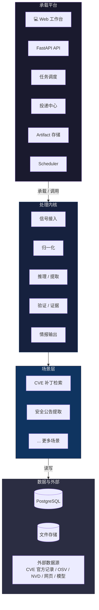
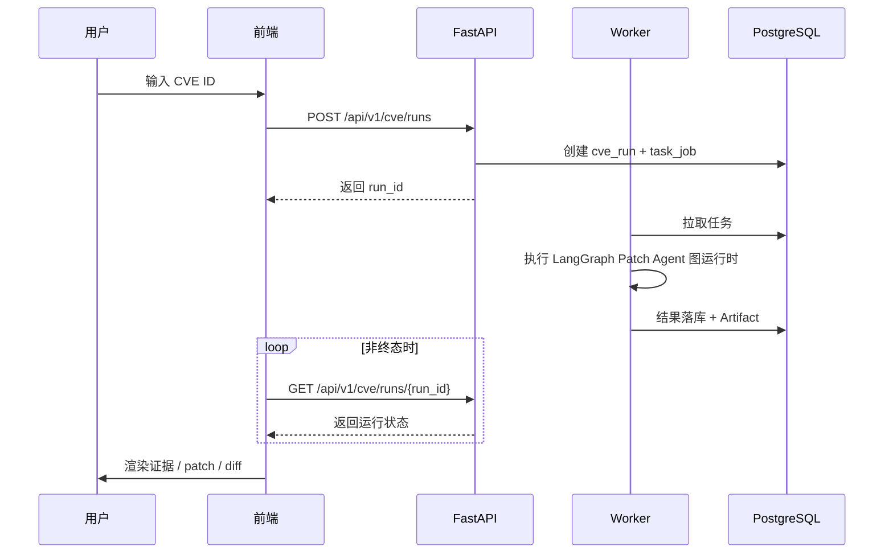
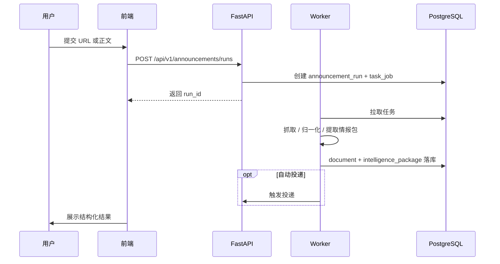
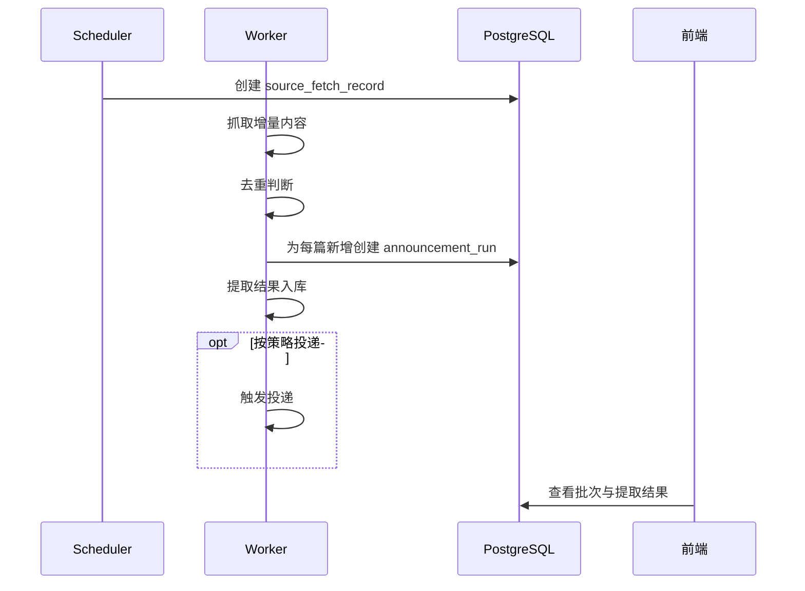

# 系统架构设计

> **整体技术架构说明**

> 读前建议：先阅读 [`总体设计`](../00-总设计/总体项目设计.md)。本文负责承载平台与运行形态展开。

---

## 📐 系统架构图

---

## 🏗️ 总体边界与工程分层

### 总体边界

按 [`总体设计`](../00-总设计/总体项目设计.md) 的定义，当前仓库区分两层：

1. **处理内核**：负责把原始信号加工成结构化情报。
2. **承载平台**：负责提供任务、调度、Artifact、工作台、投递和系统入口。

本文下面的分层架构，是在这个前提下对承载平台和引擎挂接点做工程展开，不重新定义系统总边界。

---

## 🧭 v1 运行拓扑口径

- v1 保留 `API / Worker / Scheduler` 三个逻辑角色。
- 三个逻辑角色可同进程运行，也可按调试需要拆分为多个本地进程。
- 当前系统成立不依赖消息队列和外部调度基础设施。
- Phase 2 只要求 `API + Worker` 真实闭环；`scheduler` 在早期阶段只保留 entrypoint 与 heartbeat。

---

## 🏗️ 分层架构

### 客户端层
**职责**：统一工作台、场景入口、结果展示、配置管理

**技术**：
- Web: React + Vite + TypeScript
- 路由: React Router
- 数据获取: 基于 HTTP API 的查询与轮询

**实现边界**：
- 一级导航固定为首页、CVE、公告
- 投递中心与系统页作为工具导航
- 路由、组件分层、查询与轮询策略以下位文档 `前端架构设计.md` 为准

---

### 接入层
**职责**：请求接入、参数校验、统一响应结构

**技术**：
- FastAPI
- 反向代理使用 Nginx 或等价组件

---

### 平台服务层
**职责**：
- 平台任务创建、调度和重试
- 投递目标管理与投递记录
- URL 抓取、正文归一化、Artifact 持久化
- 系统健康与执行状态聚合

**模块划分**：
- 任务执行中心
- 投递中心
- 文档采集与 Artifact 中心
- 系统配置与健康观测

---

### 处理内核层
**职责**：
- 承载与业务场景强绑定的处理主链
- 定义场景自己的 run / result schema
- 统一沉淀信号处理、证据绑定、结果收敛等核心运行时能力
- 通过承载平台复用任务、投递、文档采集等共用能力

**场景层**：
- 按需注册的情报处理场景（首批：CVE 补丁检索、安全公告提取）

---

### 执行层
**职责**：
- Worker 消费后台任务
- Scheduler 触发定时任务
- 与外部数据源、模型服务和投递通道集成

**说明**：
- 平台统一后台执行形态
- 场景不共享领域结果结构，但共享任务和重试机制
- 每一次场景执行都会创建一个 `task_job`，并绑定一个唯一的场景 `run`
- 平台级 `/retry` 只会为同一个 `job/run` 增加新的 `task_attempt`，不会隐式生成新的场景 `run`
- 如果用户需要“重新跑一遍”，必须重新调用场景 API，创建新的 `task_job + run`
- 安全公告监控批次记录在 `source_fetch_records`，批次触发的单文档提取 run 通过 `trigger_fetch_id` 与批次稳定关联

---

### 数据层
**职责**：持久化任务、投递、场景结果与证据

**技术**：
- **关系型数据库**：PostgreSQL
- **缓存**：v1 不引入独立缓存服务
- **文件存储**：本地 Artifact 存储，后续可切 S3 兼容对象存储

---

## 🔄 交互流程

### 典型 CVE 请求流程

补充说明：

- CVE 场景的正式架构目标是 `LangGraph` 编排的受控多跳 Patch Agent。
- Worker 执行的核心不是固定线性规则链，而是图运行时中的多轮搜索、候选收敛、下载验证和结果收口。
- 页面抓取、候选识别和 patch 下载属于工具层能力；页面扩展、跨域选择和停止条件由 Agent 决策与预算共同决定。

### 典型公告提取流程

### 典型监控流程

---

## 🔐 安全设计

### 当前认证授权
- **认证方式**：v1 暂不引入登录认证
- **部署假设**：单租户内部环境部署
- **权限控制**：无用户级权限，依赖部署环境隔离

### 数据安全
- **传输加密**：HTTPS/TLS
- **敏感配置**：通过环境变量与密文配置管理，不写死在代码或前端
- **Artifact 访问**：通过 API 间接读取，不直接暴露磁盘路径

### 接口安全
- 请求体校验和参数白名单
- 外部抓取域名与协议限制
- 投递目标与第三方密钥脱敏展示
- 关键操作写入审计记录

---

## 📊 性能设计

### 异步处理
- 长任务全部由后台 Worker 执行
- API 不阻塞等待最终结果
- 前端通过轮询或事件更新查看状态

### 数据库优化
- 高频查询字段建立索引
- 大字段使用 JSONB 或独立 Artifact 存储
- 按场景隔离查询表，避免单表承载所有运行结果

### 并发处理
- Worker 可多实例水平扩展
- Scheduler 作为逻辑角色可拆分，早期阶段只保留 entrypoint 与 heartbeat
- 外部抓取和模型调用要设置超时、重试和失败审计

---

## 🔧 技术栈总览

### 前端技术
| 技术 | 版本 | 用途 |
|------|------|------|
| React | 18.x | 页面渲染 |
| TypeScript | 5.x | 类型安全 |
| Vite | 6.x | 构建与开发服务器 |
| React Router | 6.x | 前端路由 |
| TanStack Query | 5.x | 查询、轮询与缓存 |

### 后端技术
| 技术 | 版本 | 用途 |
|------|------|------|
| Python | 3.11.x | 服务端语言 |
| FastAPI | 0.115.x | HTTP API |
| SQLAlchemy | 2.x | ORM/数据库访问 |
| Alembic | 1.14.x | 数据库迁移 |
| Pydantic | 2.x | 数据校验与序列化 |

### 基础设施
| 技术 | 版本 | 用途 |
|------|------|------|
| PostgreSQL | 16.x | 主数据库 |
| Playwright | 1.x | 动态页面抓取适配 |
| 邮件/微信/Webhook 通道 | 按渠道接入 | 结果投递 |

---

## 🚀 部署架构

### 开发环境
- 单机开发
- API / Worker / Scheduler 保留逻辑角色，可同进程运行，也可按调试需要拆分为多个本地进程
- PostgreSQL 单实例

### 生产环境
- 单机/单实例优先，不依赖消息队列和外部调度基础设施
- API / Worker / Scheduler 可按部署需要拆分为独立进程或容器
- 前端静态资源与 API 可按发布需要拆分
- PostgreSQL 独立数据库实例
- Artifact 存储默认本地挂载目录，后续可替换为对象存储

---

## 📝 设计原则

1. **平台与场景分层**：平台只做共用底座，场景自管领域语义。
2. **真实闭环优先**：不为抽象而抽象，两个场景都必须可真实运行。
3. **结果可追溯**：结论必须能回溯到来源、原文和证据。
4. **长任务后台化**：手动触发和定时任务统一纳入后台执行。
5. **不复活 legacy**：不把新能力塞回旧 `pipeline/product/diagnostics` 叙事。

---

## 🔄 架构演进

### 当前版本
- 单租户
- PostgreSQL 唯一后端
- 首批场景：CVE 补丁检索、安全公告提取
- 承载平台统一任务与投递底座

### 未来规划
- 增加更多安全情报场景
- 引入对象存储与更强任务队列
- 在真实需求出现后再评估认证、多租户和更细权限

---

## 📖 相关文档

- `前端架构设计.md`
- `技术选型.md`
- `../04-功能设计/README.md`
- `../13-界面设计/README.md`

---

## 🔄 变更记录

### v1.0 - 2026-04-09
- 初始化系统架构设计

### v1.1 - 2026-04-10
- 增加客户端层的前端实现边界说明
- 把前端架构文档纳入系统架构展开链路

### v1.2 - 2026-04-10
- 统一 v1 运行拓扑为“逻辑角色可拆分，但不依赖外部调度基础设施”
- 明确 scheduler 在早期阶段只保留 entrypoint 与 heartbeat

### v2.0 - 2026-04-20
- 将 CVE 场景的系统架构口径切换为 `LangGraph Patch Agent`。
- 将 Worker 执行主线切换为图运行时、预算治理与候选收敛叙事。

---

**文档版本**：v2.0
**创建日期**：2026-04-09
**最后更新**：2026-04-20
