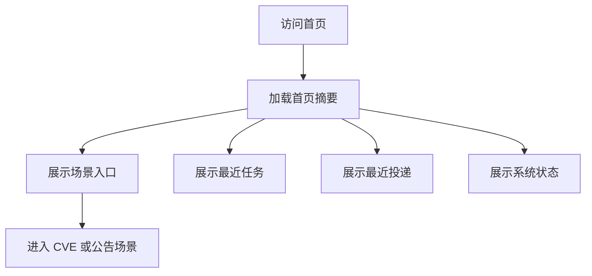

# 平台首页与场景入口功能设计

> **平台首页详细功能设计文档**

---

## 📋 模块概述

**模块名称**：平台首页与场景入口  
**模块编号**：M001  
**优先级**：P0  
**负责人**：AI + 开发团队  
**状态**：已实现最小闭环，持续迭代中

---

## 🎯 功能目标

### 业务目标
为整个系统提供一个统一入口，让用户在不进入旧后台壳语义的前提下，直接看到两个场景、最近运行、最近投递和系统状态。

### 用户价值
- 第一次进入系统就能理解“这是什么平台、能做什么”。
- 不需要先理解后台菜单结构，就能直接进入 CVE 或公告场景。
- 能快速感知当前系统是否可用、最近有哪些任务和投递活动。

---

## 👥 使用场景

### 场景1：首次进入平台
**场景描述**：用户第一次打开系统，需要迅速理解可用能力。

**用户操作流程**：
1. 用户访问首页 `/`
2. 系统展示两个场景入口卡片
3. 用户点击进入 `CVE 检索工作台` 或 `安全公告工作台`

---

### 场景2：查看最近运行状态
**场景描述**：用户不想进入具体场景，也希望先知道系统最近发生了什么。

**用户操作流程**：
1. 用户打开首页
2. 查看最近任务列表
3. 查看最近投递记录
4. 如有失败项，点击进入对应详情页

---

## 🔄 业务流程

### 主流程
```text
用户进入首页
  -> 加载首页聚合摘要
  -> 展示场景卡片/最近任务/最近投递/系统状态
  -> 用户进入具体场景
```

### 流程图


---

## 📊 功能清单

| 功能点 | 功能描述 | 优先级 | 状态 |
|--------|---------|--------|------|
| 场景入口卡片 | 展示两个场景的作用与入口 | P0 | 🟢 已实现 |
| 最近任务 | 展示最近执行中的/失败的任务 | P0 | 🟢 已实现 |
| 最近投递 | 展示最近投递记录与状态 | P1 | 🟢 已实现 |
| 系统状态摘要 | 展示 API / Worker / Scheduler / Database 健康 | P1 | 🟢 已实现 |
| 跳转动作 | 跳转到场景页、任务中心和系统状态页 | P1 | 🟢 已实现 |

---

## 🎨 界面设计

### 页面1：平台首页
**页面路径**：`/`

**页面元素**：
- 平台标题与一句话定位
- 两个场景入口卡片
- 最近任务卡片
- 最近投递卡片
- 系统健康摘要卡片

**交互说明**：
- 点击 `进入 CVE 检索`：跳转 `/cve`
- 点击 `进入安全公告`：跳转 `/announcements`
- 点击某条任务：跳转对应运行详情
- 点击某条投递记录：跳转投递中心筛选视图

---

## 🗺️ 页面映射

- 主页面规格：`../13-界面设计/P001-平台首页页面设计.md`
- 横向导航约束：`../13-界面设计/U001-信息架构与导航设计.md`
- 视觉基线：`../13-界面设计/U002-视觉基线与继承策略.md`

**页面边界**：
- 本模块负责首页摘要语义与聚合接口。
- 页面规格负责首页区块层级、降级态和视觉焦点。

---

## 💾 数据设计

### 涉及的数据表
- `task_jobs` - 最近任务摘要
- `delivery_records` - 最近投递摘要

### 核心数据字段

#### 首页摘要对象
| 字段名 | 类型 | 必填 | 说明 |
|--------|------|------|------|
| platform_name | string | 是 | 平台名称 |
| scenes | array | 是 | 场景入口卡片列表 |
| recent_jobs | array | 是 | 最近任务摘要 |
| recent_deliveries | array | 是 | 最近投递摘要 |
| health | object | 是 | 系统状态摘要 |

---

## 🔌 接口设计

### 接口1：获取首页聚合摘要
**接口路径**：`GET /api/v1/platform/home-summary`

**响应数据**：
```json
{
  "code": 0,
  "message": "success",
  "data": {
    "platform_name": "AetherFlow",
    "scenes": [
      {
        "scene_name": "cve",
        "title": "CVE 补丁检索",
        "path": "/cve"
      },
      {
        "scene_name": "announcement",
        "title": "安全公告提取",
        "path": "/announcements"
      }
    ],
    "recent_jobs": [],
    "recent_deliveries": [],
    "health": {
      "api": "healthy",
      "worker": "healthy",
      "scheduler": "healthy"
    }
  }
}
```

**业务规则**：
- 最近任务默认返回最近 10 条
- 最近投递默认返回最近 10 条
- 首页不展示冗长表格，以摘要信息为主
- 首页只承载摘要与跳转，不承载编辑、重试、计划发送等执行动作

---

## 📦 前端状态对象

#### HomeDashboardPageState
| 字段名 | 类型 | 必填 | 说明 |
|--------|------|------|------|
| loading | boolean | 是 | 是否处于首页聚合加载中 |
| degraded | boolean | 是 | 是否进入摘要降级态 |
| error_message | string | 否 | 首页摘要失败提示 |
| summary | object | 否 | 首页聚合对象 |

---

## 🔁 子流程/状态机

### 首页加载状态机
```text
idle
  -> loading
  -> ready

loading
  -> degraded_ready
  -> failed_with_fallback
```

**状态说明**：
- `ready`：首页摘要完整返回。
- `degraded_ready`：场景入口可用，但任务/投递/健康有部分缺失。
- `failed_with_fallback`：聚合接口失败，仅保留静态入口和失败提示。

---

## ✅ 业务规则

### 规则1：首页只展示摘要，不承载具体处理操作
**规则描述**：首页只作为入口和摘要中心，不在首页直接嵌入复杂场景表单。

**触发条件**：设计首页页面内容时

**规则处理**：复杂交互必须进入场景工作台完成

---

### 规则2：场景入口优先于后台模块入口
**规则描述**：导航表达必须围绕场景，而不是围绕平台内部模块。

**触发条件**：设计导航、卡片、按钮命名时

**规则处理**：优先使用“进入 CVE / 进入公告”，不使用“进入任务管理后台”作为主入口

---

## 🚨 异常处理

### 异常1：首页摘要接口失败
**触发条件**：接口超时、后端不可用或聚合查询失败

**错误提示**：`首页摘要加载失败，请稍后重试`

**处理方案**：
- 保留静态场景入口
- 最近任务和健康卡片显示降级状态

---

## 📝 当前实现说明

- 前端首页已经真实消费 `GET /api/v1/platform/home-summary`，不是静态占位卡片。
- 聚合摘要当前覆盖场景入口、最近任务、最近投递和健康摘要四块信息。
- 首页保留“摘要优先”的边界，详细操作下沉到任务中心、投递中心和场景工作台。

---

## 🔐 权限控制

### 访问权限
- v1 单租户无认证，内部用户均可访问首页

### 数据权限
- 首页展示的是全局摘要，无用户级过滤

---

## 📝 开发要点

### 技术难点
1. 首页需要聚合多个域的数据，但不能变成一个复杂大接口。
2. 需要避免视觉表达回到传统后台首页样式。

### 性能要求
- 首页聚合接口响应时间：目标 < 500ms

### 注意事项
- 首页不做详细任务列表分页
- 仅显示最近运行与健康摘要

---

## 🧪 测试要点

### 功能测试
- [x] 首页能正确显示两个场景入口
- [x] 首页能显示最近任务与投递摘要

### 边界测试
- [x] 聚合接口部分失败时页面能降级
- [x] 最近任务为空时页面仍正常展示

---

## 📅 开发计划

| 阶段 | 任务 | 预计工时 | 负责人 | 状态 |
|------|------|---------|--------|------|
| 设计 | 完成首页设计文档 | 0.5天 | AI | ✅ |
| 开发 | 聚合摘要接口开发 | 1天 | - | ✅ |
| 开发 | 首页前端开发 | 1天 | - | ✅ |
| 测试 | 聚合与降级测试 | 0.5天 | - | 🟡 |

---

## 📖 相关文档

- `README.md`
- `M002-平台任务执行与调度中心功能设计.md`
- `M003-平台投递目标与投递记录功能设计.md`
- `M005-平台系统配置与健康观测功能设计.md`
- `../13-界面设计/P001-平台首页页面设计.md`

---

## 🔄 变更记录

### v1.0 - 2026-04-09
- 初始化平台首页设计

### v1.1 - 2026-04-09
- 回填首页页面映射、前端状态对象与页面状态机

### v1.2 - 2026-04-17
- 同步平台首页摘要接口、最近任务、最近投递和系统状态摘要已落地。
- 把模块状态从“设计中”更新为“最小闭环已实现，持续迭代中”。
- 回写测试要点与开发计划当前阶段。

---

**文档版本**：v1.2  
**创建日期**：2026-04-09  
**最后更新**：2026-04-17  
**维护人**：AI + 开发团队
