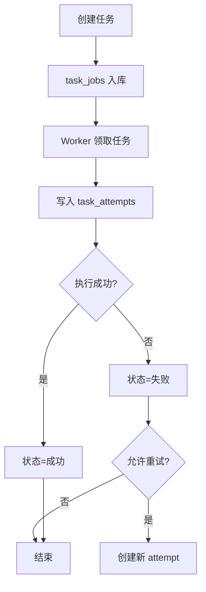

# 平台任务执行与调度中心功能设计

> **平台任务底座详细功能设计文档**

---

## 📋 模块概述

**模块名称**：平台任务执行与调度中心  
**模块编号**：M002  
**优先级**：P0  
**负责人**：AI + 开发团队  
**状态**：已实现最小平台任务中心，持续扩展中

---

## 🎯 功能目标

### 业务目标
把所有带场景 `run` 语义的长任务统一放到后台执行体系中，支撑：

- CVE fast-first run
- 安全公告手动提取
- 安全公告监控触发的单文档提取
- 失败任务重试

### 用户价值
- 用户不需要等待长任务在请求内完成。
- 用户可以追踪任务状态、查看失败原因和进行重试。

### v1 运行拓扑约束
- v1 保留 `api / worker / scheduler` 三个逻辑角色。
- Phase 2 先验证 `api + worker` 的手动任务闭环。
- `scheduler` 在早期阶段只保留 entrypoint 与 heartbeat，监控链路启用后再承担定时扫描。
- 当前 `main` 已开放平台任务查询、任务详情与失败任务重排接口，并由任务中心页面真实消费。
- 当前仍需保守处理的是 scheduler 的完整自动调度语义，不应把 heartbeat、监控触发和到期投递处理写成完整调度平台已经收口。

---

## 👥 使用场景

### 场景1：手动触发任务
**场景描述**：用户提交 CVE 或安全公告分析请求。

**用户操作流程**：
1. 前端调用场景 API
2. 场景 API 创建平台任务
3. Worker 异步执行
4. 前端轮询场景结果

---

### 场景2：定时任务触发
**场景描述**：安全公告监控源按调度计划自动执行，并为新增文档创建场景 run。

**用户操作流程**：
1. Scheduler 到点扫描启用的监控源
2. 先创建抓取批次记录
3. 对每个新增文档创建场景 `task_job + run`
4. Worker 消费任务并处理

---

### 场景3：任务失败后重试
**场景描述**：场景执行失败后，用户希望重新执行同一个 run。

**用户操作流程**：
1. 用户在任务详情或记录页点击重试
2. 系统为同一个 job 创建新的 attempt
3. Worker 在同一个场景 run 上重新执行

---

## 🔄 业务流程

### 主流程
```text
场景请求/调度触发
  -> 创建 task_job
  -> Worker claim 任务
  -> 记录 task_attempt
  -> 执行业务处理
  -> 更新任务状态
  -> 前端查看结果
```

### 流程图


---

## 📊 功能清单

| 功能点 | 功能描述 | 优先级 | 状态 |
|--------|---------|--------|------|
| 任务创建 | 由场景 API 创建后台任务并保存输入快照 | P0 | 🟢 已实现 |
| Worker 消费 | 后台 Worker 领取并执行任务 | P0 | 🟢 已实现 |
| Scheduler 心跳 | Scheduler 写入最小存活快照 | P0 | 🟢 已实现 |
| 调度触发 | Scheduler 创建监控抓取与到期投递执行 | P1 | 🟡 已实现最小切片 |
| 重试机制 | 支持失败任务重试 | P1 | 🟢 已实现 |
| 任务列表/详情 | 支持查询任务和 attempt 详情 | P1 | 🟢 已实现 |

---

## 🎨 界面设计

### 页面1：任务列表
**页面路径**：`/system/tasks`（可作为内部页面或后续系统页）

**页面元素**：
- 任务类型筛选
- 状态筛选
- 最近任务列表
- 重试按钮

**交互说明**：
- 点击任务：查看详情
- 点击重试：创建新的任务尝试

---

## 🗺️ 页面映射

- 主页面规格：`../13-界面设计/P002-平台任务中心页面设计.md`
- 首页联动：`../13-界面设计/P001-平台首页页面设计.md`
- 前端实现边界：`../03-系统架构/前端架构设计.md`

**页面边界**：
- 本模块负责任务与 attempt 的平台契约。
- `P002` 负责任务列表、详情抽屉与重试动作的前端组织。
- 当前 `P002` 已接入真实任务接口，不再只是路由壳。

---

## 💾 数据设计

### 涉及的数据表
- `task_jobs`
- `task_attempts`

### 核心数据字段

#### TaskJob
| 字段名 | 类型 | 必填 | 说明 |
|--------|------|------|------|
| job_id | uuid | 是 | 主键 |
| scene_name | string | 是 | 场景名，v1 固定为 cve/announcement |
| job_type | string | 是 | 任务类型 |
| trigger_kind | string | 是 | 触发类型 |
| status | string | 是 | 当前状态 |
| payload_json | object | 是 | 输入快照 |
| scene_run_id | string | 否 | 展示层可返回的场景 run ID |

**契约说明**：
- 一个 `task_job` 只绑定一次场景执行。
- 一个 `task_job` 只对应一个场景 `run`。
- 平台级重试只增加 `task_attempt`，不新建 `run`。
- 用户如果要重新发起一次全新的业务执行，必须重新调用场景 API，生成新的 `task_job + run`。
- 不带场景 `run` 的平台批次记录，不进入 `task_jobs`。

---

## 🔌 接口设计

### 当前已开放接口1：查询任务列表
**接口路径**：`GET /api/v1/platform/tasks`

**请求参数**：
- `scene_name`
- `status`
- `trigger_kind`
- `page`
- `page_size`

**响应数据**：
```json
{
  "code": 0,
  "message": "success",
  "data": {
    "items": [
      {
        "job_id": "uuid",
        "scene_name": "announcement",
        "job_type": "announcement.manual_extract",
        "status": "running"
      }
    ],
    "total": 1
  }
}
```

---

### 当前已开放接口2：查询任务详情
**接口路径**：`GET /api/v1/platform/tasks/{job_id}`

**业务规则**：
- 返回任务主记录和 attempts
- 不直接返回场景大结果，但必须返回稳定的场景 `run_id`
- 场景 `run_id` 通过场景表中的 `job_id` 唯一回查，而不是通过弱多态 JSON 猜测

---

### 当前已开放接口3：重试任务
**接口路径**：`POST /api/v1/platform/tasks/{job_id}/retry`

**业务规则**：
- 只能重试失败态任务
- 重排会把同一个 job 更新回 `queued`，后续由 Worker 再次创建新的 attempt
- 如果用户需要新的业务运行，必须重新调用场景 API，不使用平台级 retry

---

## 📦 前端状态对象

#### TaskCenterPageState
| 字段名 | 类型 | 必填 | 说明 |
|--------|------|------|------|
| filters | object | 是 | 当前筛选条件 |
| loading | boolean | 是 | 任务列表是否加载中 |
| selected_job_id | string | 否 | 当前选中的任务 |
| retrying_job_id | string | 否 | 当前正在重试的任务 |

#### TaskJobDetailView
| 字段名 | 类型 | 必填 | 说明 |
|--------|------|------|------|
| job_id | string | 是 | 任务 ID |
| scene_run_id | string | 否 | 场景 run |
| payload_summary | object | 否 | 输入快照摘要 |
| attempts | array | 是 | attempt 列表 |

---

## 🔁 子流程/状态机

### 任务中心状态机
```text
list_loading
  -> list_ready
  -> list_empty

list_ready
  -> detail_loading
  -> detail_ready
  -> retry_pending
  -> retry_created
  -> retry_failed
```

**状态说明**：
- `detail_loading` 与列表并行存在，不阻塞主列表。
- `retry_created` 只表示创建了新的 attempt，不表示业务已经成功。

---

## ✅ 业务规则

### 规则1：场景通过自己的 API 创建任务
**规则描述**：平台任务中心不直接暴露“创建任意场景任务”的用户接口。

**触发条件**：用户发起 CVE 或公告处理

**规则处理**：
- 由场景 API 写入 `task_jobs`
- 平台只负责执行与查询

---

### 规则2：任务状态是平台语义，结果状态是场景语义
**规则描述**：任务中心只关心执行状态，不替代场景 run 的详细阶段定义。

**触发条件**：设计状态模型时

**规则处理**：
- `task_jobs.status` 只描述任务执行生命周期
- `cve_runs.phase`、`announcement_runs.stage` 由场景自管

### 规则3：重试不改变 run 身份
**规则描述**：平台级 `/retry` 的语义是“重新执行同一个业务 run”，不是“新建一次业务 run”。

**触发条件**：用户点击任务重试

**规则处理**：
- 创建新的 `task_attempt`
- 保留原 `job_id` 和原 `run_id`
- 需要全新 run 时，走场景 API 新建

### 规则4：平台重试只处理失败态 job，不替代场景新建 run
**规则描述**：当前任务中心已开放查询和重试，但平台级重试仍然只处理既有 job 的重新排队。

**触发条件**：设计任务中心接口和重试语义时

**规则处理**：
- 失败态任务才能重排
- 需要新 run 时必须回到场景 API 创建新的业务执行

---

## 🚨 异常处理

### 异常1：Worker 领取任务失败
**触发条件**：数据库锁冲突、连接失败

**错误提示**：任务短暂保持 `queued`

**处理方案**：
- Worker 退避重试
- 记录 attempt 失败原因

---

### 异常2：任务执行中进程崩溃
**触发条件**：Worker 异常退出

**错误提示**：任务卡在 `running`

**处理方案**：
- Phase 2 先通过 health summary 暴露异常，不自动回收 `running` 任务
- 自动回收和人工重试放到后续具备真实场景查询语义后再落地

---

## 🔐 权限控制

### 访问权限
- v1 无认证，内部用户均可查看任务

### 数据权限
- 所有任务按单租户全局可见

---

## 📝 开发要点

### 技术难点
1. 同一任务底座要承载手动任务和调度任务。
2. 需要保证场景结果更新和任务状态更新的一致性。

### 性能要求
- 创建任务接口响应时间：目标 < 200ms
- Worker 扫描待处理任务延迟：目标 < 2s

### 注意事项
- 不设计统一的跨场景 run 表
- 任务只引用场景结果，不吞并场景结果结构
- `scheduler` 是逻辑角色，不是早期阶段必须独立落地的前提组件
- Phase 2 不把测试夹具误包装成产品级“内部 helper”写接口

---

## 🧪 测试要点

### 功能测试
- [x] 场景创建的 `task_jobs` 能被 Worker 消费
- [x] Scheduler 能写入 heartbeat
- [x] 任务详情可查看 attempt 轨迹

### 边界测试
- [x] 失败态以外的任务不能重排
- [x] Worker 进程退出后，health summary 能把 worker 判为降级或下线

---

## 📅 开发计划

| 阶段 | 任务 | 预计工时 | 负责人 | 状态 |
|------|------|---------|--------|------|
| 设计 | 完成任务底座设计 | 0.5天 | AI | ✅ |
| 开发 | 数据模型与任务服务 | 1.5天 | - | ✅ |
| 开发 | Worker / Scheduler | 2天 | - | 🟡 |
| 测试 | 任务流转与失败恢复 | 1天 | - | 🟡 |

---

## 📖 相关文档

- `M003-平台投递目标与投递记录功能设计.md`
- `M004-公共文档采集与Artifact基座功能设计.md`
- `../03-系统架构/数据库设计.md`
- `../13-界面设计/P002-平台任务中心页面设计.md`

---

## 🔄 变更记录

### v1.0 - 2026-04-09
- 初始化平台任务执行与调度设计

### v1.1 - 2026-04-10
- 回填任务中心页面映射、前端状态对象与状态机

### v1.2 - 2026-04-10
- 统一任务底座对 v1 运行拓扑的描述
- 明确 scheduler 在早期阶段只保留 entrypoint 与 heartbeat

### v1.3 - 2026-04-10
- 明确 Phase 2 只落运行时底座，不开放依赖 `scene_run_id` 的任务中心接口
- 把任务中心对外查询与重试语义延期到首个真实场景写路径落地之后

### v1.4 - 2026-04-16
- 把示例中的 `CVE graph run` 更新为当前真实的 `CVE fast-first run` 口径。

### v1.5 - 2026-04-17
- 同步平台任务列表、详情和失败任务重排接口已经开放。
- 同步任务中心页面已接入真实接口，不再是路由壳。
- 收口 scheduler 口径，明确当前仅实现 heartbeat、监控抓取和到期投递等最小职责。

---

**文档版本**：v1.5
**创建日期**：2026-04-09
**最后更新**：2026-04-17
**维护人**：AI + 开发团队
