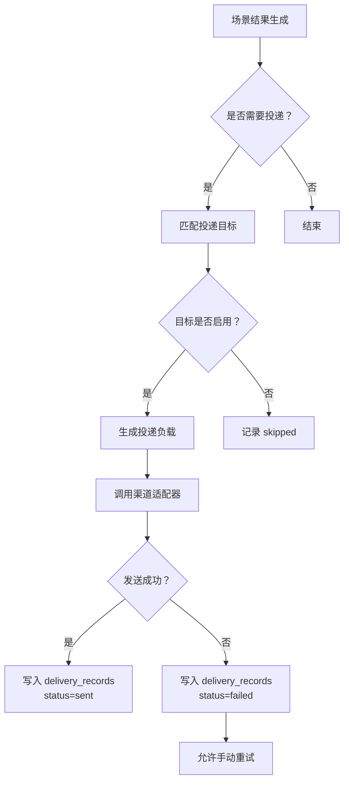

# 平台投递目标与投递记录功能设计

> **平台投递中心详细功能设计文档**

---

## 📋 模块概述

**模块名称**：平台投递目标与投递记录  
**模块编号**：M003  
**优先级**：P0  
**负责人**：AI + 开发团队  
**状态**：部分实现

---

## 🎯 功能目标

### 业务目标
统一承载邮件、微信/企业微信和 Webhook 三类投递渠道，为安全公告结果和未来场景提供统一投递底座。

### 用户价值
- 在一个地方管理所有通知目标。
- 能查看每次投递成功/失败情况。
- 遇到失败能重试，不必回到场景里重新跑整个任务。

---

## 👥 使用场景

### 场景1：新增投递目标
**场景描述**：用户想新增一个邮件地址、机器人地址或 Webhook 端点。

**用户操作流程**：
1. 进入投递管理页
2. 选择渠道类型
3. 填写目标配置
4. 保存并测试

---

### 场景2：查看投递记录
**场景描述**：用户收到异常通知，需要确认是否投递失败。

**用户操作流程**：
1. 打开投递记录页
2. 按场景、渠道或状态筛选
3. 查看投递摘要与错误信息

---

## 🔄 业务流程

### 主流程



---

## 📊 功能清单

| 功能点 | 功能描述 | 优先级 | 状态 |
|--------|---------|--------|------|
| 投递目标 CRUD | 新增、编辑、启停投递目标 | P0 | 🟡 已实现最小闭环 |
| 渠道适配 | 邮件、微信/企业微信、Webhook | P0 | ⚪ 未开始 |
| 投递记录查询 | 查询历史记录与失败原因 | P0 | 🟡 已实现基础查询与 URL 持久化筛选 |
| 重试 | 对失败记录重新投递 | P1 | ⚪ 未开始 |

---

## 🎨 界面设计

### 页面1：投递目标管理
**页面路径**：`/deliveries`

**页面元素**：
- 目标列表
- 新建按钮
- 启用/禁用开关
- 渠道类型标签

**交互说明**：
- 点击新增：打开最小目标表单，支持名称、渠道类型、启用状态、`config_json`
- 点击编辑：修改名称、渠道类型、启用状态和 `config_json`
- 点击测试：发送测试消息

---

### 页面2：投递记录
**页面路径**：`/deliveries?tab=records`

**页面元素**：
- 记录列表
- 状态筛选
- 场景筛选
- 渠道筛选
- 重试按钮

---

## 🗺️ 页面映射

- 主页面规格：`../13-界面设计/P003-平台投递中心页面设计.md`
- 公告结果区块联动：`../13-界面设计/P205-安全公告结果投递区块设计.md`
- 前端实现边界：`../03-系统架构/前端架构设计.md`

**页面边界**：
- 本模块负责投递目标和投递记录的统一平台契约。
- `P003` 负责目标管理 tab、记录 tab、测试发送和重试的页面组织。

---

## 💾 数据设计

### 涉及的数据表
- `delivery_targets`
- `delivery_records`

### 核心数据字段

#### DeliveryTarget
| 字段名 | 类型 | 必填 | 说明 |
|--------|------|------|------|
| target_id | uuid | 是 | 主键 |
| name | string | 是 | 目标名称 |
| channel_type | string | 是 | email/wecom/webhook |
| enabled | boolean | 是 | 是否启用 |
| config_json | object | 是 | 配置 |

#### DeliveryRecord
| 字段名 | 类型 | 必填 | 说明 |
|--------|------|------|------|
| record_id | uuid | 是 | 主键 |
| target_id | uuid | 是 | 目标 ID |
| scene_name | string | 是 | 来源场景 |
| status | string | 是 | 投递状态 |
| error_message | string | 否 | 错误信息 |

---

## 🔌 接口设计

### 接口1：查询投递目标
**接口路径**：`GET /api/v1/platform/delivery-targets`

### 接口2：新建投递目标
**接口路径**：`POST /api/v1/platform/delivery-targets`

**请求参数**：
```json
{
  "name": "SecOps 邮件组",
  "channel_type": "email",
  "enabled": true,
  "config_json": {
    "recipients": ["secops@example.com"],
    "scene_names": ["announcement"]
  }
}
```

### 接口3：更新投递目标
**接口路径**：`PATCH /api/v1/platform/delivery-targets/{target_id}`

**最小可编辑字段**：
- `name`
- `channel_type`
- `enabled`
- `config_json`

### 接口4：测试发送
**接口路径**：`POST /api/v1/platform/delivery-targets/{target_id}/test`

### 接口5：查询投递记录
**接口路径**：`GET /api/v1/platform/delivery-records`

**当前支持的筛选参数**：
- `scene_name`
- `status`
- `channel_type`

### 接口6：重试投递
**接口路径**：`POST /api/v1/platform/delivery-records/{record_id}/retry`

---

## 📦 前端状态对象

#### DeliveryCenterPageState
| 字段名 | 类型 | 必填 | 说明 |
|--------|------|------|------|
| active_tab | string | 是 | `targets/records` |
| filters | object | 否 | 记录筛选条件 |
| editing_target_id | string | 否 | 当前编辑的目标 |
| testing_target_id | string | 否 | 当前测试发送的目标 |
| retrying_record_id | string | 否 | 当前重试的记录 |

---

## 🔁 子流程/状态机

### 投递中心状态机
```text
targets_ready
  -> editor_open
  -> saving_target
  -> testing_target

records_ready
  -> filtering
  -> retrying_record
  -> retry_succeeded
  -> retry_failed
```

**状态说明**：
- 目标管理与投递记录共处一页，但状态机分开。
- 测试发送与正式发送必须在记录层可区分。

---

## ✅ 业务规则

### 规则1：投递模板由场景生成，渠道由平台执行
**规则描述**：平台不负责理解场景语义，只负责发送场景给出的投递内容。

**触发条件**：场景发起投递时

**规则处理**：
- 场景生成摘要负载
- 平台渠道适配器负责转换为目标格式

---

### 规则2：目标禁用后不再参与新投递
**规则描述**：被禁用的投递目标不会接收新任务。

**触发条件**：目标 `enabled = false`

**规则处理**：跳过该目标，并在记录中标记 `skipped`

---

## 🚨 异常处理

### 异常1：渠道请求失败
**触发条件**：邮件服务器失败、Webhook 超时、微信接口报错

**错误提示**：`投递失败，请查看错误详情`

**处理方案**：
- 写入 `delivery_records`
- 保留失败原因
- 允许手动重试

---

### 异常2：配置缺失
**触发条件**：目标没有必要配置字段

**错误提示**：表单校验失败

**处理方案**：前端与后端双重校验，阻止保存

---

## 🔐 权限控制

### 访问权限
- v1 全局可见

### 数据权限
- 单租户共享

---

## 📝 开发要点

### 技术难点
1. 三类渠道配置结构不同，需要统一校验又保持扩展性。
2. 投递记录要足够详细，但不能存敏感明文。

### 性能要求
- 目标列表接口响应目标 < 300ms
- 单次投递失败要在超时阈值内快速返回

### 注意事项
- 敏感字段只存引用或脱敏内容
- 渠道测试发送需与正式发送隔离标记

---

## 🧪 测试要点

### 功能测试
- [x] 三类渠道目标都可按统一表单创建基础配置
- [x] 场景结果可创建投递记录
- [ ] 失败记录可重试

### 边界测试
- [x] 禁用目标不会继续投递
- [ ] 渠道返回异常时错误能被记录

---

## 📅 开发计划

| 阶段 | 任务 | 预计工时 | 负责人 | 状态 |
|------|------|---------|--------|------|
| 设计 | 完成投递中心设计 | 0.5天 | AI | ✅ |
| 开发 | 渠道模型与最小 CRUD | 1天 | - | 🟡 |
| 开发 | 渠道适配与重试 | 1.5天 | - | ⚪ |
| 测试 | 目标管理与记录筛选回归 | 1天 | - | 🟡 |

---

## 📖 相关文档

- `M002-平台任务执行与调度中心功能设计.md`
- `M205-安全公告投递触发与通知策略功能设计.md`
- `../13-界面设计/P003-平台投递中心页面设计.md`
- `../13-界面设计/P205-安全公告结果投递区块设计.md`

---

## 🔄 变更记录

### v1.0 - 2026-04-09
- 初始化平台投递中心设计

### v1.1 - 2026-04-10
- 回填投递中心页面映射、测试发送接口与前端状态机

### v1.2 - 2026-04-16
- 标记目标管理最小新建、编辑和启停能力已落地
- 回填投递记录的 `scene_name/status/channel_type` URL 筛选能力
- 更新接口字段为当前实现口径

---

**文档版本**：v1.2
**创建日期**：2026-04-09
**最后更新**：2026-04-16
**维护人**：AI + 开发团队
