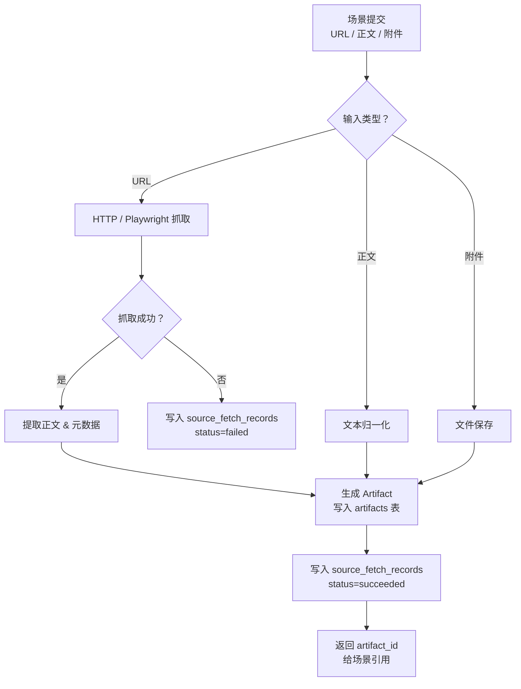

# 公共文档采集与 Artifact 基座功能设计

> **平台文档处理基座详细功能设计文档**

---

## 📋 模块概述

**模块名称**：公共文档采集与 Artifact 基座  
**模块编号**：M004  
**优先级**：P0  
**负责人**：AI + 开发团队  
**状态**：设计中

---

## 🎯 功能目标

### 业务目标
提供统一的文档处理底座，支撑两个场景对 URL、正文、HTML、patch 和原始附件的采集、归一化和持久化。

### 用户价值
- 用户看到的结果能回溯到原始文档和证据。
- 场景不必各自重复实现抓取和文件保存逻辑。
- 原文和归一化正文都有唯一的 canonical source，不会出现“业务表一份、Artifact 又一份”的双写口径。

### Phase 2 实现边界
- Phase 2 只落 Artifact 的最小存储、读取和 attempt 关联，不提前做 URL 抓取与 Playwright 动态抓取。
- URL 模式与抓取审计在首个真实场景切片接入时继续细化。

---

## 👥 使用场景

### 场景1：CVE 页面抓取
**场景描述**：CVE fast-first run 需要抓取引用页面和 patch 内容。

**用户操作流程**：
1. 场景服务提交 URL
2. 平台抓取页面
3. 保存 HTML/patch Artifact
4. 把 Artifact 引用返回场景

---

### 场景2：公告 URL 提取
**场景描述**：公告场景接收 URL，需获取正文、归一化内容并保存快照。

**用户操作流程**：
1. 用户提交 URL
2. 平台抓取页面并抽取正文
3. 保存原始快照与归一化正文
4. 公告场景继续提取结构化情报

---

## 🔄 业务流程

### 主流程

---

## 📊 功能清单

| 功能点 | 功能描述 | 优先级 | 状态 |
|--------|---------|--------|------|
| URL 抓取 | 抓取 HTML/文本内容 | P0 | ⚪ 未开始 |
| 正文归一化 | 清洗正文、提取标题与发布时间 | P0 | ⚪ 未开始 |
| Artifact 持久化 | 保存 HTML/text/patch/raw file | P0 | ⚪ 未开始 |
| 抓取审计 | 保存 source_fetch_records | P1 | ⚪ 未开始 |

---

## 🎨 界面设计

### 页面1：Artifact 查看入口
**页面路径**：由场景详情页间接进入，无独立用户入口为主

**页面元素**：
- Artifact 元数据
- 原文链接
- 内容预览或下载入口

**交互说明**：
- 点击证据片段：跳转到对应 Artifact 或定位内容

---

## 💾 数据设计

### 涉及的数据表
- `artifacts`
- `task_attempt_artifacts`
- `source_fetch_records`

### 核心数据字段

#### Artifact
| 字段名 | 类型 | 必填 | 说明 |
|--------|------|------|------|
| artifact_id | uuid | 是 | 主键 |
| artifact_kind | string | 是 | html/text/patch/raw_file |
| source_url | string | 否 | 来源 URL |
| storage_path | string | 是 | 存储路径 |
| checksum | string | 是 | 校验值 |

#### TaskAttemptArtifact
| 字段名 | 类型 | 必填 | 说明 |
|--------|------|------|------|
| attempt_id | uuid | 是 | 关联 `task_attempts` |
| artifact_id | uuid | 是 | 关联 `artifacts` |
| created_at | timestamptz | 是 | 关联创建时间 |

---

## 🔌 接口设计

### 接口1：读取 Artifact 元数据
**接口路径**：`GET /api/v1/platform/artifacts/{artifact_id}`

### 接口2：读取 Artifact 内容
**接口路径**：`GET /api/v1/platform/artifacts/{artifact_id}/content`

**业务规则**：
- 对于 patch/text 类内容可直接文本返回
- 对于 binary/raw file 返回下载流

---

## ✅ 业务规则

### 规则1：大内容必须走 Artifact
**规则描述**：HTML、正文快照、patch 和抓取文件不直接塞进场景业务表。

**触发条件**：保存大文本或文件内容时

**规则处理**：统一保存为 Artifact，再在场景表中引用

### 规则3：归一化正文也属于 Artifact
**规则描述**：对安全公告场景而言，原文快照和归一化正文都属于大文本内容，canonical source 都是 Artifact。

**触发条件**：保存公告正文、归一化文本或抓取快照时

**规则处理**：
- `announcement_documents` 只保留 `source_artifact_id`、`normalized_text_artifact_id` 和摘要字段
- 提取器和证据定位统一从 Artifact 读取 canonical text

---

### 规则2：抓取行为必须留痕
**规则描述**：任何外部抓取都要留下抓取记录与结果摘要。

**触发条件**：调用外部页面抓取时

**规则处理**：写入 `source_fetch_records`

### 规则4：Artifact 保持中立，attempt 归属通过关联表表达
**规则描述**：`artifacts` 只描述内容对象本身，不在主表里直接写“由哪次 attempt 产出”。

**触发条件**：需要回查某次任务尝试产出了哪些 Artifact 时

**规则处理**：
- 通过 `task_attempt_artifacts` 表记录运行时归属
- 不在 `artifacts` 主表中增加 `producer_attempt_id` 一类字段

---

## 🚨 异常处理

### 异常1：页面抓取失败
**触发条件**：页面超时、证书异常、域名不可达

**错误提示**：按场景返回“抓取失败”

**处理方案**：
- 抓取记录写失败状态
- 场景决定是否重试或降级

---

### 异常2：正文提取失败
**触发条件**：页面结构异常，无法抽取正文

**错误提示**：`正文提取失败，将保留原始快照`

**处理方案**：
- 保存原始 HTML Artifact
- 场景可回退到原文文本处理或标记失败

---

## 🔐 权限控制

### 访问权限
- 通过场景详情页或平台 Artifact API 间接访问

### 数据权限
- v1 单租户全局可见，但不直接暴露磁盘路径

---

## 📝 开发要点

### 技术难点
1. 既要支持简单 HTML 抓取，也要支撑 Playwright 动态页面抓取。
2. 需要统一文本、patch 和原始附件的存储与读取方式。

### 性能要求
- 单次普通页面抓取超时默认 < 15s
- 动态抓取要有更严格的域名白名单与超时控制

### 注意事项
- 必须保存 checksum 以支持去重
- 必须记录来源 URL 和采集时间
- Phase 2 先保证文件落盘与内容读取闭环，不提前耦合场景抓取逻辑

---

## 🧪 测试要点

### 功能测试
- [ ] 一次 attempt 成功后能生成 Artifact 并写入关联表
- [ ] Patch 内容可通过 Artifact API 读取
- [ ] `task_attempt_artifacts` 可回查某次 attempt 的输出

### 边界测试
- [ ] Artifact API 不暴露底层磁盘路径
- [ ] Phase 2 不因未实现 URL 抓取而阻塞最小 Artifact 闭环

---

## 📅 开发计划

| 阶段 | 任务 | 预计工时 | 负责人 | 状态 |
|------|------|---------|--------|------|
| 设计 | 完成 Artifact 基座设计 | 0.5天 | AI | ✅ |
| 开发 | Artifact 存储与读取 | 1天 | - | ⚪ |
| 开发 | HTTP/Playwright 抓取 | 1.5天 | - | ⚪ |
| 测试 | 抓取与文件读取测试 | 1天 | - | ⚪ |

---

## 📖 相关文档

- `M103-CVE数据源与页面探索规则功能设计.md`
- `M201-安全公告手动提取功能设计.md`
- `M206-安全公告来源适配器功能设计.md`

---

## 🔄 变更记录

### v1.0 - 2026-04-09
- 初始化文档采集与 Artifact 基座设计

### v1.1 - 2026-04-16
- 把场景示例中的 `CVE graph run` 更新为当前真实的 `CVE fast-first run` 口径。

---

**文档版本**：v1.1
**创建日期**：2026-04-09
**最后更新**：2026-04-16
**维护人**：AI + 开发团队
