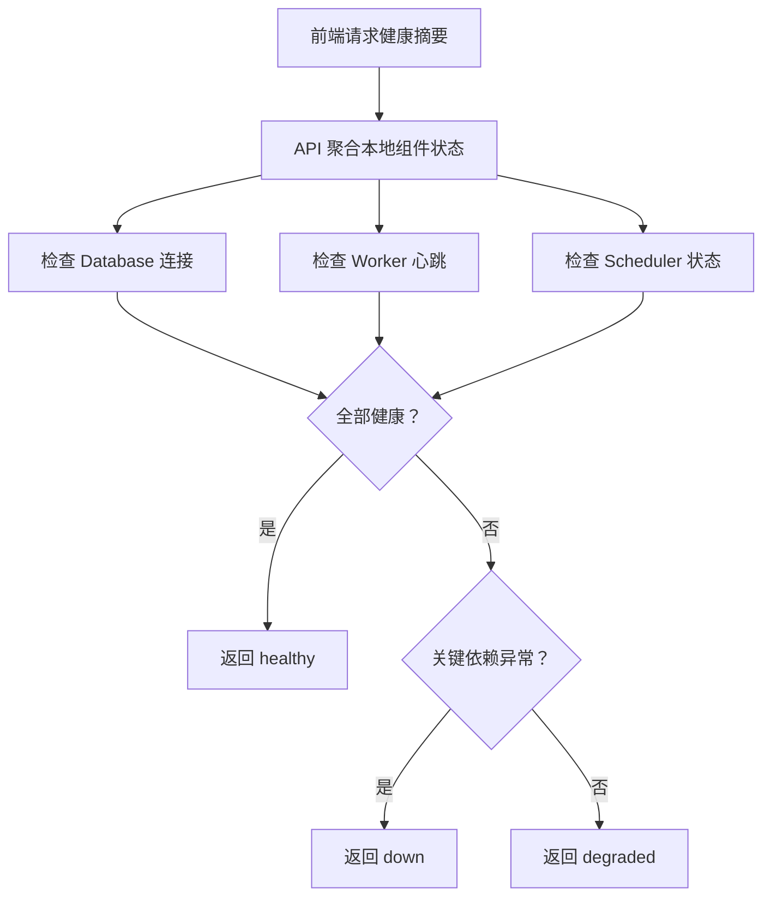
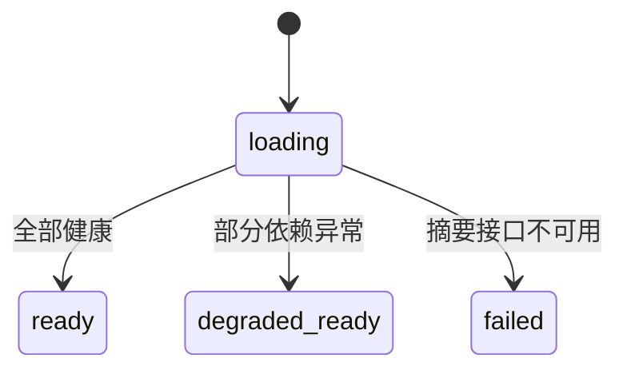

# 平台系统配置与健康观测功能设计

> **平台配置与健康观测详细功能设计文档**

---

## 📋 模块概述

**模块名称**：平台系统配置与健康观测  
**模块编号**：M005  
**优先级**：P1  
**负责人**：AI + 开发团队  
**状态**：已实现最小健康观测，持续补强中

---

## 🎯 功能目标

### 业务目标
为前端首页和运维排障提供必要的系统健康信息、运行组件状态和配置摘要。

### 用户价值
- 能快速判断 API、Worker、Scheduler 是否在线。
- 能知道关键外部依赖是否可用。
- 能明确当前系统启用了哪些渠道和来源。

### Phase 2 实现边界
- Phase 2 的健康摘要只包含 `api / database / worker / scheduler / notes`。
- `enabled_sources` 与 `enabled_channels` 延期到监控源与投递中心真正落地后再进入系统页摘要。

---

## 👥 使用场景

### 场景1：用户查看系统状态
**场景描述**：用户想知道系统当前是否可用，是否适合发起任务。

**用户操作流程**：
1. 打开首页或系统页
2. 查看健康状态摘要
3. 决定是否继续操作

---

### 场景2：排查失败任务
**场景描述**：任务连续失败，需要判断是外部依赖故障还是内部执行问题。

**用户操作流程**：
1. 查看系统健康
2. 查看最近 Worker / Scheduler 状态
3. 查看外部依赖可达性

---

## 🔄 业务流程

### 主流程

---

## 📊 功能清单

| 功能点 | 功能描述 | 优先级 | 状态 |
|--------|---------|--------|------|
| 健康检查 | 检查 API / DB / Worker / Scheduler | P0 | 🟢 已实现 |
| 配置摘要 | 展示启用的来源与投递渠道 | P1 | ⚪ 未开始 |
| 失败提示 | 在状态异常时给出可读提示 | P1 | 🟢 已实现最小版本 |
| 系统状态页 | 以独立页面展示健康摘要和 notes | P1 | 🟢 已实现 |

---

## 🎨 界面设计

### 页面1：系统状态卡片
**页面路径**：首页摘要 / 可选系统页

**页面元素**：
- API 状态
- 数据库状态
- Worker 状态
- Scheduler 状态
- 最近异常摘要

---

## 🗺️ 页面映射

- 主页面规格：`../13-界面设计/P005-平台系统状态页面设计.md`
- 首页联动：`../13-界面设计/P001-平台首页页面设计.md`
- 前端实现边界：`../03-系统架构/前端架构设计.md`

**页面边界**：
- 本模块负责健康摘要接口与健康判级契约。
- `P005` 负责系统状态页的完整落点，首页只消费其摘要版。

---

## 💾 数据设计

### 涉及的数据表
- `runtime_heartbeats`

### 核心数据字段

#### HealthSummary
| 字段名 | 类型 | 必填 | 说明 |
|--------|------|------|------|
| api | string | 是 | healthy/degraded/down |
| database | string | 是 | healthy/degraded/down |
| worker | string | 是 | healthy/degraded/down |
| scheduler | string | 是 | healthy/degraded/down |
| notes | array | 否 | 附加说明 |

#### RuntimeHeartbeat
| 字段名 | 类型 | 必填 | 说明 |
|--------|------|------|------|
| role | string | 是 | `worker` 或 `scheduler` |
| instance_name | string | 是 | 运行实例名，形如 `<role>@<hostname>:<pid>` |
| heartbeat_at | string | 是 | 最近一次心跳时间 |

---

## 🔌 接口设计

### 接口1：基础健康检查
**接口路径**：`GET /api/v1/platform/health`

### 接口2：详细健康摘要
**接口路径**：`GET /api/v1/platform/health/summary`

**业务规则**：
- 基础健康检查用于存活检测
- 详细摘要用于前端展示
- Phase 2 的详细摘要不返回 `enabled_sources`、`enabled_channels`
- 当前系统状态页真实消费 `GET /api/v1/platform/health/summary`

---

## 📦 前端状态对象

#### HealthPageState
| 字段名 | 类型 | 必填 | 说明 |
|--------|------|------|------|
| loading | boolean | 是 | 是否正在加载健康摘要 |
| status_level | string | 否 | healthy/degraded/down |
| summary | object | 否 | 健康摘要对象 |
| error_message | string | 否 | 摘要失败原因 |

---

## 🔁 子流程/状态机

### 系统状态页状态机

**状态说明**：
- `degraded_ready` 用于部分依赖异常但页面仍可展示说明。
- `failed` 表示健康摘要接口不可用。

---

## ✅ 业务规则

### 规则1：健康摘要是系统状态，不是业务结果
**规则描述**：健康页不展示业务明细，只展示系统可用性信息。

### 规则2：状态分级要保守
**规则描述**：只要关键依赖异常，就应将系统标为 `degraded` 或 `down`，不能假装健康。

### 规则3：心跳规则必须固定，不能在实现时临场发明
**规则描述**：Worker 与 Scheduler 的 heartbeat 实例命名、刷新间隔和过期阈值必须是固定值或固定配置项。

**触发条件**：实现 `runtime_heartbeats`、`/health/summary` 或系统页判级时

**规则处理**：
- `instance_name` 默认规则为 `<role>@<hostname>:<pid>`
- 刷新间隔配置项：`AETHERFLOW_RUNTIME_HEARTBEAT_INTERVAL_SECONDS`，默认 `10`
- 过期阈值配置项：`AETHERFLOW_RUNTIME_HEARTBEAT_STALE_SECONDS`，默认 `30`
- 最新 heartbeat 年龄 `<= stale_seconds` 记为 `healthy`
- 最新 heartbeat 年龄 `> stale_seconds` 且 `<= 2 * stale_seconds` 记为 `degraded`
- 无 heartbeat 或最新 heartbeat 年龄 `> 2 * stale_seconds` 记为 `down`

---

## 🚨 异常处理

### 异常1：数据库不可达
**触发条件**：连接失败

**错误提示**：`数据库连接异常`

**处理方案**：健康状态标记为 `down`，首页显示醒目标识

---

### 异常2：Worker 心跳缺失
**触发条件**：长时间没有 Worker 活跃记录

**错误提示**：`后台执行器不可用`

**处理方案**：按固定 TTL 规则标记 `worker = degraded/down`

---

## 🔐 权限控制

### 访问权限
- v1 全局可见

### 数据权限
- 单租户全局状态

---

## 📝 开发要点

### 技术难点
1. 没有复杂运维平台时，仍要给出足够可读的健康信息。
2. 需要区分“服务存活”和“业务能力可用”。

### 当前实现说明
- 首页与系统状态页都已经消费健康摘要接口，不再是纯设计状态。
- 当前最小健康面只覆盖 API、Database、Worker、Scheduler 与 notes，仍不把来源配置和渠道配置强行塞进健康摘要。
- 系统状态页明确保持“排障摘要页”定位，不演变成监控大屏。

### 性能要求
- 健康摘要接口响应时间目标 < 300ms

### 注意事项
- 不做实时图表平台
- 只输出当前最需要的状态摘要和告警提示
- `enabled_sources`、`enabled_channels` 不作为 Phase 2 健康摘要的必需字段

---

## 🧪 测试要点

### 功能测试
- [x] 数据库可用时健康状态正常
- [x] Worker/Scheduler 状态可读取

### 边界测试
- [x] 单个依赖异常时状态降级正确
- [x] 摘要接口失败时首页可降级
- [x] heartbeat 超过固定阈值后能从 `healthy` 变为 `degraded/down`

---

## 📅 开发计划

| 阶段 | 任务 | 预计工时 | 负责人 | 状态 |
|------|------|---------|--------|------|
| 设计 | 完成健康观测设计 | 0.5天 | AI | ✅ |
| 开发 | 健康检查接口 | 0.5天 | - | ✅ |
| 开发 | 首页状态卡片 | 0.5天 | - | ✅ |
| 测试 | 降级状态验证 | 0.5天 | - | 🟡 |

---

## 📖 相关文档

- `M001-平台首页与场景入口功能设计.md`
- `../07-部署运维/环境配置.md`
- `../13-界面设计/P005-平台系统状态页面设计.md`

---

## 🔄 变更记录

### v1.0 - 2026-04-09
- 初始化系统配置与健康观测设计

### v1.1 - 2026-04-10
- 回填系统状态页映射、前端状态对象与健康状态机

### v1.2 - 2026-04-17
- 同步健康检查、系统状态页和异常提示的最小实现已经落地。
- 回写当前实现说明、测试要点和开发计划状态。

---

**文档版本**：v1.2  
**创建日期**：2026-04-09  
**最后更新**：2026-04-17  
**维护人**：AI + 开发团队
