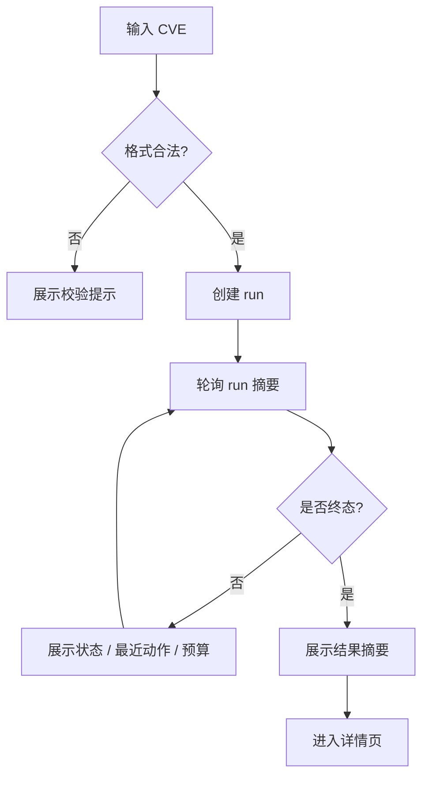

# CVE 检索工作台功能设计

> **CVE 场景详细功能设计文档**

---

## 📋 模块概述

**模块名称**：CVE 检索工作台  
**模块编号**：M101  
**优先级**：P0  
**负责人**：AI + 开发团队  
**状态**：按浏览器 Agent 主线重构并接入真实验收语义

---

## 🎯 功能目标

### 业务目标

提供一个围绕 `cve_run + search_graph` 的用户工作台，让用户输入 CVE 编号后：

- 发起一次 Patch 搜索
- 看到运行状态和预算推进
- 理解系统正在如何搜索
- 快速进入详情页查看搜索图、patch 收敛和证据

### 用户价值

- 不需要理解底层实现，也能知道系统是否在继续搜索、搜索到了哪里、是否已经接近 patch。
- 工作台不是只告诉用户“在跑”，而是告诉用户“Agent 在做什么”。
- 失败或未收敛时，用户可以直接进入详情页查看搜索图，而不是只看到一个 stop reason。

---

## 👥 使用场景

### 场景1：发起一次 Patch 搜索

**场景描述**：用户输入 CVE 编号，希望系统主动搜索 patch。

**用户操作流程**：

1. 打开 `/patch`
2. 输入 `CVE-2024-3094`
3. 点击开始搜索
4. 查看运行状态、最近动作与预算变化
5. 查看结果摘要或进入详情页

### 场景2：回看最近一次搜索

**场景描述**：用户希望在不重新输入的情况下回看最近运行和当前结果。

**用户操作流程**：

1. 打开工作台
2. 查看最近运行列表
3. 选择一条运行记录
4. 进入详情页复核搜索图和 patch 证据

---

## 🔄 业务流程

### 主流程

```text
输入 CVE ID
  -> 校验格式
  -> 创建 run
  -> 前端轮询 run 摘要
  -> 展示状态 / 预算 / 最近动作
  -> 终态后展示结果摘要
  -> 允许进入详情页查看完整搜索图
```

### 流程图



---

## 📊 功能清单

| 功能点 | 功能描述 | 优先级 | 状态 |
|--------|---------|--------|------|
| CVE 输入校验 | 校验编号格式 | P0 | ✅ |
| 创建 run | 发起 `cve_run` | P0 | ✅ |
| 运行态展示 | 展示当前状态、阶段、最近动作与预算 | P0 | 🚧 |
| 结果摘要 | 展示是否命中 patch 与主证据摘要 | P0 | ✅ |
| 最近运行列表 | 展示最近几次 run 与当前收敛结果 | P1 | ✅ |
| 详情页跳转 | 进入搜索图与证据详情页 | P1 | ✅ |
| 搜索图摘要 | 工作台首屏展示最小 `search_graph` 进度信息 | P1 | 🚧 |

---

## 🎨 界面设计

### 页面1：CVE 检索工作台

**页面路径**：`/patch`

**页面元素**：

- CVE 输入框
- 开始搜索按钮
- 当前运行状态卡片
- 最近动作区块
- 预算摘要区块
- 结果摘要卡片
- 验收 / 基线摘要区块（可选）
- 最近运行列表
- 详情页入口

**交互说明**：

- 输入非法 CVE：立即显示格式提示
- 点击开始搜索：调用创建 run 接口
- 运行中：轮询 `GET /api/v1/cve/runs/{run_id}`
- 工作台优先展示摘要，不展开完整搜索图
- 用户进入详情页后查看完整搜索路径、frontier 和决策记录

---

## 🗺️ 页面映射

- 主页面规格：`../13-界面设计/P101-CVE检索工作台页面设计.md`
- 详情页映射：`../13-界面设计/P102-CVE运行详情页面设计.md`
- 横向导航约束：`../13-界面设计/U001-信息架构与导航设计.md`

**页面边界**：

- 本模块负责工作台的输入、运行摘要与接口契约
- `P101` 负责首屏区块、运行态表达、预算摘要和结果卡片组织

---

## 💾 数据设计

### 涉及的数据表

- `cve_runs`
- `task_jobs`
- `cve_search_nodes`
- `cve_search_decisions`

### 核心数据字段

#### `CVEWorkbenchRunSummary`

| 字段名 | 类型 | 必填 | 说明 |
|--------|------|------|------|
| `run_id` | string | 是 | 运行 ID |
| `cve_id` | string | 是 | CVE 编号 |
| `status` | string | 是 | `queued/running/succeeded/failed` |
| `phase` | string | 是 | 当前阶段 |
| `stop_reason` | string | 否 | 停止原因 |
| `summary` | object | 是 | 结果摘要 |
| `progress` | object | 是 | 进度摘要 |
| `recent_progress` | array | 是 | 最近 1 到 3 条动作 |
| `budget_status` | object | 否 | 预算摘要 |
| `chain_summary` | array | 否 | 链路摘要（按 active/completed/dead_end 聚合） |
| `page_roles` | array | 否 | 当前已访问页面角色摘要 |
| `acceptance_summary` | object | 否 | 最近 acceptance baseline / gate 摘要，仅做入口提示 |

### 前端状态对象

#### `CVEWorkbenchPageState`

| 字段名 | 类型 | 必填 | 说明 |
|--------|------|------|------|
| `query` | string | 是 | 当前输入值 |
| `validation_message` | string | 否 | 输入校验提示 |
| `loading` | boolean | 是 | 是否正在创建 run |
| `active_run` | object | 否 | 当前运行摘要 |
| `recent_runs` | array | 是 | 最近运行列表 |

---

## 🔌 接口设计

### 接口1：创建 CVE 运行

**接口路径**：`POST /api/v1/cve/runs`

**请求参数**：

```json
{
  "cve_id": "CVE-2024-3094"
}
```

### 接口2：获取运行详情摘要

**接口路径**：`GET /api/v1/cve/runs/{run_id}`

**业务规则**：

- 工作台消费 `status`、`phase`、`summary`、`progress`、`recent_progress`
- 允许额外消费最小 `budget_status`
- 完整 `search_graph` 延迟到详情页消费

### 接口3：获取最近运行列表

**接口路径**：`GET /api/v1/cve/runs`

**业务规则**：

- 按创建时间倒序返回最近若干次 run
- 工作台页消费 `run_id`、`cve_id`、`status`、`phase`、`stop_reason`、`summary` 和 `created_at`

---

## 🔁 子流程 / 状态机

```text
idle
  -> validating
  -> validation_failed
  -> creating_run
  -> polling
  -> terminal_succeeded
  -> terminal_failed
```

**状态说明**：

- `creating_run`：提交后创建新 run
- `polling`：按固定间隔刷新摘要字段
- `terminal_succeeded/terminal_failed`：进入终态后停止轮询，但保留当前结果

---

## ✅ 业务规则

### 规则1：工作台先给状态和结果，再给详情入口

工作台不承担完整搜索图阅读职责，但必须提供足够的运行摘要和进入详情页的路径。

### 规则2：运行中必须可见

只要任务未终止，前端必须持续显示当前阶段、最近动作和预算推进。

### 规则3：工作台展示最小搜索图摘要

工作台可以展示“已访问页面数、已用预算、是否接近 patch”，但不应挤入完整节点图。

### 规则4：工作台不承担人工复核操作

人工复核入口和详细决策审计留给详情页，不在工作台首屏展开。

### 规则5：工作台只展示 gate 摘要，不替代详情解释

- baseline / regression gate 结果在工作台只用于提示“当前结果是否通过本地稳定基线”
- 具体链路、页面角色、警告和失败信号统一在详情页或验收报告中解释

---

## 🔄 变更记录

### v2.2 - 2026-04-23

- 将工作台前端页面路径同步为 `/patch`

### v2.1 - 2026-04-23

- 同步浏览器 Agent 已实现的链路摘要、页面角色和 acceptance 摘要口径
- 明确工作台只承载运行摘要，不替代详情页中的链路与 gate 解释

---

**文档版本**：v2.2
**创建日期**：2026-04-09  
**最后更新**：2026-04-20
**维护人**：AI + 开发团队
