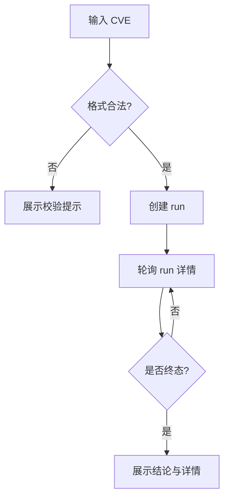

# CVE 检索工作台功能设计

> **CVE 场景详细功能设计文档**

---

## 📋 模块概述

**模块名称**：CVE 检索工作台  
**模块编号**：M101  
**优先级**：P0  
**负责人**：AI + 开发团队  
**状态**：最小闭环已落地

---

## 🎯 功能目标

### 业务目标
提供一个围绕 `cve_run` 主线的用户工作台，让用户输入 CVE 编号后，发起检索、轮询运行详情，并在首屏看到实时进展与结果结论。

### 用户价值
- 不需要理解底层执行链路，就能获得“是否找到补丁、证据在哪里”的结论。
- 运行中也能看到系统是否在继续推进，而不是只能等待最终结果。
- 失败时能够直接看到真实失败阶段，为进入详情页排障提供入口。

### 接入时机
- 当前已完成 fast-first 最小闭环，工作台已接入创建 run、轮询详情、查看详情页入口。
- 当前已补上最小历史列表，可回看最近几次 run 的状态、主证据与详情入口。
- 当前已接入官方优先多源 seed 与非 NVD 规则增强后的真实运行结果。
- 当前仍以 CVE 补丁获取 fast-first 主线为优先，后续再继续扩展更深证据能力。
- 后续扩展仍沿用 graph-ready 方向，但本轮仍不包含复用运行、graph/fix family 和 LLM fallback。

---

## 👥 使用场景

### 场景1：手动查询一个 CVE
**场景描述**：用户输入一个具体 CVE 编号，希望知道是否存在补丁。

**用户操作流程**：
1. 打开 `/cve`
2. 输入 `CVE-2024-3094`
3. 点击开始检索
4. 查看运行状态与最近进展
5. 查看结论与详情入口

### 场景2：重新查看一次已完成运行
**场景描述**：用户在工作台完成一次检索后，希望继续进入详情页复核证据。

**用户操作流程**：
1. 在工作台看到终态结果
2. 点击 `查看详情`
3. 跳转 `/cve/runs/{run_id}`

---

## 🔄 业务流程

### 主流程
```text
输入 CVE ID
  -> 校验格式
  -> 创建 run
  -> 前端轮询 run 详情
  -> 展示运行中状态与最近进展
  -> 终态后展示结论和详情入口
```

### 流程图


---

## 📊 功能清单

| 功能点 | 功能描述 | 优先级 | 状态 |
|--------|---------|--------|------|
| CVE 输入校验 | 校验编号格式 | P0 | ✅ 已完成 |
| 创建 run | 发起 `cve_run` | P0 | ✅ 已完成 |
| 运行态展示 | 展示当前阶段、进度与最近进展 | P0 | ✅ 已完成 |
| 结果摘要 | 展示是否命中补丁与主要证据 | P0 | ✅ 已完成 |
| 最近运行列表 | 展示最近几次 run 与主证据摘要 | P1 | ✅ 已完成 |
| 跳转详情 | 进入详细证据页 | P1 | ✅ 已完成 |
| 新 patch 类型文案 | 用可读标签展示新增补丁类型 | P1 | ✅ 已完成 |

---

## 🎨 界面设计

### 页面1：CVE 检索工作台
**页面路径**：`/cve`

**页面元素**：
- CVE 输入框
- 开始检索按钮
- 当前运行状态卡片
- 最近进展区块
- 结论卡片
- 最近运行列表
- 详情页入口

**交互说明**：
- 输入非法 CVE：立即显示格式提示
- 点击开始检索：调用创建 run 接口，并把 `run_id` 作为当前活跃运行
- 运行中：每 1.5 秒轮询一次 `GET /api/v1/cve/runs/{run_id}`
- 终态：停止轮询，保留当前摘要和“查看详情”按钮
- 页面初始化时加载 `GET /api/v1/cve/runs`，展示最近几次 run 的状态和详情入口

---

## 🗺️ 页面映射

- 主页面规格：`../13-界面设计/P101-CVE检索工作台页面设计.md`
- 详情页映射：`../13-界面设计/P102-CVE运行详情页面设计.md`
- 横向导航约束：`../13-界面设计/U001-信息架构与导航设计.md`

**页面边界**：
- 本模块负责 CVE 工作台的输入、运行摘要与接口契约。
- `P101` 负责首屏区块、运行态表达与结果摘要组织。

---

## 💾 数据设计

### 涉及的数据表
- `cve_runs`
- `task_jobs`

### 核心数据字段

#### CVEWorkbenchRunSummary
| 字段名 | 类型 | 必填 | 说明 |
|--------|------|------|------|
| run_id | string | 是 | 运行 ID |
| cve_id | string | 是 | CVE 编号 |
| status | string | 是 | `queued/running/succeeded/failed` |
| phase | string | 是 | 当前阶段 |
| stop_reason | string | 否 | 停止原因 |
| summary | object | 是 | 结论摘要 |
| progress | object | 是 | 进度摘要 |
| recent_progress | array | 是 | 最近 1 到 3 条进展 |

---

## 🔌 接口设计

### 接口1：创建 CVE 运行
**接口路径**：`POST /api/v1/cve/runs`

**请求参数**：
```json
{
  "cve_id": "CVE-2024-3094"
}
```

**响应数据**：
```json
{
  "code": 0,
  "message": "success",
  "data": {
    "run_id": "uuid",
    "cve_id": "CVE-2024-3094",
    "status": "queued",
    "phase": "resolve_seeds"
  }
}
```

**业务规则**：
- v1 每次提交都创建新的 `cve_run`
- 当前不支持 `reuse_running`

### 接口2：获取运行详情摘要
**接口路径**：`GET /api/v1/cve/runs/{run_id}`

**业务规则**：
- 工作台页消费 `status`、`phase`、`summary`、`progress` 和 `recent_progress`
- 同一个接口也为详情页提供完整 payload，工作台只取摘要子集

### 接口3：获取最近运行列表
**接口路径**：`GET /api/v1/cve/runs`

**业务规则**：
- 按创建时间倒序返回最近若干次 run
- 工作台页消费 `run_id`、`cve_id`、`status`、`phase`、`stop_reason`、`summary` 和 `created_at`

---

## 📦 前端状态对象

#### CVEWorkbenchPageState
| 字段名 | 类型 | 必填 | 说明 |
|--------|------|------|------|
| query | string | 是 | 当前输入值 |
| validation_message | string | 否 | 输入校验提示 |
| loading | boolean | 是 | 是否正在创建 run |
| active_run | object | 否 | 当前运行摘要 |
| recent_runs | array | 是 | 最近运行列表 |

---

## 🔁 子流程/状态机

### 检索工作台状态机
```text
idle
  -> validating
  -> validation_failed
  -> creating_run
  -> polling
  -> terminal_succeeded
  -> terminal_failed
```

**状态说明**：
- `creating_run`：提交后创建新 run。
- `polling`：按固定间隔刷新摘要字段。
- `terminal_succeeded/terminal_failed`：进入终态后停止轮询，但保留当前结果。

---

## ✅ 业务规则

### 规则1：只保留 `cve_run` 主线
**规则描述**：新平台中 CVE 工作台不再接入旧 lookup 兼容接口。

### 规则2：运行中必须可见
**规则描述**：只要任务未终止，前端必须持续显示当前阶段和最近进展。

### 规则3：结论优先
**规则描述**：终态后先展示“是否找到补丁”“主证据是什么”，再展示工程细节。

### 规则4：失败进度必须保留真实失败阶段
**规则描述**：失败态不能伪装成“全部步骤已完成”；工作台应展示真实 `phase` 和截至失败点的 `completed_steps`。

### 规则5：工作台必须支持最近运行回看
**规则描述**：用户不重新提交也应能从首屏进入最近一次或最近几次 run 的详情页。

### 规则6：工作台不得泄露原始 patch_type 内部值
**规则描述**：工作台与详情页相关摘要应通过文案映射展示新增类型，如 `Debdiff`、`GitHub PR Patch`、`Bugzilla Attachment Patch`。

---

## 🚨 异常处理

### 异常1：CVE 格式不合法
**触发条件**：不符合 `CVE-YYYY-NNNN...` 规则

**错误提示**：`请输入合法的 CVE 编号，例如 CVE-2024-3094`

**处理方案**：前端阻止提交

### 异常2：运行创建失败
**触发条件**：后端创建任务失败或数据库异常

**错误提示**：`CVE 检索创建失败，请稍后重试`

**处理方案**：显示错误态，允许重新提交

### 异常3：运行失败
**触发条件**：seed 解析、页面抓取、页面分析或 patch 下载阶段失败

**错误提示**：工作台显示 `stop_reason` 和真实失败阶段

**处理方案**：保留最近进展和详情页入口，允许用户进入详情页排障

---

## 🔐 权限控制

### 访问权限
- v1 全局可访问

### 数据权限
- 单租户共享 run 结果

---

## 📝 开发要点

### 技术难点
1. 工作台视图要结论优先，避免退回工程诊断台风格。
2. 需要在“运行中可见”和“轮询压力可控”之间平衡。

### 性能要求
- 创建 run 接口响应目标 < 300ms
- 轮询接口响应目标 < 300ms

### 注意事项
- 工作台页只展示摘要，不把全部 trace 一次塞进首页
- 详情页承担完整证据展开
- CVE 是当前优先实现的业务主线，先跑通补丁获取，再继续补证据展开
- 最近运行列表只做最小回看，不扩展筛选、分页和复用运行

---

## 🧪 测试要点

### 功能测试
- [x] 合法 CVE 可创建 run
- [x] 运行中状态可轮询
- [x] 终态后显示结果摘要

### 边界测试
- [x] 非法 CVE 无法提交
- [x] 创建失败时页面有错误提示
- [x] 失败 run 展示真实阶段而不是伪终态进度

---

## 📅 开发计划

| 阶段 | 任务 | 预计工时 | 负责人 | 状态 |
|------|------|---------|--------|------|
| 设计 | 完成工作台设计 | 0.5天 | AI | ✅ |
| 开发 | 创建/查询接口接入 | 1天 | AI | ✅ |
| 开发 | 工作台页面开发 | 1天 | AI | ✅ |
| 测试 | 表单与轮询测试 | 0.5天 | AI | ✅ |

---

## 📖 相关文档

- `M102-CVE运行详情与补丁证据功能设计.md`
- `M103-CVE数据源与页面探索规则功能设计.md`
- `../13-界面设计/P101-CVE检索工作台页面设计.md`
- `../13-界面设计/P102-CVE运行详情页面设计.md`

---

## 🔄 变更记录

### v1.0 - 2026-04-09
- 初始化 CVE 检索工作台设计

### v1.1 - 2026-04-09
- 回填页面映射、前端状态对象与工作台状态机

### v1.2 - 2026-04-10
- 明确 CVE 在首个公告切片稳定后接入
- 固定 CVE 晚于公告正文模式与公告 URL 模式落地

### v1.3 - 2026-04-13
- 回填工作台最小闭环已落地的真实接口与页面行为
- 删除 `reuse_running`、`run_mode` 等未落地字段描述
- 补充失败进度语义、轮询规则与当前测试覆盖面
- 固定当前优先目标仍是 CVE 补丁获取 fast-first 主链

### v1.4 - 2026-04-15
- 增加最近运行列表接口与工作台回看能力
- 补充工作台最近运行的数据对象、接口契约和业务规则

### v1.5 - 2026-04-15
- 同步官方优先多源 seed 与非 NVD 规则增强已接入工作台主链
- 补充新增 patch_type 的前端文案映射约束
- 修正旧的“本轮仍不包含多源聚合”描述

---

**文档版本**：v1.5
**创建日期**：2026-04-09
**最后更新**：2026-04-15
**维护人**：AI + 开发团队
