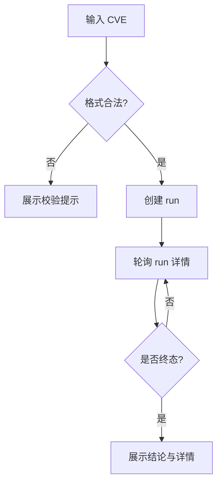

# CVE 检索工作台功能设计

> **CVE 场景详细功能设计文档**

---

## 📋 模块概述

**模块名称**：CVE 检索工作台  
**模块编号**：M101  
**优先级**：P0  
**负责人**：AI + 开发团队  
**状态**：设计中

---

## 🎯 功能目标

### 业务目标
提供一个围绕 `graph run` 主线的用户工作台，让用户输入 CVE 编号后，发起检索并查看实时进展与结果结论。

### 用户价值
- 不需要理解底层 graph 过程，就能获得“是否找到补丁、证据在哪里”的结论。
- 运行中也能看到系统是否在继续推进，而不是只能等待最终结果。

---

## 👥 使用场景

### 场景1：手动查询一个 CVE
**场景描述**：用户输入一个具体 CVE 编号，希望知道是否存在补丁。

**用户操作流程**：
1. 打开 `/cve`
2. 输入 `CVE-2024-3094`
3. 点击开始检索
4. 查看运行状态
5. 查看结论与详情

---

### 场景2：重新查看历史运行
**场景描述**：用户通过 run 详情链接进入，回看之前的结果。

**用户操作流程**：
1. 打开 `/cve/runs/{run_id}`
2. 查看结论卡片、patch 摘要与证据

---

## 🔄 业务流程

### 主流程
```text
输入 CVE ID
  -> 校验格式
  -> 创建 graph run
  -> 前端轮询 run 详情
  -> 展示运行中状态
  -> 终态后展示结论和详情入口
```

### 流程图


---

## 📊 功能清单

| 功能点 | 功能描述 | 优先级 | 状态 |
|--------|---------|--------|------|
| CVE 输入校验 | 校验编号格式 | P0 | ⚪ 未开始 |
| 创建 run | 发起 graph run | P0 | ⚪ 未开始 |
| 运行态展示 | 展示当前阶段、进度与最近进展 | P0 | ⚪ 未开始 |
| 结果摘要 | 展示是否命中补丁与主要证据 | P0 | ⚪ 未开始 |
| 跳转详情 | 进入详细证据页 | P1 | ⚪ 未开始 |

---

## 🎨 界面设计

### 页面1：CVE 检索工作台
**页面路径**：`/cve`

**页面元素**：
- CVE 输入框
- 开始检索按钮
- 当前运行状态卡片
- 结论卡片
- 最近一次有效进展

**交互说明**：
- 输入非法 CVE：立即显示格式提示
- 点击开始检索：调用创建 run 接口
- 运行中：每 1~2 秒轮询一次
- 终态：显示“查看详情”按钮

---

## 🗺️ 页面映射

- 主页面规格：`../13-界面设计/P101-CVE检索工作台页面设计.md`
- 详情页映射：`../13-界面设计/P102-CVE运行详情页面设计.md`
- 横向导航约束：`../13-界面设计/U001-信息架构与导航设计.md`

**页面边界**：
- 本模块负责 CVE 工作台的输入、运行摘要与接口契约。
- `P101` 负责首屏区块、运行态表达与结果摘要组织。

---

## 💾 数据设计

### 涉及的数据表
- `cve_runs`
- `task_jobs`

### 核心数据字段

#### CVEWorkBenchRunSummary
| 字段名 | 类型 | 必填 | 说明 |
|--------|------|------|------|
| run_id | string | 是 | 运行 ID |
| cve_id | string | 是 | CVE 编号 |
| status | string | 是 | succeeded/failed/running |
| phase | string | 是 | 当前阶段 |
| stop_reason | string | 否 | 停止原因 |
| summary | object | 是 | 结论摘要 |
| progress | object | 是 | 进度摘要 |

---

## 🔌 接口设计

### 接口1：创建 CVE 运行
**接口路径**：`POST /api/v1/cve/runs`

**请求参数**：
```json
{
  "cve_id": "CVE-2024-3094",
  "run_mode": "agent",
  "reuse_running": true
}
```

**响应数据**：
```json
{
  "code": 0,
  "message": "success",
  "data": {
    "run_id": "uuid",
    "cve_id": "CVE-2024-3094",
    "status": "running",
    "phase": "resolve_seeds"
  }
}
```

**业务规则**：
- `reuse_running=true` 时，如果存在同 CVE 的非终态 run，优先复用
- v1 默认 `run_mode=agent`

---

### 接口2：获取运行详情摘要
**接口路径**：`GET /api/v1/cve/runs/{run_id}`

**业务规则**：
- 工作台页只消费摘要字段
- 详细证据在详情页继续展开

---

## 📦 前端状态对象

#### CVEWorkbenchPageState
| 字段名 | 类型 | 必填 | 说明 |
|--------|------|------|------|
| query | string | 是 | 当前输入值 |
| validation_message | string | 否 | 输入校验提示 |
| loading | boolean | 是 | 是否正在创建或附着 run |
| attach_mode | string | 否 | `latest/requested/null` |
| active_run | object | 否 | 当前运行摘要 |

---

## 🔁 子流程/状态机

### 检索工作台状态机
```text
idle
  -> validating
  -> validation_failed
  -> creating_run
  -> polling
  -> terminal_succeeded
  -> terminal_failed
```

**状态说明**：
- `creating_run`：提交后创建新 run 或附着已有非终态 run。
- `polling`：按固定间隔刷新摘要字段。
- `terminal_succeeded/terminal_failed`：进入终态后停止轮询，但保留当前结果。

---

## ✅ 业务规则

### 规则1：只保留 graph run 主线
**规则描述**：新平台中 CVE 工作台不再接入旧 lookup 兼容接口。

### 规则2：运行中必须可见
**规则描述**：只要任务未终止，前端必须持续显示当前阶段和最近进展。

### 规则3：结论优先
**规则描述**：终态后先展示“是否找到补丁”“主证据是什么”，再展示工程细节。

---

## 🚨 异常处理

### 异常1：CVE 格式不合法
**触发条件**：不符合 `CVE-YYYY-NNNN...` 规则

**错误提示**：`请输入合法的 CVE 编号，例如 CVE-2024-3094`

**处理方案**：前端阻止提交

---

### 异常2：运行创建失败
**触发条件**：后端创建任务失败或数据库异常

**错误提示**：`CVE 检索创建失败，请稍后重试`

**处理方案**：显示错误态，允许重新提交

---

## 🔐 权限控制

### 访问权限
- v1 全局可访问

### 数据权限
- 单租户共享 run 结果

---

## 📝 开发要点

### 技术难点
1. 工作台视图要结论优先，避免退回工程诊断台风格。
2. 需要在“运行中可见”和“轮询压力可控”之间平衡。

### 性能要求
- 创建 run 接口响应目标 < 300ms
- 轮询接口响应目标 < 300ms

### 注意事项
- 工作台页只展示摘要，不把全部 trace 一次塞进首页
- 详情页承担完整证据展开

---

## 🧪 测试要点

### 功能测试
- [ ] 合法 CVE 可创建 run
- [ ] 运行中状态可轮询
- [ ] 终态后显示结果摘要

### 边界测试
- [ ] 非法 CVE 无法提交
- [ ] 创建失败时页面有错误提示

---

## 📅 开发计划

| 阶段 | 任务 | 预计工时 | 负责人 | 状态 |
|------|------|---------|--------|------|
| 设计 | 完成工作台设计 | 0.5天 | AI | ✅ |
| 开发 | 创建/查询接口接入 | 1天 | - | ⚪ |
| 开发 | 工作台页面开发 | 1天 | - | ⚪ |
| 测试 | 表单与轮询测试 | 0.5天 | - | ⚪ |

---

## 📖 相关文档

- `M102-CVE运行详情与补丁证据功能设计.md`
- `M103-CVE数据源与页面探索规则功能设计.md`
- `../13-界面设计/P101-CVE检索工作台页面设计.md`
- `../13-界面设计/P102-CVE运行详情页面设计.md`

---

## 🔄 变更记录

### v1.0 - 2026-04-09
- 初始化 CVE 检索工作台设计

### v1.1 - 2026-04-09
- 回填页面映射、前端状态对象与工作台状态机

---

**文档版本**：v1.1  
**创建日期**：2026-04-09  
**最后更新**：2026-04-09  
**维护人**：AI + 开发团队
