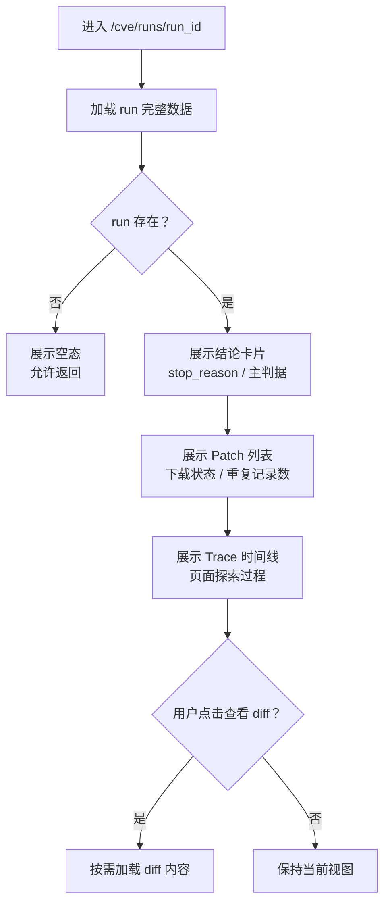

# CVE 运行详情与补丁证据功能设计

> **CVE 详情页详细功能设计文档**

---

## 📋 模块概述

**模块名称**：CVE 运行详情与补丁证据  
**模块编号**：M102  
**优先级**：P0  
**负责人**：AI + 开发团队  
**状态**：最小闭环已落地

---

## 🎯 功能目标

### 业务目标
提供一个“可解释”的运行详情页，完整展示一次 CVE run 的结论、进度、来源证据、patch 列表和 diff。

### 用户价值
- 用户不仅知道有没有补丁，还知道系统是如何找到补丁的。
- 可以在详情页里直接完成复核，而不必回外部站点逐一打开。
- 即使运行失败，也能看到失败阶段、最近进展与来源证据。

---

## 👥 使用场景

### 场景1：复核主补丁
**场景描述**：用户想确认系统标记的主补丁是否可信。

**用户操作流程**：
1. 打开 `/cve/runs/{run_id}`
2. 查看主结论卡片
3. 查看主 patch 和来源证据
4. 打开 diff 内容核查

### 场景2：查看页面探索过程
**场景描述**：用户想知道系统为什么从某个公告页跳到某个 patch 链接。

**用户操作流程**：
1. 在详情页查看 trace timeline
2. 查看步骤摘要
3. 查看 `status`、`url`、`error_message` 和 `stop_reason`

---

## 🔄 业务流程

### 主流程



---

## 📊 功能清单

| 功能点 | 功能描述 | 优先级 | 状态 |
|--------|---------|--------|------|
| 结论卡片 | 展示是否命中主补丁、主要依据 | P0 | ✅ 已完成 |
| Patch 列表 | 展示候选补丁、下载状态与重复记录数 | P0 | ✅ 已完成 |
| Diff 查看 | 在线查看补丁内容 | P0 | ✅ 已完成 |
| Trace 时间线 | 展示页面探索过程 | P0 | ✅ 已完成 |
| 失败态进度 | 展示真实失败阶段与完成步数 | P0 | ✅ 已完成 |

---

## 🎨 界面设计

### 页面1：CVE 运行详情页
**页面路径**：`/cve/runs/:runId`

**页面元素**：
- 顶部结论卡片
- diff 查看器
- patch 列表区块
- trace 时间线

**交互说明**：
- 点击 patch：按稳定的 `patch_id` 选中当前 patch
- 点击“查看 Diff”：按需加载文本内容
- patch 内容不存在时，按钮不可点
- trace 默认展示整理后的步骤摘要

---

## 🗺️ 页面映射

- 主页面规格：`../13-界面设计/P102-CVE运行详情页面设计.md`
- 上游工作台：`../13-界面设计/P101-CVE检索工作台页面设计.md`
- 视觉基线：`../13-界面设计/U002-视觉基线与继承策略.md`

**页面边界**：
- 本模块负责详情接口、patch 与证据数据对象。
- `P102` 负责“结论 -> Diff Viewer -> Patch -> Trace”的页面排序。

---

## 💾 数据设计

### 涉及的数据表
- `cve_runs`
- `cve_patch_artifacts`
- `artifacts`
- `source_fetch_records`

### 核心数据字段

#### CVERunDetail
| 字段名 | 类型 | 必填 | 说明 |
|--------|------|------|------|
| run_id | string | 是 | 运行 ID |
| cve_id | string | 是 | CVE 编号 |
| status | string | 是 | 状态 |
| phase | string | 是 | 当前阶段 |
| stop_reason | string | 否 | 停止原因 |
| summary | object | 是 | 运行摘要 |
| progress | object | 是 | 阶段进度摘要 |
| recent_progress | array | 是 | 最近 1 到 3 条进展 |
| patches | array | 是 | 补丁记录 |
| source_traces | array | 是 | 页面探索证据 |

#### CVEPatchView
| 字段名 | 类型 | 必填 | 说明 |
|--------|------|------|------|
| patch_id | string | 是 | 稳定补丁标识 |
| candidate_url | string | 是 | 候选 patch URL |
| patch_type | string | 是 | `patch/diff` |
| download_status | string | 是 | 下载状态 |
| artifact_id | string | 否 | 关联 Artifact |
| duplicate_count | number | 是 | 同 URL 的落表记录数 |
| content_available | boolean | 是 | 是否允许查看 diff |
| content_type | string | 否 | Artifact 内容类型 |
| download_url | string | 否 | 真实下载地址 |

---

## 🔌 接口设计

### 接口1：获取运行详情
**接口路径**：`GET /api/v1/cve/runs/{run_id}`

**业务规则**：
- 直接返回详情页所需完整 payload
- `patches` 已按 `candidate_url` 去重，并返回 `duplicate_count`

### 接口2：获取补丁内容
**接口路径**：`GET /api/v1/cve/runs/{run_id}/patch-content?patch_id=...`

**业务规则**：
- 补丁内容按需加载
- 如果 Artifact 不存在，返回 404
- 优先按稳定 `patch_id` 读取内容
- 为兼容历史调用，接口仍可接受 `candidate_url`
- 如果同一 `candidate_url` 存在多条记录，按“代表条目”读取可消费内容

---

## 📦 前端状态对象

#### PatchDiffPanelState
| 字段名 | 类型 | 必填 | 说明 |
|--------|------|------|------|
| patch_id | string | 否 | 当前查看的补丁标识 |
| loading | boolean | 是 | 是否正在加载 diff |
| content_available | boolean | 是 | 是否存在 diff 内容 |
| error_message | string | 否 | diff 加载失败提示 |

---

## 🔁 子流程/状态机

### 详情页与 Diff 查看状态机
```text
detail_loading
  -> detail_ready
  -> detail_empty

detail_ready
  -> diff_idle
  -> diff_loading
  -> diff_ready
  -> diff_failed
```

**状态说明**：
- 详情页加载与 diff 加载分成两个状态机，避免局部失败拖垮整页。
- `detail_empty` 用于无效 `run_id` 或结果不存在场景。

---

## ✅ 业务规则

### 规则1：先给结论，再给证据
**规则描述**：详情页顶部必须先说明主结论，而不是先显示调试数据。

### 规则2：当前不实现 fix family
**规则描述**：主补丁由 `summary.primary_patch_url` 和 patch 列表共同表达，不扩展 family 视图。

### 规则3：证据链可读性优先
**规则描述**：trace 不只是原始 JSON，要整理为人类可读的时间线与步骤原因。

### 规则4：重复 patch 只展示代表条目
**规则描述**：相同 `candidate_url` 的重复记录不重复出卡，而是合并为一条，并通过 `duplicate_count` 暴露重复数量。

### 规则5：`content_available` 必须反映真实可读性
**规则描述**：只有 Artifact 行存在且磁盘文件仍存在时，按钮才允许查看 diff。

### 规则6：详情页内部交互优先使用稳定标识
**规则描述**：前端选中补丁和读取 diff 时优先使用 `patch_id`，避免依赖 `candidate_url` 这种业务键。

### 规则7：失败排障必须给出最短阅读路径
**规则描述**：失败 run 的详情页应先给停止原因，再给建议动作和最近失败步骤，避免要求用户自己从整条 trace 里排查。

---

## 🚨 异常处理

### 异常1：run 不存在
**触发条件**：通过无效 run_id 打开详情页

**错误提示**：`运行记录不存在`

**处理方案**：展示空态并允许返回工作台

### 异常2：diff 内容缺失
**触发条件**：patch 记录存在，但 Artifact 丢失或下载失败

**错误提示**：`补丁内容不存在或尚未下载`

**处理方案**：保留 patch 元数据，标记内容不可查看

---

## 🔐 权限控制

### 访问权限
- v1 全局可见

### 数据权限
- 单租户共享详情结果

---

## 📝 开发要点

### 技术难点
1. trace 与 patch 信息都来源于运行链路，但必须按“结论优先”拆开组织。
2. diff 内容可能很长，需要按需加载和懒渲染。
3. 旧数据中可能存在重复 patch URL，需要在详情服务层合并。

### 性能要求
- 详情接口响应目标 < 500ms
- diff 内容接口按需加载，避免首页一次返回大文本

### 注意事项
- 详情页是“证据页”，不是“原始 JSON 页”
- 原始字段可以保留为开发辅助，但不能是主视图

---

## 🧪 测试要点

### 功能测试
- [x] 详情页能展示主结论
- [x] patch 列表能展示下载状态
- [x] diff 查看可按需加载
- [x] 重复 `candidate_url` 只展示一条代表记录，并返回 `duplicate_count`

### 边界测试
- [x] 无效 run_id 显示空态
- [x] 无 diff 内容时显示明确提示
- [x] 失败 run 显示真实失败阶段与完成步数

---

## 📅 开发计划

| 阶段 | 任务 | 预计工时 | 负责人 | 状态 |
|------|------|---------|--------|------|
| 设计 | 完成详情页设计 | 0.5天 | AI | ✅ |
| 开发 | 详情数据接口 | 1天 | AI | ✅ |
| 开发 | 前端详情页与 diff 查看 | 1.5天 | AI | ✅ |
| 测试 | 详情与异常路径测试 | 1天 | AI | ✅ |

---

## 📖 相关文档

- `M101-CVE检索工作台功能设计.md`
- `M103-CVE数据源与页面探索规则功能设计.md`
- `../13-界面设计/P102-CVE运行详情页面设计.md`

---

## 🔄 变更记录

### v1.0 - 2026-04-09
- 初始化 CVE 运行详情与证据设计

### v1.1 - 2026-04-09
- 回填详情页页面映射、Diff 状态对象与双层状态机

### v1.2 - 2026-04-13
- 回填本轮最小闭环真实实现，移除未落地的 fix family / `/patches` 接口描述
- 增加失败进度、代表条目、`duplicate_count` 和真实 `content_available` 契约
- 同步来源证据 `source_fetch_records` 的详情页消费方式

### v1.3 - 2026-04-15
- 把详情页补丁交互从 `candidate_url` 收敛为稳定的 `patch_id`
- 同步 diff 内容接口、详情 payload 和前端状态对象

### v1.4 - 2026-04-15
- 增加失败详情页的排障表达约束：建议动作、错误摘要和失败步骤强调
- 明确失败 run 详情应先给最短阅读路径，再给完整 trace

---

**文档版本**：v1.4
**创建日期**：2026-04-09  
**最后更新**：2026-04-15
**维护人**：AI + 开发团队
