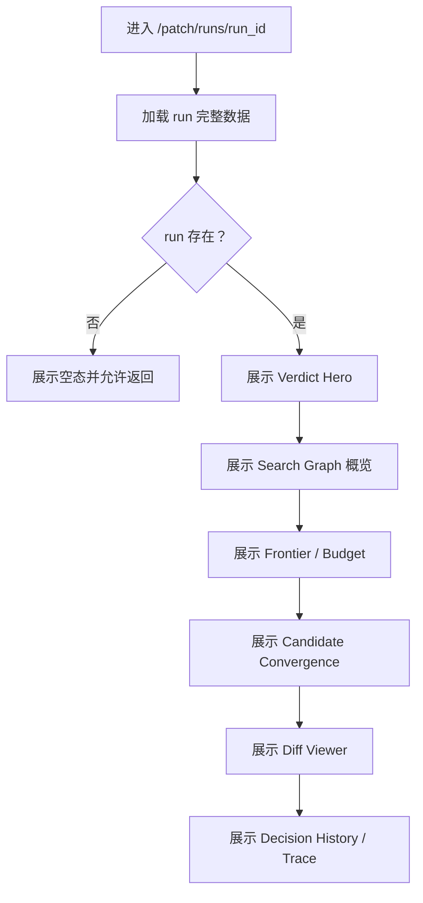

# CVE 运行详情与补丁证据功能设计

> **CVE 详情页详细功能设计文档**

---

## 📋 模块概述

**模块名称**：CVE 运行详情与补丁证据  
**模块编号**：M102  
**优先级**：P0  
**负责人**：AI + 开发团队  
**状态**：按浏览器 Agent 搜索图详情页重构

---

## 🎯 功能目标

### 业务目标

提供一个完整展示 Patch Agent 搜索过程与结果的详情页，组织以下信息：

- 最终 patch 结论
- 搜索路径图
- 当前或历史 frontier
- Agent 决策记录
- 预算消耗
- patch 收敛与 diff 内容
- acceptance baseline / regression gate 复核信息

### 用户价值

- 用户不仅知道有没有补丁，还知道系统为什么访问某些页面、为什么跳过某些页面、为什么最终停在当前结果。
- 可以直接在详情页复核从 seed 到 patch 的完整路径，而不必回外部站点逐一打开。
- 即使运行失败或未收敛，也能看到搜索图、停止原因和下一步建议。

---

## 👥 使用场景

### 场景1：复核主补丁

**场景描述**：用户想确认系统标记的主补丁是否可信。

**用户操作流程**：

1. 打开 `/patch/runs/{run_id}`
2. 查看 Verdict Hero
3. 查看 patch 收敛链与来源图
4. 打开 diff 内容核查

### 场景2：查看搜索路径

**场景描述**：用户想知道系统为什么从某个页面跳到另一个页面。

**用户操作流程**：

1. 查看搜索路径图
2. 查看某个节点的页面角色和来源关系
3. 查看对应 Agent 决策

### 场景3：查看预算与停止原因

**场景描述**：用户想理解为什么系统停止搜索。

**用户操作流程**：

1. 查看预算面板
2. 查看 stop reason
3. 查看最后一轮 frontier 和决策结果

---

## 🔄 业务流程

### 主流程



---

## 📊 功能清单

| 功能点 | 功能描述 | 优先级 | 状态 |
|--------|---------|--------|------|
| Verdict Hero | 展示是否命中主补丁、停止原因和下一步 | P0 | ✅ |
| Search Graph | 展示搜索节点、边和路径 | P0 | 🚧 |
| Budget 面板 | 展示页面预算、深度预算、跨域预算和下载预算 | P0 | 🚧 |
| Frontier 面板 | 展示当前或最后一轮 frontier | P0 | 🚧 |
| Candidate Convergence | 展示候选如何收敛到最终 patch | P0 | 🚧 |
| Patch 列表 | 展示候选补丁、下载状态与重复记录数 | P0 | ✅ |
| Diff 查看 | 在线查看补丁内容 | P0 | ✅ |
| Decision History | 展示 Agent 决策记录和 validator 结果 | P1 | 🚧 |

---

## 🎨 界面设计

### 页面1：CVE 运行详情页

**页面路径**：`/patch/runs/:runId`

**页面元素**：

- 顶部结论卡片
- 搜索图概览区
- 预算与 frontier 侧栏
- patch 收敛区
- diff 查看器
- 决策历史与 trace 区

**交互说明**：

- 点击 patch：按稳定的 `patch_id` 选中当前 patch
- 点击图节点：查看页面角色、URL、摘要和来源边
- 点击某轮决策：查看输入摘要、输出动作和校验结果
- 点击“查看 Diff”：按需加载文本内容

---

## 🗺️ 页面映射

- 主页面规格：`../13-界面设计/P102-CVE运行详情页面设计.md`
- 上游工作台：`../13-界面设计/P101-CVE检索工作台页面设计.md`
- 视觉基线：`../13-界面设计/U002-视觉基线与继承策略.md`

**页面边界**：

- 本模块负责详情接口、搜索图、patch 与证据数据对象
- `P102` 负责“结论 -> 图概览 -> 预算/frontier -> 收敛 -> diff -> 决策历史”的页面排序

---

## 💾 数据设计

### 涉及的数据表

- `cve_runs`
- `cve_search_nodes`
- `cve_search_edges`
- `cve_search_decisions`
- `cve_candidate_artifacts`
- `cve_patch_artifacts`
- `artifacts`

### 核心数据字段

#### `CVERunDetail`

| 字段名 | 类型 | 必填 | 说明 |
|--------|------|------|------|
| `run_id` | string | 是 | 运行 ID |
| `cve_id` | string | 是 | CVE 编号 |
| `status` | string | 是 | 状态 |
| `phase` | string | 是 | 当前阶段 |
| `stop_reason` | string | 否 | 停止原因 |
| `summary` | object | 是 | 运行摘要 |
| `progress` | object | 是 | 阶段进度摘要 |
| `search_graph` | object | 是 | 搜索图摘要 |
| `budget_status` | object | 是 | 预算状态 |
| `frontier_status` | object | 是 | frontier 摘要 |
| `navigation_chains` | array | 是 | 链路追踪记录 |
| `page_roles` | object | 是 | 页面角色摘要与统计 |
| `fix_families` | array | 是 | patch 收敛族视图 |
| `patches` | array | 是 | 补丁记录 |
| `decision_history` | array | 是 | 决策记录 |
| `source_traces` | array | 是 | 工具级抓取证据 |
| `acceptance_summary` | object | 否 | 对应 baseline / gate / compare 结果摘要 |

#### `PatchSearchGraphView`

| 字段名 | 类型 | 必填 | 说明 |
|--------|------|------|------|
| `nodes` | array | 是 | 搜索节点 |
| `edges` | array | 是 | 搜索边 |
| `highlight_path` | array | 否 | 当前主路径 |

#### `PatchBudgetView`

| 字段名 | 类型 | 必填 | 说明 |
|--------|------|------|------|
| `max_pages_total` | number | 是 | 页面总预算 |
| `visited_pages` | number | 是 | 已访问页面数 |
| `max_depth` | number | 是 | 最大深度 |
| `current_max_depth` | number | 是 | 当前深度 |
| `max_cross_domain_expansions` | number | 是 | 跨域预算 |
| `used_cross_domain_expansions` | number | 是 | 已用跨域预算 |
| `max_download_attempts` | number | 是 | 下载预算 |
| `used_download_attempts` | number | 是 | 已用下载预算 |

#### `PatchDecisionView`

| 字段名 | 类型 | 必填 | 说明 |
|--------|------|------|------|
| `decision_id` | string | 是 | 决策 ID |
| `decision_type` | string | 是 | 动作类型 |
| `validated` | boolean | 是 | 是否通过校验 |
| `reason_summary` | string | 否 | 决策摘要 |
| `selected_links` | array | 否 | 选中的链接 |
| `navigation_context_present` | boolean | 否 | 是否带导航上下文 |

---

## 🔌 接口设计

### 接口1：获取运行详情

**接口路径**：`GET /api/v1/cve/runs/{run_id}`

**业务规则**：

- 返回详情页所需完整 payload
- 详情页必须能消费 `search_graph`、`budget_status`、`frontier_status`、`decision_history`
- `patches` 和 `fix_families` 负责表达 patch 收敛结果
- `source_traces` 保留为工具级抓取明细

### 接口2：获取补丁内容

**接口路径**：`GET /api/v1/cve/runs/{run_id}/patch-content?patch_id=...`

**业务规则**：

- 补丁内容按需加载
- 如果 Artifact 不存在，返回 404
- 优先按稳定 `patch_id` 读取内容

---

## 📦 前端状态对象

#### `PatchDiffPanelState`

| 字段名 | 类型 | 必填 | 说明 |
|--------|------|------|------|
| `patch_id` | string | 否 | 当前查看的补丁标识 |
| `loading` | boolean | 是 | 是否正在加载 diff |
| `content_available` | boolean | 是 | 是否存在 diff 内容 |
| `error_message` | string | 否 | diff 加载失败提示 |

#### `PatchGraphPanelState`

| 字段名 | 类型 | 必填 | 说明 |
|--------|------|------|------|
| `selected_node_id` | string | 否 | 当前选中的搜索节点 |
| `selected_decision_id` | string | 否 | 当前选中的决策 |
| `show_budget` | boolean | 是 | 是否显示预算面板 |

---

## 🔁 子流程 / 状态机

```text
detail_loading
  -> detail_ready
  -> detail_empty

detail_ready
  -> graph_idle
  -> node_selected
  -> decision_selected
  -> diff_loading
  -> diff_ready
  -> diff_failed
```

**状态说明**：

- 详情页加载与 diff 加载分成两个状态机，避免局部失败拖垮整页
- `detail_empty` 用于无效 `run_id` 或结果不存在场景

---

## ✅ 业务规则

### 规则1：先给结论，再给搜索图

详情页顶部必须先说明主结论和停止原因，然后再展开搜索图与证据。

### 规则2：图必须可解释

用户必须能从详情页回答：

- 为什么访问这个页面
- 为什么继续扩展这个链接
- 为什么跳过另一个链接
- 为什么停止搜索

### 规则3：预算必须可见

详情页必须明确展示页面预算、跨域预算、下载预算和当前消耗。

### 规则4：规则事实与模型决策必须分层

- patch 下载成功是规则和工具层事实
- Agent 决策属于搜索过程说明
- 二者不能混为同一层级

### 规则5：详情页内部交互优先使用稳定标识

前端选中节点、决策和 patch 时都优先使用稳定 ID，而不是业务 URL。

### 规则6：未命中 patch 也必须展示搜索成果

即使 run 未成功命中 patch，详情页仍必须展示搜索图、预算和停止原因。

### 规则7：详情页承接 acceptance / gate 的解释职责

- 如果运行结果进入本地 acceptance baseline 或 regression gate，比对结果应在详情页可见
- 详情页负责解释 baseline 代表的链路样本、页面角色变化、patch 质量变化和 fallback 信号
- 工作台只展示摘要，不承接这部分细节解释

---

## 🔄 变更记录

### v2.2 - 2026-04-23

- 将详情页前端页面路径同步为 `/patch/runs/:runId`
- 将用户操作示例中的详情入口同步为 `/patch/runs/{run_id}`

### v2.1 - 2026-04-23

- 补充浏览器 Agent 的 `navigation_chains`、页面角色与 acceptance / gate 详情语义
- 明确详情页是链路、决策与基线解释的正式承载面

---

**文档版本**：v2.2
**创建日期**：2026-04-09  
**最后更新**：2026-04-23
**维护人**：AI + 开发团队
