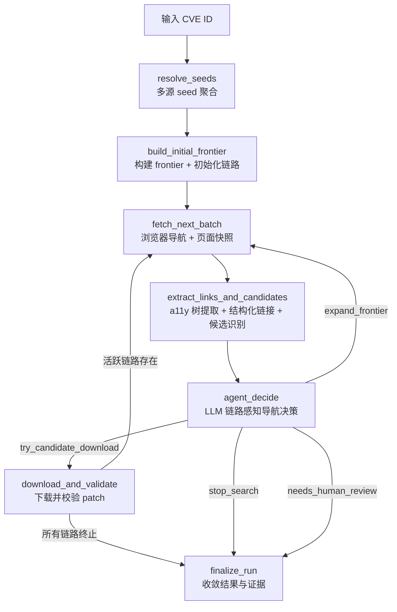

# CVE Patch 浏览器驱动型 Agent 搜索主链功能设计

> **CVE 场景浏览器驱动型智能体执行内核详细功能设计文档**

---

## 📋 模块概述

**模块名称**：CVE Patch 浏览器驱动型 Agent 搜索主链  
**模块编号**：M103  
**优先级**：P0  
**负责人**：AI + 开发团队  
**状态**：当前主链、真实 acceptance baseline 与 regression gate 已落地  
**补丁下载补强**：已完成 GitHub/kernel 多策略下载、GitHub API 优先路径、可选 `GITHUB_TOKEN` 增强、内部退避重试、错误分类与终态候选跳过。  
**历史重设计规格参考**：[2026-04-21-cve-browser-agent-design.md](/opt/projects/demo/aetherflow/docs/superpowers/specs/2026-04-21-cve-browser-agent-design.md)

---

## 🎯 功能目标

### 业务目标

当前 CVE 场景的后端主链已经收口为 `Playwright 浏览器驱动型 AI Agent`。

主链长期目标：

- 用真实浏览器打开页面，获取完整 DOM 和可访问性树
- 让 LLM 看到页面的结构化语义表示，而非 HTML 截断
- 通过链路感知的导航决策跨域追踪完整链路（advisory→tracker→commit→patch）
- 在有限预算内找到可下载、可校验、可复核的 patch 地址
- 完整保留搜索路径、链路状态、决策原因、候选收敛和下载验证证据

### 用户价值

- 用户可以看到系统是如何沿多条来源链逐步追踪到 patch 的完整链路
- 跨域链路（如 NVD → Debian tracker → GitLab commit）不再被截断
- 动态渲染的页面（JS 渲染）可以正确获取内容
- 即使最终未成功命中 patch，系统也能解释完整的探索路径和停止原因

### 模块职责

本模块负责定义 CVE Patch 浏览器 Agent 的执行内核：

- 多源 seed 聚合
- 初始 frontier 构建与页面角色分类
- **浏览器页面导航与快照构建**
- **可访问性树提取与裁剪**
- **结构化链接提取与上下文保留**
- **链路追踪与链路状态管理**
- **LLM 链路感知导航决策**
- 候选下载与校验
- 搜索图落库与证据收敛

---

## 👥 使用场景

### 场景1：标准 CVE Patch 搜索

**场景描述**：用户输入一个 CVE 编号，系统从官方记录、OSV、GitHub Advisory、NVD 等来源拿到初始 references，并通过浏览器 Agent 在有限预算内搜索 patch。

**目标能力**：

- 优先利用显式 patch 候选（seed 中直接包含 .patch/.diff 链接）
- 若没有显式 patch，则启动浏览器 Agent 多跳搜索
- 最终返回 patch 结果或明确的停止原因与探索路径

### 场景2：跨域链路追踪

**场景描述**：seed 指向的是公告页或 tracker 页，patch 在另一个域上。需要跨域追踪完整链路。

**典型链路**：

```
NVD advisory → Debian security-tracker → GitLab commit → .patch 下载
NVD advisory → Red Hat errata → Bugzilla → upstream commit
oss-security 邮件列表 → GitHub commit → .patch 下载
```

**当前能力**：LLM 在链路上下文中做跨域导航决策，受跨域预算控制。

### 场景3：动态页面处理

**场景描述**：部分安全 tracker 和 advisory 页面使用 JavaScript 渲染内容，httpx 无法获取有效信息。

**当前能力**：Playwright 浏览器执行 JS 后获取完整 DOM 和 a11y 树。

### 场景4：搜索未收敛但需要解释

**场景描述**：最终没有拿到 patch，但系统必须向用户展示：

- 完整的链路追踪记录（每条链路的状态：in_progress / completed / dead_end）
- 每个页面的角色判定和导航决策原因
- 预算消耗情况
- 为什么在当前状态下停止

---

## 🔄 业务流程

### 主流程



### 主流程说明

1. **resolve_seeds**：从 CVE 官方记录、OSV、GitHub Advisory、NVD 聚合 seed references（纯 API 调用，无需浏览器）
2. **build_initial_frontier**：对 seed URL 进行页面角色分类、优先级评分，初始化导航链路
3. **fetch_next_batch**：使用 **Playwright 浏览器**打开页面，构建 BrowserPageSnapshot（含 a11y 树、结构化链接、markdown）
4. **extract_links_and_candidates**：从 BrowserPageSnapshot 提取结构化链接（含上下文），运行 page_analyzer + reference_matcher 识别候选
5. **agent_decide**：LLM 接收 NavigationContext（含链路状态、a11y 树、key_links），输出结构化导航决策
6. **download_and_validate**：下载候选 patch 并校验内容。**如果仍有活跃链路且预算未尽，路由回 fetch_next_batch 继续探索**
7. **finalize_run**：收敛结果，生成 summary_json（含链路摘要）

### 补丁下载稳定化要点

当前补丁下载链路已经补齐以下稳定性措施：

- GitHub commit 候选按多策略顺序尝试：页面 `.patch` / `.diff` 与 GitHub API patch / diff 组合兜底
- GitHub PR 候选在页面 `.patch` 短时超时或异常时，会继续尝试 GitHub Pull API patch / diff 与页面 `.diff` 兜底
- kernel commit 候选优先从 `git.kernel.org` URL 提取 commit SHA，再走 GitHub API patch / diff 渲染补丁
- `git.kernel.org` 直连 patch 仅作为最后诊断兜底；遇到 Anubis / bot challenge 时不绕过，按失败类型记录
- `GITHUB_TOKEN` 是可选稳定性增强，不是 API 路径前置条件；无 token 时仍可匿名调用 GitHub API
- token 仅从环境变量读取，下载日志和 attempts 记录不得输出 token 或授权头
- 下载函数内部增加退避重试，专门覆盖短时超时和网络抖动
- 下载失败按 `timeout / rate_limited / not_found / http_error / invalid_content / network_error / bot_challenge` 分类
- 下载 attempts 会记录 `strategy / url / repository / media_type / status / error_kind`，用于解释每次策略切换
- `downloaded` / `failed` 终态候选在图节点层直接跳过，避免重复下载和重复写证据
- 候选全部终态时，`download_and_validate` 直接收敛，不再空转图循环

### Frontier 噪声过滤要点

当前页面探索链路已将以下链接视为全局低价值导航噪声：

- 登录、注册、帮助、定价、企业版等通用站点导航；
- Debian 安全首页、FAQ 等无法直接指向具体补丁的泛化页面；
- 邮件列表中的日期翻页、线程翻页、索引页等归档导航；
- NVD CVSS calculator：`/vuln-metrics/cvss/`。

NVD CVSS calculator 的处理原则是：

- 它可以作为 CVE 严重度参考，但不是补丁、tracker、commit 或 download 线索；
- 不应进入普通 frontier 扩展队列；
- 即使历史 frontier 中已经存在该链接，规则 fallback 也必须跳过；
- LLM 如果判断当前页面无补丁线索，系统不应继续消耗预算访问其它 CVSS calculator。

### Acceptance 失败分类语义

Acceptance 报告中的 `failure_category` 用于把系统缺陷和可解释的非行动项拆开，避免后续
Phase 3 迭代把所有 `status=failed` 都当成同一类问题处理。

当前已明确的无补丁类语义：

- `no_public_patch`：验收判定为 `PASS`、未找到 patch，且停止原因是无补丁候选或无剩余
  frontier / candidate。代表样本包括只落在 NVD / CVE.org / VulDB 信息页的 no-patch 路径。
- `non_maintained_component`：验收判定为 `PASS`、未找到 patch，且探索路径指向当前 CVE
  Patch Agent 不优先维护的组件生态，例如 WordPress 插件、WPScan、WordPress Trac 或
  Wordfence 来源。该分类表示不应直接扩展 downloader 或主导航链路。

该分类只影响 acceptance 报告和 evaluation-driven iteration 的决策入口，不改变主链运行、
Candidate Judge、patch 下载策略或用户可见的 patch 证据。

---

## 📊 功能清单

| 功能点 | 功能描述 | 优先级 | 当前状态 |
|--------|---------|--------|----------|
| Seed 解析 | 从多源聚合 seed references，保留来源级 trace | P0 | 已落地 |
| 直达候选识别 | 识别 seed 中显式 `.patch/.diff/.debdiff` 与 commit / PR / MR patch 候选 | P0 | 已落地 |
| 浏览器基础设施 | BrowserBackend 协议、PlaywrightPool、SyncBrowserBridge | P0 | 已落地 |
| 页面角色分类 | URL 启发式分类（advisory / tracker / commit / download 等） | P0 | 已落地 |
| a11y 树裁剪 | 从 Playwright 快照提取裁剪后的可访问性树（≤6000 字符） | P0 | 已落地 |
| Markdown 提取 | 浏览器内 Readability 提取纯文本 markdown（≤2000 字符） | P0 | 已落地 |
| 结构化链接提取 | 从 a11y 树提取带上下文的 PageLink 列表 | P0 | 已落地 |
| LLM 导航接口 | 构建 LLMPageView + NavigationContext，调用 LLM 返回结构化决策 | P0 | 已落地 |
| 链路追踪 | NavigationChain 创建/扩展/关闭/查询 | P0 | 已落地 |
| 导航提示词 | browser_agent_navigation.md 系统提示词 | P0 | 已落地 |
| 节点主链 | agent_nodes.py 使用浏览器 + chain-aware LLM 驱动主链 | P0 | 已落地 |
| 条件路由 | download_and_validate 后可回到 fetch（活跃链路时） | P0 | 已落地 |
| 链路感知停止 | 基于链路状态的停止评估（替代简单的“无 frontier 则停”） | P0 | 已落地 |
| 单路径运行时 | runtime.py 保持单主路径，移除 fast-first 与 httpx 页面主链 | P0 | 已落地 |
| 搜索图落库 | 持久化搜索节点、边、决策和候选收敛（复用现有表） | P0 | 已落地 |
| 补丁下载稳定化 | GitHub/kernel 多策略下载、API 优先、可选 token 增强、退避重试、错误分类、终态候选跳过 | P0 | 已落地 |
| acceptance baseline / gate | compare、baseline 与 regression gate 形成稳定回归约束 | P0 | 已落地 |
| 详情页图回放 | 展示链路追踪、frontier、budget、决策记录 | P1 | 已接入详情页语义，持续随详情能力演进 |

---

## 🎨 界面设计

### 页面1：无独立页面

本模块是 CVE 场景的后端浏览器 Agent 执行内核，用户通过以下页面间接感知：

- `M101`：工作台结果和运行状态
- `M102`：详情页中的搜索路径、链路追踪、patch 收敛与证据图

### 对前端的影响

当前详情页已具备：

- 运行状态
- patch 列表
- trace 时间线
- diff 查看

浏览器 Agent 落地后新增：

- **链路追踪面板**：每条 NavigationChain 的状态和步骤
- 搜索路径图（含跨域边标识）
- 页面角色标签
- Agent 决策记录（含链路上下文和跨域理由）
- 预算消耗面板

---

## 🏗️ 核心架构

### 长期定义主落点

- 本文档是当前浏览器 Agent 搜索主链的长期功能定义主落点。
- `docs/superpowers/specs/2026-04-21-cve-browser-agent-design.md` 保留为浏览器 Agent 重设计阶段的规格与历史背景说明。
- 当阶段性 spec 与本文档存在表述差异时，以本文档和当前代码实现为准。

### 执行架构

浏览器 Agent 当前长期架构只有一条主路径：

```text
CVE ID -> seed 解析 -> 浏览器 Agent 搜索图 -> patch 结果
```

- 运行时入口位于 `backend/app/cve/runtime.py`，由 `PlaywrightBackend + SyncBrowserBridge` 驱动。
- 执行图位于 `backend/app/cve/agent_graph.py`，主节点顺序为：
  `resolve_seeds -> build_initial_frontier -> fetch_next_batch -> extract_links_and_candidates -> agent_decide -> download_and_validate/finalize_run`
- `download_and_validate` 在存在活跃链路且预算未耗尽时，可以返回 `fetch_next_batch` 继续探索。
- 不存在并行主链、fast-first 规则执行器、httpx 页面抓取主路径或 feature flag 主链切换。

### 补丁下载实现约束

`backend/app/cve/patch_downloader.py` 当前承担补丁下载与校验，长期约束如下：

- 只负责候选补丁文件下载，不承担页面主抓取职责
- 对普通 GitHub commit 候选组合尝试页面 `.patch` / `.diff` 与 API patch / diff
- 对 GitHub PR 候选组合尝试页面 `.patch`、Pull API patch / diff 与页面 `.diff`
- 对 kernel commit 候选优先走 GitHub API patch / diff，`git.kernel.org` 直连只作诊断兜底
- `GITHUB_TOKEN` 仅作为可选增强降低匿名限流风险，不作为下载能力硬依赖
- 通过浏览器风格请求头、API media type、内部重试和错误分类增强稳定性
- 下载失败原因会写入 `patch_meta_json` 与 `source_fetch_records`，用于审计与排障

### 主运行时与节点职责

| 位置 | 当前职责 |
|------|---------|
| `backend/app/cve/runtime.py` | 创建浏览器桥接、构建初始状态、执行 LangGraph、处理诊断模式 |
| `backend/app/cve/agent_graph.py` | 定义单主路径拓扑和条件路由 |
| `backend/app/cve/agent_nodes.py` | 页面抓取、候选识别、LLM 决策、规则保底、下载校验、结果收口 |
| `backend/app/cve/agent_policy.py` | 预算约束、决策校验、停止条件、人审语义收紧 |
| `backend/app/cve/browser_agent_llm.py` | LLM 页面视图、导航上下文和结构化导航决策调用 |
| `backend/app/cve/chain_tracker.py` | 链路状态管理与预期下一步角色约束 |

### 浏览器层

```
BrowserBackend (Protocol)
    ├── PlaywrightBackend        # Playwright 实现
    │     └── PlaywrightPool     # BrowserContext 池（默认 3 个）
    └── (未来) LightpandaBackend # 通过 CDP 端点连接

SyncBrowserBridge                # async→sync 桥接，供 LangGraph 同步节点调用
```

浏览器层当前长期约束如下：

- 页面内容获取统一通过浏览器层完成，不再以 `httpx` 文本抓取作为页面主获取方式。
- 浏览器层对上游节点暴露的唯一核心快照对象是 `BrowserPageSnapshot`。
- `httpx` 当前只保留给 seed 解析 API 调用和 patch 文件下载，不承担页面主抓取职责。

### Lightpanda CDP 验证状态

| 能力 | 状态 | 备注 |
|------|------|------|
| CDP 连接 | 待验证 | 已补 `backend/scripts/verify_lightpanda_cdp.py`，当前工作区无可用 Lightpanda 端点 |
| a11y snapshot | 待验证 | 脚本会调用 `page.accessibility.snapshot()` 并输出结果 |
| DOM content | 待验证 | 脚本会调用 `page.content()` 并记录内容长度 |
| JS 执行（链接提取） | 待验证 | 脚本复用 `_LINK_EXTRACTION_SCRIPT` 验证页面内 JS 执行能力 |

**BrowserPageSnapshot** 是浏览器层的唯一输出物，包含：

| 字段 | 说明 |
|------|------|
| `url` / `final_url` | 请求 URL 与重定向后的最终 URL |
| `status_code` | HTTP 状态码 |
| `title` | 页面标题 |
| `raw_html` | 原始 HTML（供 page_analyzer 使用） |
| `accessibility_tree` | 裁剪后的 a11y 树（≤6000 字符） |
| `markdown_content` | Readability 提取的纯文本 markdown（≤2000 字符） |
| `links` | 结构化 PageLink 列表（含 text、context、is_cross_domain、estimated_target_role） |
| `page_role_hint` | 启发式页面角色 |
| `fetch_duration_ms` | 页面加载耗时 |

### LLM 决策层

```
NavigationContext
    ├── cve_id
    ├── budget_remaining
    ├── navigation_path          # 从哪来
    ├── current_page (LLMPageView)  # 在哪里
    │     ├── accessibility_tree_summary (≤6000 字符)
    │     ├── key_links (前 15 个，含上下文)
    │     ├── patch_candidates
    │     └── page_text_summary (≤2000 字符)
    ├── active_chains            # 链路状态
    ├── discovered_candidates    # 已有发现
    └── visited_domains
```

#### 当前稳定数据对象

当前代码中已经稳定落地的浏览器 Agent 数据对象包括：

| 对象 | 位置 | 当前用途 |
|------|------|---------|
| `BrowserPageSnapshot` | `backend/app/cve/browser/base.py` | 浏览器层对节点输出的标准页面快照 |
| `PageLink` | `backend/app/cve/browser/base.py` | 页面中的结构化链接与上下文 |
| `LLMPageView` | `backend/app/cve/browser_agent_llm.py` | 发给 LLM 的当前页面视图 |
| `NavigationContext` | `backend/app/cve/browser_agent_llm.py` | LLM 导航决策输入上下文 |
| `NavigationChain` / `ChainStep` | `backend/app/cve/chain_tracker.py` | 链路追踪、状态转换、预期下一步角色 |

#### LLM 导航主决策器定位

- LLM 是当前浏览器 Agent 的导航主决策器。
- LLM 输入以 `BrowserPageSnapshot` 派生出的 `LLMPageView` 和 `NavigationContext` 为核心，不再以 HTML 截断为主输入。
- `agent_nodes.py` 当前通过 `build_llm_page_view`、`build_navigation_context`、`call_browser_agent_navigation` 形成完整导航决策链。
- LLM 负责做结构化导航判断，规则层负责预算、合法性和停止条件校验，不与 LLM 形成并列主架构。

### 链路追踪层

```
NavigationChain
    ├── chain_id
    ├── chain_type               # advisory_to_patch / tracker_to_commit / mailing_list_to_fix
    ├── steps: list[ChainStep]   # [{url, page_role, depth}]
    ├── status                   # in_progress / completed / dead_end
    └── expected_next_roles      # 预期下一步的页面角色
```

当前实现已经稳定表达以下链路模式：

- `advisory_to_patch`
- `tracker_to_commit`
- `mailing_list_to_fix`

链路追踪当前承担三类长期职责：

1. 记录从 seed 到 patch 的真实页面路径和页面角色变化。
2. 为 LLM 提供“从哪来、现在在哪、下一步应该去哪类页面”的链路上下文。
3. 与停止条件、下载后继续探索、详情页回放和 acceptance baseline 共同构成可解释性边界。

---

## 💾 数据设计

### 数据存储复用

浏览器 Agent 复用现有搜索图数据模型，无需 schema 变更：

| 现有表 | 新增存储内容 |
|--------|------------|
| `cve_search_nodes` | `page_role` 存入 `heuristic_features_json`；a11y 树元数据存入 `content_excerpt` |
| `cve_search_edges` | 跨域边标识存入 `edge_type`；链路 ID 存入 `link_context` |
| `cve_search_decisions` | NavigationContext 存入 `input_json`；链路更新存入 `output_json` |
| `cve_candidate_artifacts` | 来源链路 ID 存入 `evidence_json` |
| `cve_runs` | 链路摘要存入 `summary_json` |

### 状态字段扩展

`AgentState` 新增字段（内存态，不影响 DB schema）：

| 字段 | 类型 | 说明 |
|------|------|------|
| `navigation_chains` | `list[dict]` | NavigationChain 列表 |
| `current_chain_id` | `str | None` | 当前活跃链路 ID |
| `page_role_history` | `list[dict]` | 页面角色记录 `[{url, role, title, depth}]` |
| `cross_domain_hops` | `int` | 已用跨域次数 |
| `browser_snapshots` | `dict[str, dict]` | URL → BrowserPageSnapshot 序列化 |

这些字段当前已经是运行时事实，而不是阶段性设计占位：

- `navigation_chains` 驱动链路状态与停止判断
- `page_role_history` 驱动导航路径、父页面摘要与详情页解释
- `cross_domain_hops` 驱动跨域预算与回归观察
- `browser_snapshots` 驱动页面加载耗时、页面摘要与证据回放

---

## 🔌 接口设计

### 接口1：创建 run

**接口路径**：`POST /api/v1/cve/runs`

**约束**：不需要为浏览器 Agent 重写对外入口。Agent 在后台执行，不改变工作台入口模式。

### 接口2：获取 run 详情

**接口路径**：`GET /api/v1/cve/runs/{run_id}`

**当前已返回**：`summary`、`progress`、`source_traces`、`patches`、`search_graph`、`frontier_status`、`decision_history`

**浏览器 Agent 新增字段**：

| 字段 | 类型 | 说明 |
|------|------|------|
| `navigation_chains` | `array` | 链路追踪记录 |
| `page_roles` | `object` | 每个节点的页面角色 |
| `cross_domain_hops` | `number` | 已用跨域次数 |

### 接口3：获取 patch 内容

**接口路径**：`GET /api/v1/cve/runs/{run_id}/patch-content`

**约束**：Agent 化不改变 patch 内容读取方式。

---

## ✅ 业务规则

### 规则1：浏览器是唯一页面获取方式

- 所有页面获取通过 Playwright 浏览器完成
- 不再使用 httpx 抓取页面（httpx 仅用于 seed 解析 API 调用和 patch 文件下载）
- 无 fallback 降级到 httpx

### 规则2：LLM 看到的是 a11y 树，不是 HTML 截断

- 主输入为裁剪后的可访问性树（≤6000 字符）
- 辅助输入为 Readability 提取的 markdown（≤2000 字符）
- 不再向 LLM 传递原始 HTML 或截断文本

### 规则3：导航决策由 LLM 在链路上下文中做出

- LLM 接收完整的 NavigationContext（含链路状态、导航路径、预算）
- 不再使用关键词打分决定导航方向
- LLM 可以选择跨域链接，但必须说明理由

### 规则4：链路终止前不得停止

- 只要存在 `in_progress` 状态的链路且预算未耗尽，Agent 不得停止
- `needs_human_review` 仅在无活跃链路、无未扩展 frontier、无跨域候选时接受

### 规则5：模型只能选路，不能编路

- 默认只能从当前页面已提取的 key_links 中选择下一跳
- 唯一允许的 URL 变换是调用 canonicalize 工具把 commit/MR/PR 转为 patch URL

### 规则6：跨域受预算控制

- 跨域扩展消耗 `max_cross_domain_expansions` 预算
- 默认预算 8 次，允许追踪 advisory→tracker→commit 完整链路

### 规则7：单主路径与受限鲁棒性保底

- CVE Patch Agent 的执行架构仍然只有一条主路径：
  `CVE ID -> seed 解析 -> 浏览器 Agent 搜索图 -> patch 结果`
- LLM 是导航主决策器，负责基于浏览器快照、链路上下文和预算信息做结构化导航判断。
- rule fallback / URL fallback 不是新的执行架构，也不是与 LLM 并列的主路径。
- rule fallback 仅用于 LLM 不可用、超时、预算耗尽或结构化决策未通过校验时的受限鲁棒性保底。
- URL fallback 仅用于已知代码托管 URL 形态的 deterministic patch 派生，例如 commit / PR / MR 到 `.patch` 的规范化。
- acceptance baseline 记录的是：
  - 真实互联网链路样本
  - 单主路径内部的鲁棒性边界
- acceptance baseline 不代表系统存在多套执行主链，也不改变 LLM 作为主决策器的定位。

### 规则8：成功 patch 事实不可覆盖

- 已下载成功并通过内容校验的 patch，模型不得覆盖该事实
- 模型只能决定是否继续搜索补充更多证据

### 规则9：Agent 输出必须结构化并经过校验

- 决策输出必须是结构化 JSON
- 动作仅允许：`expand_frontier` / `try_candidate_download` / `stop_search` / `needs_human_review`
- 任何超预算、越权、未知链接、重复跳转的输出必须被拒绝

### 规则10：停止必须可解释

Agent 停止时必须明确属于以下之一：

- `patches_downloaded`
- `no_seed_references`
- `max_pages_total_exhausted`
- `all_chains_resolved`
- `no_remaining_frontier_or_candidates`
- `needs_human_review`
- `resolve_seeds_failed`
- `build_initial_frontier_failed`
- `fetch_next_batch_failed`
- `extract_links_and_candidates_failed`
- `agent_decide_failed`
- `download_and_validate_failed`
- `finalize_run_failed`

### 规则11：停止条件以链路与预算事实为准

`backend/app/cve/agent_policy.py` 中当前长期有效的停止逻辑包括：

- 已有下载成功的 patch 时，收口为 `patches_downloaded`
- 只要仍有活跃链路且页面预算未耗尽，就不能停止
- 存在候选且所有链路已终止时，收口为 `all_chains_resolved`
- 无活跃链路、无未扩展 frontier、无候选时，收口为 `no_remaining_frontier_or_candidates`
- 页面预算耗尽时，收口为 `max_pages_total_exhausted`

`needs_human_review` 当前也已被收紧为受限语义：

- 必须同时满足“没有活跃链路”“没有未扩展 frontier”“没有链路推导出的跨域候选”才允许成立
- 它是单主路径内部的保底收口，不代表存在另一条执行主链

---

## 🚨 异常处理

### 异常1：无 seed references

**触发条件**：多源查询后没有可用初始 references  
**处理方案**：运行收口为 `no_seed_references`，保留来源级 trace

### 异常2：浏览器页面加载超时

**触发条件**：页面在 30 秒内未完成加载  
**处理方案**：以当前已加载内容构建快照；若内容为空，节点标记为 `blocked_page`

### 异常3：浏览器进程崩溃

**触发条件**：Playwright 浏览器进程异常退出  
**处理方案**：PlaywrightPool 重建浏览器实例，当前页面重试一次；若仍失败，标记节点 `blocked_page` 继续搜索

### 异常4：模型输出非法

**触发条件**：返回未知动作、选择不存在的链接、超出预算  
**处理方案**：决策记录写入 `validated = false`，拒绝输出，可重试一次

### 异常5：搜索预算耗尽

**触发条件**：任一预算维度耗尽  
**处理方案**：收口为 `search_budget_exhausted`，返回当前已访问路径和链路状态

### 异常6：所有链路进入死胡同

**触发条件**：所有 NavigationChain 状态为 `dead_end`，无候选  
**处理方案**：收口为 `no_viable_frontier`，返回完整链路追踪记录

---

## 🧪 测试要点

### 浏览器基础设施测试

- [ ] PlaywrightPool 启动/导航/快照/停止正常工作
- [ ] a11y_pruner 输出 ≤6000 字符
- [ ] page_role_classifier 正确分类各类页面
- [ ] SyncBrowserBridge 在同步上下文中正确返回快照
- [ ] 页面加载超时时以已加载内容构建快照

### LLM 决策测试

- [ ] LLM 请求载荷包含 a11y 树 + NavigationContext
- [ ] fake LLM 测试：给定 tracker 页面 + 活跃链路，选择跨域 commit 链接
- [ ] Agent 输出非法动作时被 validator 拒绝
- [ ] 已有成功 patch 时模型不能覆盖成功事实

### 链路追踪测试

- [ ] 链路状态机正确转换（in_progress → completed / dead_end）
- [ ] 活跃链路存在时 Agent 不早停
- [ ] 所有链路终止后正确收口

### 端到端测试

- [ ] fake browser + fake LLM：Agent 走完 advisory→tracker→commit 链
- [ ] 跨域导航正常工作且扣减预算
- [ ] download_and_validate 后可回到 fetch_next_batch（活跃链路时）
- [ ] 搜索图节点、边、决策可正确落库
- [ ] 预算耗尽时返回可解释 stop reason

### 集成测试（当前已验证）

- [x] CVE-2022-2509：通过 Debian tracker → GitLab commit 链路找到 patch
- [x] CVE-2024-3094：多链路多域场景
- [x] 链路完成率 ≥ 80%
- [x] 单次运行 ≤ 3 分钟

### 真实验收结果（2026-04-23 收口）

- `CVE-2022-2509` 已在真实 DashScope OpenAI 兼容配置下通过：
  `mailing_list_page -> tracker_page -> commit_page -> patch download`
- `CVE-2024-3094` 已在真实多链路跨域场景下通过：
  从 `tracker_page` 跨域进入 `oss-security`，直接收敛到上游 GitHub commit patch
- 当前推荐预算：
  - `CVE-2022-2509`：`max_llm_calls=4`、`max_pages_total=12`
  - `CVE-2024-3094`：`max_llm_calls=6`、`max_pages_total=16`
  - 共用：`LLM_WALL_CLOCK_TIMEOUT_SECONDS=90`、`AETHERFLOW_CVE_RUNTIME_DIAGNOSTIC_TIMEOUT_SECONDS=360`

### acceptance baseline / compare / gate

当前浏览器 Agent 的 acceptance 已经不是阶段性补充，而是长期回归基线的一部分。

#### baseline 报告定位

- `backend/scripts/acceptance_browser_agent.py` 负责生成 `acceptance_report.json`
- `backend/scripts/acceptance_regression_gate.py` 负责消费 baseline report 与 candidate report，输出 gate 结果
- `backend/tests/test_acceptance_browser_agent.py` 负责验证 baseline schema、compare 与 gate 的本地稳定性

#### baseline_sample 当前长期语义

`baseline_sample` 当前采用以下结构：

- `execution_architecture`
- `chain_patterns`
- `resilience_modes`
- `stable_fields`
- `volatile_fields`

其中：

- `execution_architecture` 固定表达单主路径，例如 `single_browser_agent_path`
- `chain_patterns` 表达真实互联网链路模式样本
- `resilience_modes` 表达单主路径内部的受限鲁棒性保底模式
- `stable_fields` 与 `volatile_fields` 用于 compare/gate 的可比性边界

#### regression gate 当前长期角色

- regression gate 比较 baseline report 与 candidate report，不改写浏览器 Agent 主逻辑
- gate 当前关注的核心退化信号是：
  - `patch_quality_degraded`
  - `high_value_path_regressed`
- 其余如 `patch_url_changed`、`navigation_path_changed`、`more_rule_fallback`、`new_page_roles` 当前是 warning 级观察信号
- gate 语义当前服务于“防止主链退化”，而不是定义新的执行模式

### 本轮确认的关键实现路径

1. `mailing_list_page` 或 `tracker_page` 进入目标 `tracker_page`
2. `tracker_page` 必须优先保留并提升 `commit_page` / `download_page` 类型链接
3. 当真实 `commit_page` 被 Cloudflare challenge 拦截时，不能依赖正文提取；必须从 commit URL 自身派生 `.patch` 候选
4. 一旦存在高质量上游 patch 候选，允许直接 `try_candidate_download`

### 之前没有打通的根因

1. `tracker_page` 的 frontier 打分中过度偏向 NVD / bugtracker / 其它 tracker 噪声，导致真实上游 `commit_page` 在 children 上限下被挤掉
2. 早期 acceptance 预算过低，`max_llm_calls=2` 只够走到目标 tracker，还来不及进入 commit
3. 真实 GitLab `commit_page` 会遇到 Cloudflare challenge；如果只依赖页面正文，系统无法产出 patch candidate
4. 真实供应商配置最初未固化到本地配置文件，导致 acceptance 容易停在环境缺失而非业务逻辑
5. NVD CVSS calculator 曾被当作普通 advisory frontier 消耗预算；当前已通过全局噪声过滤阻断
6. GitHub PR `.patch` 页面曾因短时 timeout 导致 `patch_download_failed`；当前已补充 Pull API patch / diff 与 `.diff` 兜底

---

## 📖 相关文档

- [总体项目设计.md](/opt/projects/demo/aetherflow/docs/00-总设计/总体项目设计.md)
- [CVE Patch 浏览器驱动型 AI Agent 设计规格](/opt/projects/demo/aetherflow/docs/superpowers/specs/2026-04-21-cve-browser-agent-design.md)
- `M101-CVE检索工作台功能设计.md`
- `M102-CVE运行详情与补丁证据功能设计.md`
- `M004-公共文档采集与Artifact基座功能设计.md`

---

## 🔄 变更记录

### 2026-04-21

- 从"CVE Patch 多跳 Agent 搜索主链"全量重写为"CVE Patch 浏览器驱动型 Agent 搜索主链"
- 废弃 httpx 抓取、关键词打分导航、同域限制、fast-first 路径
- 引入浏览器基础设施（BrowserBackend Protocol + PlaywrightPool + SyncBrowserBridge）
- 引入 a11y 树作为 LLM 主输入

### 2026-04-23

- 真实验收确认 `CVE-2022-2509` 与 `CVE-2024-3094` 均已通过
- 明确收口根因：`tracker_page` 对 `commit_page` 优先级不足、`commit_page` challenge 场景缺少 URL 级 patch fallback
- 将集成测试勾选项从设计目标更新为已验证事实
- 引入链路意识模型（NavigationChain）
- 引入链路感知停止条件
- 所有节点改造为浏览器 + chain-aware LLM
- 将浏览器 Agent 的长期定义进一步收口到 `docs/04-功能设计/` 主文档
- 明确 acceptance baseline / compare / regression gate 属于长期回归语义，而非阶段性验收附录

### 2026-04-20

- 从"CVE 数据源与页面探索规则"改写为"CVE Patch 多跳 Agent 搜索主链"
- 引入 LangGraph 图运行时、Agent 决策、预算模型、搜索图落库
