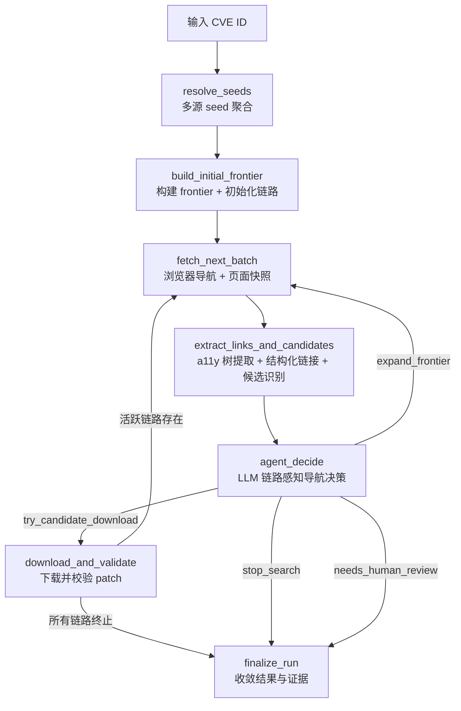

# CVE Patch 浏览器驱动型 Agent 搜索主链功能设计

> **CVE 场景浏览器驱动型智能体执行内核详细功能设计文档**

---

## 📋 模块概述

**模块名称**：CVE Patch 浏览器驱动型 Agent 搜索主链  
**模块编号**：M103  
**优先级**：P0  
**负责人**：AI + 开发团队  
**状态**：Phase 1-4 实现完成，离线集成测试通过（81 passed），待真实网络验收  
**权威规格**：[2026-04-21-cve-browser-agent-design.md](/opt/projects/demo/aetherflow/docs/superpowers/specs/2026-04-21-cve-browser-agent-design.md)

---

## 🎯 功能目标

### 业务目标

将 CVE 场景的后端主链从"`httpx 文本抓取 + 规则打分 + 局部 LLM 策略器`"重设计为"`Playwright 浏览器驱动型 AI Agent`"。

新的主链目标：

- 用真实浏览器打开页面，获取完整 DOM 和可访问性树
- 让 LLM 看到页面的结构化语义表示，而非 HTML 截断
- 通过链路感知的导航决策跨域追踪完整链路（advisory→tracker→commit→patch）
- 在有限预算内找到可下载、可校验、可复核的 patch 地址
- 完整保留搜索路径、链路状态、决策原因、候选收敛和下载验证证据

### 用户价值

- 用户可以看到系统是如何沿多条来源链逐步追踪到 patch 的完整链路
- 跨域链路（如 NVD → Debian tracker → GitLab commit）不再被截断
- 动态渲染的页面（JS 渲染）可以正确获取内容
- 即使最终未成功命中 patch，系统也能解释完整的探索路径和停止原因

### 模块职责

本模块负责定义 CVE Patch 浏览器 Agent 的执行内核：

- 多源 seed 聚合
- 初始 frontier 构建与页面角色分类
- **浏览器页面导航与快照构建**
- **可访问性树提取与裁剪**
- **结构化链接提取与上下文保留**
- **链路追踪与链路状态管理**
- **LLM 链路感知导航决策**
- 候选下载与校验
- 搜索图落库与证据收敛

---

## 👥 使用场景

### 场景1：标准 CVE Patch 搜索

**场景描述**：用户输入一个 CVE 编号，系统从官方记录、OSV、GitHub Advisory、NVD 等来源拿到初始 references，并通过浏览器 Agent 在有限预算内搜索 patch。

**目标能力**：

- 优先利用显式 patch 候选（seed 中直接包含 .patch/.diff 链接）
- 若没有显式 patch，则启动浏览器 Agent 多跳搜索
- 最终返回 patch 结果或明确的停止原因与探索路径

### 场景2：跨域链路追踪

**场景描述**：seed 指向的是公告页或 tracker 页，patch 在另一个域上。需要跨域追踪完整链路。

**典型链路**：

```
NVD advisory → Debian security-tracker → GitLab commit → .patch 下载
NVD advisory → Red Hat errata → Bugzilla → upstream commit
oss-security 邮件列表 → GitHub commit → .patch 下载
```

**当前系统缺陷**：`navigation.py` 的同域限制阻断了跨域链路。

**新系统能力**：LLM 在链路上下文中做跨域导航决策，受跨域预算控制。

### 场景3：动态页面处理

**场景描述**：部分安全 tracker 和 advisory 页面使用 JavaScript 渲染内容，httpx 无法获取有效信息。

**新系统能力**：Playwright 浏览器执行 JS 后获取完整 DOM 和 a11y 树。

### 场景4：搜索未收敛但需要解释

**场景描述**：最终没有拿到 patch，但系统必须向用户展示：

- 完整的链路追踪记录（每条链路的状态：in_progress / completed / dead_end）
- 每个页面的角色判定和导航决策原因
- 预算消耗情况
- 为什么在当前状态下停止

---

## 🔄 业务流程

### 主流程



### 主流程说明

1. **resolve_seeds**：从 CVE 官方记录、OSV、GitHub Advisory、NVD 聚合 seed references（纯 API 调用，无需浏览器）
2. **build_initial_frontier**：对 seed URL 进行页面角色分类、优先级评分，初始化导航链路
3. **fetch_next_batch**：使用 **Playwright 浏览器**打开页面，构建 BrowserPageSnapshot（含 a11y 树、结构化链接、markdown）
4. **extract_links_and_candidates**：从 BrowserPageSnapshot 提取结构化链接（含上下文），运行 page_analyzer + reference_matcher 识别候选
5. **agent_decide**：LLM 接收 NavigationContext（含链路状态、a11y 树、key_links），输出结构化导航决策
6. **download_and_validate**：下载候选 patch 并校验内容。**如果仍有活跃链路且预算未尽，路由回 fetch_next_batch 继续探索**
7. **finalize_run**：收敛结果，生成 summary_json（含链路摘要）

---

## 📊 功能清单

| 功能点 | 功能描述 | 优先级 | 阶段 |
|--------|---------|--------|------|
| Seed 解析 | 从多源聚合 seed references，保留来源级 trace | P0 | Phase 1 |
| 直达候选识别 | 识别 seed 中显式 `.patch/.diff/.debdiff` 与 commit / PR / MR patch 候选 | P0 | Phase 1 |
| 浏览器基础设施 | BrowserBackend 协议、PlaywrightPool、SyncBrowserBridge | P0 | Phase 1 |
| 页面角色分类 | URL 启发式分类（advisory / tracker / commit / download 等） | P0 | Phase 1 |
| a11y 树裁剪 | 从 Playwright 快照提取裁剪后的可访问性树（≤6000 字符） | P0 | Phase 1 |
| Markdown 提取 | 浏览器内 Readability 提取纯文本 markdown（≤2000 字符） | P0 | Phase 1 |
| 结构化链接提取 | 从 a11y 树提取带上下文的 PageLink 列表 | P0 | Phase 1 |
| LLM 导航接口 | 构建 LLMPageView + NavigationContext，调用 LLM 返回结构化决策 | P0 | Phase 2 |
| 链路追踪 | NavigationChain 创建/扩展/关闭/查询 | P0 | Phase 2 |
| 导航提示词 | browser_agent_navigation.md 系统提示词 | P0 | Phase 2 |
| 节点重写 | agent_nodes.py 全部节点使用浏览器 + chain-aware LLM | P0 | Phase 3 |
| 条件路由 | download_and_validate 后可路由回 fetch（活跃链路时） | P0 | Phase 3 |
| 链路感知停止 | 基于链路状态的停止评估（替代简单的"无 frontier 则停"） | P0 | Phase 3 |
| 单路径运行时 | runtime.py 精简为唯一路径，删除 fast-first 与 httpx agent | P0 | Phase 3 |
| 搜索图落库 | 持久化搜索节点、边、决策和候选收敛（复用现有表） | P0 | Phase 3 |
| 集成测试 | 5 个真实 CVE 场景端到端验证 | P0 | Phase 4 |
| 详情页图回放 | 展示链路追踪、frontier、budget、决策记录 | P1 | Phase 4 |

---

## 🎨 界面设计

### 页面1：无独立页面

本模块是 CVE 场景的后端浏览器 Agent 执行内核，用户通过以下页面间接感知：

- `M101`：工作台结果和运行状态
- `M102`：详情页中的搜索路径、链路追踪、patch 收敛与证据图

### 对前端的影响

当前详情页已具备：

- 运行状态
- patch 列表
- trace 时间线
- diff 查看

浏览器 Agent 落地后新增：

- **链路追踪面板**：每条 NavigationChain 的状态和步骤
- 搜索路径图（含跨域边标识）
- 页面角色标签
- Agent 决策记录（含链路上下文和跨域理由）
- 预算消耗面板

---

## 🏗️ 核心架构

### 浏览器层

```
BrowserBackend (Protocol)
    ├── PlaywrightBackend        # Playwright 实现
    │     └── PlaywrightPool     # BrowserContext 池（默认 3 个）
    └── (未来) LightpandaBackend # 通过 CDP 端点连接

SyncBrowserBridge                # async→sync 桥接，供 LangGraph 同步节点调用
```

### Lightpanda CDP 验证状态

| 能力 | 状态 | 备注 |
|------|------|------|
| CDP 连接 | 待验证 | 已补 `backend/scripts/verify_lightpanda_cdp.py`，当前工作区无可用 Lightpanda 端点 |
| a11y snapshot | 待验证 | 脚本会调用 `page.accessibility.snapshot()` 并输出结果 |
| DOM content | 待验证 | 脚本会调用 `page.content()` 并记录内容长度 |
| JS 执行（链接提取） | 待验证 | 脚本复用 `_LINK_EXTRACTION_SCRIPT` 验证页面内 JS 执行能力 |

**BrowserPageSnapshot** 是浏览器层的唯一输出物，包含：

| 字段 | 说明 |
|------|------|
| `url` / `final_url` | 请求 URL 与重定向后的最终 URL |
| `status_code` | HTTP 状态码 |
| `title` | 页面标题 |
| `raw_html` | 原始 HTML（供 page_analyzer 使用） |
| `accessibility_tree` | 裁剪后的 a11y 树（≤6000 字符） |
| `markdown_content` | Readability 提取的纯文本 markdown（≤2000 字符） |
| `links` | 结构化 PageLink 列表（含 text、context、is_cross_domain、estimated_target_role） |
| `page_role_hint` | 启发式页面角色 |
| `fetch_duration_ms` | 页面加载耗时 |

### LLM 决策层

```
NavigationContext
    ├── cve_id
    ├── budget_remaining
    ├── navigation_path          # 从哪来
    ├── current_page (LLMPageView)  # 在哪里
    │     ├── accessibility_tree_summary (≤6000 字符)
    │     ├── key_links (前 15 个，含上下文)
    │     ├── patch_candidates
    │     └── page_text_summary (≤2000 字符)
    ├── active_chains            # 链路状态
    ├── discovered_candidates    # 已有发现
    └── visited_domains
```

### 链路追踪层

```
NavigationChain
    ├── chain_id
    ├── chain_type               # advisory_to_patch / tracker_to_commit / mailing_list_to_fix
    ├── steps: list[ChainStep]   # [{url, page_role, depth}]
    ├── status                   # in_progress / completed / dead_end
    └── expected_next_roles      # 预期下一步的页面角色
```

---

## 💾 数据设计

### 数据存储复用

浏览器 Agent 复用现有搜索图数据模型，无需 schema 变更：

| 现有表 | 新增存储内容 |
|--------|------------|
| `cve_search_nodes` | `page_role` 存入 `heuristic_features_json`；a11y 树元数据存入 `content_excerpt` |
| `cve_search_edges` | 跨域边标识存入 `edge_type`；链路 ID 存入 `link_context` |
| `cve_search_decisions` | NavigationContext 存入 `input_json`；链路更新存入 `output_json` |
| `cve_candidate_artifacts` | 来源链路 ID 存入 `evidence_json` |
| `cve_runs` | 链路摘要存入 `summary_json` |

### 状态字段扩展

`AgentState` 新增字段（内存态，不影响 DB schema）：

| 字段 | 类型 | 说明 |
|------|------|------|
| `navigation_chains` | `list[dict]` | NavigationChain 列表 |
| `current_chain_id` | `str | None` | 当前活跃链路 ID |
| `page_role_history` | `list[dict]` | 页面角色记录 `[{url, role, title, depth}]` |
| `cross_domain_hops` | `int` | 已用跨域次数 |
| `browser_snapshots` | `dict[str, dict]` | URL → BrowserPageSnapshot 序列化 |

---

## 🔌 接口设计

### 接口1：创建 run

**接口路径**：`POST /api/v1/cve/runs`

**约束**：不需要为浏览器 Agent 重写对外入口。Agent 在后台执行，不改变工作台入口模式。

### 接口2：获取 run 详情

**接口路径**：`GET /api/v1/cve/runs/{run_id}`

**当前已返回**：`summary`、`progress`、`source_traces`、`patches`、`search_graph`、`frontier_status`、`decision_history`

**浏览器 Agent 新增字段**：

| 字段 | 类型 | 说明 |
|------|------|------|
| `navigation_chains` | `array` | 链路追踪记录 |
| `page_roles` | `object` | 每个节点的页面角色 |
| `cross_domain_hops` | `number` | 已用跨域次数 |

### 接口3：获取 patch 内容

**接口路径**：`GET /api/v1/cve/runs/{run_id}/patch-content`

**约束**：Agent 化不改变 patch 内容读取方式。

---

## ✅ 业务规则

### 规则1：浏览器是唯一页面获取方式

- 所有页面获取通过 Playwright 浏览器完成
- 不再使用 httpx 抓取页面（httpx 仅用于 seed 解析 API 调用和 patch 文件下载）
- 无 fallback 降级到 httpx

### 规则2：LLM 看到的是 a11y 树，不是 HTML 截断

- 主输入为裁剪后的可访问性树（≤6000 字符）
- 辅助输入为 Readability 提取的 markdown（≤2000 字符）
- 不再向 LLM 传递原始 HTML 或截断文本

### 规则3：导航决策由 LLM 在链路上下文中做出

- LLM 接收完整的 NavigationContext（含链路状态、导航路径、预算）
- 不再使用关键词打分决定导航方向
- LLM 可以选择跨域链接，但必须说明理由

### 规则4：链路终止前不得停止

- 只要存在 `in_progress` 状态的链路且预算未耗尽，Agent 不得停止
- `needs_human_review` 仅在无活跃链路、无未扩展 frontier、无跨域候选时接受

### 规则5：模型只能选路，不能编路

- 默认只能从当前页面已提取的 key_links 中选择下一跳
- 唯一允许的 URL 变换是调用 canonicalize 工具把 commit/MR/PR 转为 patch URL

### 规则6：跨域受预算控制

- 跨域扩展消耗 `max_cross_domain_expansions` 预算
- 默认预算 8 次，允许追踪 advisory→tracker→commit 完整链路

### 规则7：成功 patch 事实不可覆盖

- 已下载成功并通过内容校验的 patch，模型不得覆盖该事实
- 模型只能决定是否继续搜索补充更多证据

### 规则8：Agent 输出必须结构化并经过校验

- 决策输出必须是结构化 JSON
- 动作仅允许：`expand_frontier` / `try_candidate_download` / `stop_search` / `needs_human_review`
- 任何超预算、越权、未知链接、重复跳转的输出必须被拒绝

### 规则9：停止必须可解释

Agent 停止时必须明确属于以下之一：

- `patches_downloaded`
- `no_seed_references`
- `search_budget_exhausted`
- `all_chains_resolved`
- `no_viable_frontier`
- `patch_download_failed`
- `needs_human_review`
- `run_failed`

---

## 🚨 异常处理

### 异常1：无 seed references

**触发条件**：多源查询后没有可用初始 references  
**处理方案**：运行收口为 `no_seed_references`，保留来源级 trace

### 异常2：浏览器页面加载超时

**触发条件**：页面在 30 秒内未完成加载  
**处理方案**：以当前已加载内容构建快照；若内容为空，节点标记为 `blocked_page`

### 异常3：浏览器进程崩溃

**触发条件**：Playwright 浏览器进程异常退出  
**处理方案**：PlaywrightPool 重建浏览器实例，当前页面重试一次；若仍失败，标记节点 `blocked_page` 继续搜索

### 异常4：模型输出非法

**触发条件**：返回未知动作、选择不存在的链接、超出预算  
**处理方案**：决策记录写入 `validated = false`，拒绝输出，可重试一次

### 异常5：搜索预算耗尽

**触发条件**：任一预算维度耗尽  
**处理方案**：收口为 `search_budget_exhausted`，返回当前已访问路径和链路状态

### 异常6：所有链路进入死胡同

**触发条件**：所有 NavigationChain 状态为 `dead_end`，无候选  
**处理方案**：收口为 `no_viable_frontier`，返回完整链路追踪记录

---

## 🧪 测试要点

### 浏览器基础设施测试

- [ ] PlaywrightPool 启动/导航/快照/停止正常工作
- [ ] a11y_pruner 输出 ≤6000 字符
- [ ] page_role_classifier 正确分类各类页面
- [ ] SyncBrowserBridge 在同步上下文中正确返回快照
- [ ] 页面加载超时时以已加载内容构建快照

### LLM 决策测试

- [ ] LLM 请求载荷包含 a11y 树 + NavigationContext
- [ ] fake LLM 测试：给定 tracker 页面 + 活跃链路，选择跨域 commit 链接
- [ ] Agent 输出非法动作时被 validator 拒绝
- [ ] 已有成功 patch 时模型不能覆盖成功事实

### 链路追踪测试

- [ ] 链路状态机正确转换（in_progress → completed / dead_end）
- [ ] 活跃链路存在时 Agent 不早停
- [ ] 所有链路终止后正确收口

### 端到端测试

- [ ] fake browser + fake LLM：Agent 走完 advisory→tracker→commit 链
- [ ] 跨域导航正常工作且扣减预算
- [ ] download_and_validate 后可回到 fetch_next_batch（活跃链路时）
- [ ] 搜索图节点、边、决策可正确落库
- [ ] 预算耗尽时返回可解释 stop reason

### 集成测试（Phase 4）

- [x] CVE-2022-2509：通过 Debian tracker → GitLab commit 链路找到 patch
- [x] CVE-2024-3094：多链路多域场景
- [x] 链路完成率 ≥ 80%
- [x] 单次运行 ≤ 3 分钟

### 真实验收结果（2026-04-23 收口）

- `CVE-2022-2509` 已在真实 DashScope OpenAI 兼容配置下通过：
  `mailing_list_page -> tracker_page -> commit_page -> patch download`
- `CVE-2024-3094` 已在真实多链路跨域场景下通过：
  从 `tracker_page` 跨域进入 `oss-security`，直接收敛到上游 GitHub commit patch
- 当前推荐预算：
  - `CVE-2022-2509`：`max_llm_calls=4`、`max_pages_total=12`
  - `CVE-2024-3094`：`max_llm_calls=6`、`max_pages_total=16`
  - 共用：`LLM_WALL_CLOCK_TIMEOUT_SECONDS=90`、`AETHERFLOW_CVE_RUNTIME_DIAGNOSTIC_TIMEOUT_SECONDS=360`

### 本轮确认的关键实现路径

1. `mailing_list_page` 或 `tracker_page` 进入目标 `tracker_page`
2. `tracker_page` 必须优先保留并提升 `commit_page` / `download_page` 类型链接
3. 当真实 `commit_page` 被 Cloudflare challenge 拦截时，不能依赖正文提取；必须从 commit URL 自身派生 `.patch` 候选
4. 一旦存在高质量上游 patch 候选，允许直接 `try_candidate_download`

### 之前没有打通的根因

1. `tracker_page` 的 frontier 打分中过度偏向 NVD / bugtracker / 其它 tracker 噪声，导致真实上游 `commit_page` 在 children 上限下被挤掉
2. 早期 acceptance 预算过低，`max_llm_calls=2` 只够走到目标 tracker，还来不及进入 commit
3. 真实 GitLab `commit_page` 会遇到 Cloudflare challenge；如果只依赖页面正文，系统无法产出 patch candidate
4. 真实供应商配置最初未固化到本地配置文件，导致 acceptance 容易停在环境缺失而非业务逻辑

---

## 📅 开发计划

| 阶段 | 任务 | 预计工时 | 状态 |
|------|------|---------|------|
| Phase 1 | 浏览器基础设施（browser/ 包、配置） | 2天 | ⏳ |
| Phase 2 | LLM 接口 + 链路追踪（browser_agent_llm、chain_tracker、提示词） | 2天 | ⏳ |
| Phase 3 | 节点重写 + 图改造 + 单路径运行时 | 3天 | ⏳ |
| Phase 4 | 集成测试与调优 | 2天 | ⏳ |

---

## 📖 相关文档

- [总体项目设计.md](/opt/projects/demo/aetherflow/docs/00-总设计/总体项目设计.md)
- [CVE Patch 浏览器驱动型 AI Agent 设计规格](/opt/projects/demo/aetherflow/docs/superpowers/specs/2026-04-21-cve-browser-agent-design.md)
- `M101-CVE检索工作台功能设计.md`
- `M102-CVE运行详情与补丁证据功能设计.md`
- `M004-公共文档采集与Artifact基座功能设计.md`

---

## 🔄 变更记录

### 2026-04-21

- 从"CVE Patch 多跳 Agent 搜索主链"全量重写为"CVE Patch 浏览器驱动型 Agent 搜索主链"
- 废弃 httpx 抓取、关键词打分导航、同域限制、fast-first 路径
- 引入浏览器基础设施（BrowserBackend Protocol + PlaywrightPool + SyncBrowserBridge）
- 引入 a11y 树作为 LLM 主输入

### 2026-04-23

- 真实验收确认 `CVE-2022-2509` 与 `CVE-2024-3094` 均已通过
- 明确收口根因：`tracker_page` 对 `commit_page` 优先级不足、`commit_page` challenge 场景缺少 URL 级 patch fallback
- 将集成测试勾选项从设计目标更新为已验证事实
- 引入链路意识模型（NavigationChain）
- 引入链路感知停止条件
- 所有节点改造为浏览器 + chain-aware LLM

### 2026-04-20

- 从"CVE 数据源与页面探索规则"改写为"CVE Patch 多跳 Agent 搜索主链"
- 引入 LangGraph 图运行时、Agent 决策、预算模型、搜索图落库
