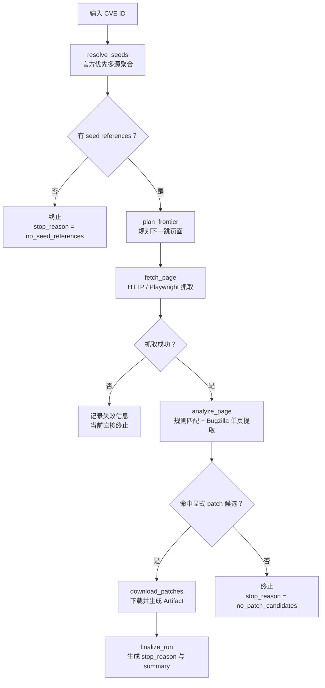

# CVE 数据源与页面探索规则功能设计

> **CVE 数据处理主链详细功能设计文档**

---

## 📋 模块概述

**模块名称**：CVE 数据源与页面探索规则  
**模块编号**：M103  
**优先级**：P0  
**负责人**：AI + 开发团队  
**状态**：Phase A 已落地，待继续演进

---

## 🎯 功能目标

### 业务目标
定义 CVE 场景的真实后端主链：多源 seed 解析、frontier 规划、页面抓取、规则匹配、单页特化提取、patch 下载与 stop reason 生成。

### 用户价值
- 用户看到的补丁结果不是“黑盒猜出来的”，而是沿当前可信数据源和页面规则推导出来的。

---

## 👥 使用场景

### 场景1：标准 CVE 补丁查询
**场景描述**：针对常规 CVE，从当前支持的数据源获取参考并沿页面继续探索。

### 场景2：复杂 vendor 页面链路
**场景描述**：需要经过 Debian BTS、GitHub/GitLab commit、kernel stable、Bugzilla 附件等路径才能拿到 patch。

---

## 🔄 业务流程

### 主流程

---

## 📊 功能清单

| 功能点 | 功能描述 | 优先级 | 状态 |
|--------|---------|--------|------|
| Seed 解析 | 当前从 `cve_official -> osv -> github_advisory -> nvd` 聚合 seed，并记录来源级 trace | P0 | ✅ 已完成 |
| Frontier 规划 | 当前最小一跳规划，按 `urldefrag` 去重并限制页数 | P0 | ✅ 已完成 |
| 规则匹配 | 当前命中 `.patch` / `.diff` / `.debdiff` / `patch=` / GitHub / GitLab / kernel stable | P0 | ✅ 已完成 |
| 单页特化提取 | 当前支持 Bugzilla detail 页 raw attachment | P0 | ✅ 已完成 |
| 内容下载与校验 | 下载 patch 并校验不是 HTML 页面 | P0 | ✅ 已完成 |
| 平台状态对齐 | run 与 job/attempt 终态对齐 | P0 | ✅ 已完成 |
| 多源聚合 | `cve_official`、OSV、GitHub Advisory、NVD 已落地 | P0 | ✅ 已完成 |
| Trace 落表与 frontier 治理 | `source_fetch_records` 已接入 seed/page/download，frontier 仍保持最小一跳 | P1 | 🟡 部分完成 |
| 受限 LLM 兜底 | 在规则不足时从候选中做有限选择 | P2 | ⚪ 未开始 |

---

## 🎨 界面设计

### 页面1：无独立页面
该模块为后端主链模块，用户通过 `M101` 和 `M102` 间接感知其效果。

---

## 💾 数据设计

### 涉及的数据表
- `cve_runs`
- `cve_patch_artifacts`
- `artifacts`
- `source_fetch_records`

说明：

- 当前真实实现已使用 `cve_runs`、`cve_patch_artifacts`、`artifacts`
- `source_fetch_records` 已接入 CVE 主链，用于记录 seed 解析、页面抓取与 patch 下载 trace
- `cve_fix_families` 不属于本轮已实现范围

### 核心数据字段

#### SourceTraceStep
| 字段名 | 类型 | 必填 | 说明 |
|--------|------|------|------|
| url | string | 否 | 当前步骤关联 URL |
| label | string | 是 | 当前步骤的人类可读标签 |
| request_snapshot | object | 是 | 请求快照 |
| response_meta | object | 是 | 响应元数据 |
| error_message | string | 否 | 当前步错误信息 |

说明：

- 当前 API 已返回 `source_traces`
- `cve_seed_resolve` 的 `response_meta` 中已包含 `source_results`
- `cve_seed_resolve` 的 `request_snapshot` 中已包含固定顺序的 `request_urls`

---

## 🔌 接口设计

### 接口1：创建 run
**接口路径**：`POST /api/v1/cve/runs`

### 接口2：获取 run
**接口路径**：`GET /api/v1/cve/runs/{run_id}`

**业务规则**：
- 工作台消费摘要字段
- 详情页消费完整 `source_traces`、`patches` 与 diff 加载入口
- 数据源、frontier 和下载逻辑为场景内部实现

---

## ✅ 业务规则

### 规则1：规则优先于 LLM
**规则描述**：能用显式规则命中 patch 时，不走 LLM；当前第一轮尚未接入 LLM。

### 规则2：LLM 只能做候选选择，不能编造新 URL
**规则描述**：作为后续扩展保留；当前第一轮未实现。

### 规则3：停止原因必须明确
**规则描述**：无论成功还是失败，都必须留下 `stop_reason`。

### 规则4：agent 模式下命中的 patch 全部下载
**规则描述**：一旦进入候选列表，不再对已命中的 patch 做数量截断。

### 规则5：普通 HTML 页面不能伪装成 patch 成功
**规则描述**：下载器必须校验响应内容不是 HTML 页面，且正文看起来像真实 patch/diff。

### 规则6：平台任务状态必须与场景 run 终态对齐
**规则描述**：`cve_run = failed` 时，`task_job` / `task_attempt` 也必须收口为失败。

### 规则7：seed 解析必须保留来源级可解释性
**规则描述**：`resolve_seeds` 不只返回合并后的引用，还必须在 trace 中保留固定顺序的 `source_results`、`status_code` 和 `request_urls`。

### 规则8：页面分析必须先 matcher，后单页特化提取
**规则描述**：`analyze_page` 先保留 HTML 中 URL 扫描得到的 matcher 候选，再追加 Bugzilla raw attachment 候选，并按 `urldefrag(candidate_url).url` 去重。

---

## 🚨 异常处理

### 异常1：无 seed references
**触发条件**：多源查询没有拿到有效引用

**错误提示**：`当前数据源未返回可用参考链接`

**处理方案**：run 终止，`stop_reason = no_seed_references`

---

### 异常1.1：所有 seed 来源都失败
**触发条件**：`cve_official`、`osv`、`github_advisory`、`nvd` 全部失败

**错误提示**：在运行摘要和 trace 中体现为 `resolve_seeds_failed`

**处理方案**：
- `resolve_seed_references` 抛出异常
- `response_meta_json` 仍保留来源级失败结果
- 运行收口为 `stop_reason = resolve_seeds_failed`

---

### 异常2：页面抓取失败
**触发条件**：目标页面访问失败

**错误提示**：在详情页体现为该步抓取失败

**处理方案**：
- 当前第一轮直接终止
- `stop_reason = fetch_failed`
- 错误信息进入 `summary.error`

### 异常3：阶段执行异常
**触发条件**：`resolve_seeds`、`analyze_page`、`download_patches` 等阶段抛出异常

**错误提示**：在运行摘要中能看到明确 `stop_reason` 与 `summary.error`

**处理方案**：
- `cve_run` 必须收口为 `failed/finalize_run`
- 不能停留在 `running`
- Worker 必须同步把平台 `task_job` / `task_attempt` 标记为失败

---

## 🔐 权限控制

### 访问权限
- 无独立权限

### 数据权限
- 结果通过场景接口暴露

---

## 📝 开发要点

### 技术难点
1. 需要在“显式规则命中率”和“误把普通页面当 patch”的风险之间做收紧。
2. 多源 seed 已接入后，必须保证来源级 trace 对工作台与详情页仍然可解释。
3. Bugzilla raw attachment 只能做单页特化，不能演进成无边界多跳抓取。

### 性能要求
- 单次 run 必须有整体超时和页面抓取超时
- 同一 run 内要限制 frontier 深度和动态抓取次数
- API 不应为每个请求重复创建新的数据库 Engine / 连接池

### 注意事项
- 不把主链塞回旧 pipeline/stages 目录
- 当前主线不引入 graph run、fix family 或 LLM fallback
- 文档和实现都必须保持“官方记录优先、多源补充、规则优先”的口径
- 测试环境重建 public schema 时，需要避免复用旧缓存连接状态

---

## 🧪 测试要点

### 功能测试
- [x] 当前官方优先多源 seed 查询可返回初始 references
- [x] 规则可命中 `.patch` / `.diff` / `.debdiff` / GitHub / GitLab / kernel stable URL
- [x] Bugzilla detail 页可提取 raw attachment
- [x] 下载后能生成 patch Artifact
- [x] 普通 HTML commit 页面会被拒绝
- [x] 运行失败时平台任务状态与场景 run 状态对齐

### 边界测试
- [x] 无 reference 时 stop reason 正确
- [x] 所有 seed 来源失败时收口为 `resolve_seeds_failed`
- [x] `resolve_seeds` / `analyze_page` 异常时 run 不会卡在 running
- [x] seed / page / download trace 已落表
- [x] 多源 seed 聚合已落地
- [x] Debian BTS、Bugzilla、Openwall regression fixture 已离线固化
- [ ] LLM 兜底（后续）

---

## 📅 开发计划

| 阶段 | 任务 | 预计工时 | 负责人 | 状态 |
|------|------|---------|--------|------|
| 设计 | 完成主链规则设计 | 0.5天 | AI | ✅ |
| 开发 | 官方优先多源 seed 聚合 | 2天 | AI | ✅ |
| 开发 | 非 NVD 规则匹配与单页 Bugzilla 提取 | 2天 | AI | ✅ |
| 测试 | 回归样例、异常路径与状态对齐补强 | 1.5天 | AI | ✅ |
| 下一步 | graph/fix family/LLM fallback 评估 | 1天 | - | ⚪ |

---

## 📖 相关文档

- `M101-CVE检索工作台功能设计.md`
- `M102-CVE运行详情与补丁证据功能设计.md`
- `M004-公共文档采集与Artifact基座功能设计.md`

---

## 🔄 变更记录

### v1.2 - 2026-04-15
- 同步 Phase A 已落地事实：官方优先多源 seed、非 NVD 规则库、Bugzilla 单页提取与 regression fixture
- 更新主流程、功能清单、trace 结构、测试要点与下一步边界
- 把旧的“仅 NVD seed / source_fetch_records 未接入”描述修正为当前实现状态

### v1.1 - 2026-04-13
- 根据第一轮真实实现更新功能边界
- 明确当前仅支持 NVD seed、显式 patch 规则和 GitHub commit 转 patch
- 补充状态对齐、HTML 伪阳性防护和数据库连接复用约束

### v1.0 - 2026-04-09
- 初始化 CVE 数据源与页面探索设计

---

**文档版本**：v1.2  
**创建日期**：2026-04-09  
**最后更新**：2026-04-15  
**维护人**：AI + 开发团队
