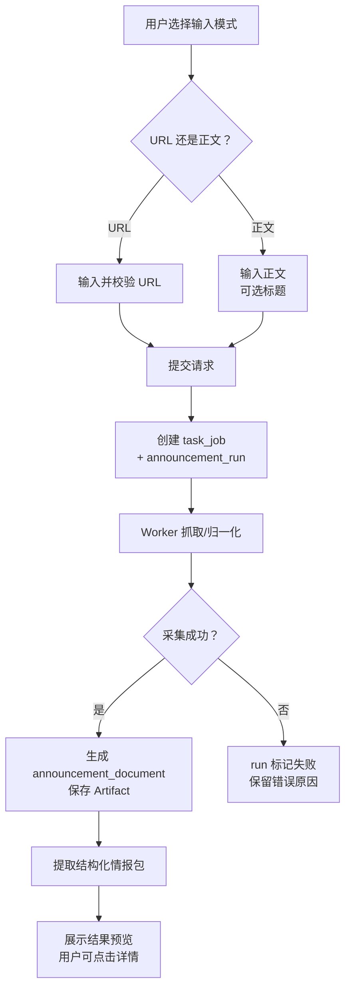

# 安全公告手动提取功能设计

> **安全公告场景详细功能设计文档**

---

## 📋 模块概述

**模块名称**：安全公告手动提取  
**模块编号**：M201  
**优先级**：P0  
**负责人**：AI + 开发团队  
**状态**：设计中

---

## 🎯 功能目标

### 业务目标
支持用户以 `URL` 或 `正文粘贴` 两种方式提交安全公告文档，并产出统一的结构化情报包。

### 用户价值
- 不依赖监控源，用户可以对任意一篇公告立即发起分析。
- 结果结构统一，便于后续进入投递、复核或二次使用。

### 首个切片定位
- 正文模式是首个可运行垂直切片，用来先验证 `api + worker` 与情报提取主链闭环。
- URL 模式在正文模式稳定后接入，用来补齐抓取、归一化与来源元信息链路。

---

## 👥 使用场景

### 场景1：URL 提取
**场景描述**：用户拿到一篇公告链接，希望立即分析其关键信息。

**用户操作流程**：
1. 进入 `/announcements`
2. 选择 `URL 提取`
3. 输入 URL
4. 点击开始提取
5. 查看结构化情报包

---

### 场景2：正文粘贴提取
**场景描述**：用户手里只有拷贝下来的正文，没有可访问 URL。

**用户操作流程**：
1. 选择 `正文提取`
2. 输入标题（可选）和正文
3. 点击开始提取
4. 查看提取结果与证据片段

---

## 🔄 业务流程

### 主流程



---

## 📊 功能清单

| 功能点 | 功能描述 | 优先级 | 状态 |
|--------|---------|--------|------|
| URL 提交 | 支持 URL 输入与校验 | P0 | ⚪ 未开始 |
| 正文提交 | 支持正文粘贴与标题提示 | P0 | ⚪ 未开始 |
| 运行状态 | 展示提取进度 | P0 | ⚪ 未开始 |
| 情报包展示 | 展示结构化结果 | P0 | ⚪ 未开始 |

---

## 🎨 界面设计

### 页面1：安全公告工作台
**页面路径**：`/announcements`

**页面元素**：
- 模式切换：URL / 正文
- URL 输入框
- 标题输入框（正文模式可选）
- 正文文本域
- 运行状态区块
- 提取结果预览卡片

**交互说明**：
- URL 模式下隐藏正文输入
- 正文模式下 URL 输入禁用
- 成功后可点击进入详情页

---

## 🗺️ 页面映射

- 主页面规格：`../13-界面设计/P201-安全公告手动提取页面设计.md`
- 结果详情：`../13-界面设计/P204-安全公告情报包详情页面设计.md`
- 监控批次入口：`../13-界面设计/P203-安全公告监控批次与结果页面设计.md`

**页面边界**：
- 本模块负责手动输入模式、run 契约与结果预览对象。
- `P201` 负责双模式切换、运行态表达和结果预览布局。

---

## 💾 数据设计

### 涉及的数据表
- `announcement_runs`
- `announcement_documents`
- `announcement_intelligence_packages`
- `artifacts`

### 核心数据字段

#### ManualAnnouncementRunInput
| 字段名 | 类型 | 必填 | 说明 |
|--------|------|------|------|
| input_mode | string | 是 | `url` 或 `text` |
| source_url | string | 否 | URL 模式使用 |
| title_hint | string | 否 | 正文模式可选 |
| raw_text | string | 否 | 正文模式使用 |

**运行约束**：
- 一个手动 `announcement_run` 只对应一篇 `announcement_document`
- 一篇 `announcement_document` 只对应一个 `announcement_intelligence_package`

---

## 🔌 接口设计

### 接口1：创建手动提取运行
**接口路径**：`POST /api/v1/announcements/runs`

**请求参数（URL 模式）**：
```json
{
  "input_mode": "url",
  "source_url": "https://example.com/advisory/123"
}
```

**请求参数（正文模式）**：
```json
{
  "input_mode": "text",
  "title_hint": "OpenSSL 安全公告",
  "raw_text": "公告正文内容..."
}
```

### 接口2：获取运行详情
**接口路径**：`GET /api/v1/announcements/runs/{run_id}`

---

## 📦 前端状态对象

#### AnnouncementInputDraft
| 字段名 | 类型 | 必填 | 说明 |
|--------|------|------|------|
| input_mode | string | 是 | 当前输入模式 |
| source_url | string | 否 | URL 输入值 |
| title_hint | string | 否 | 标题提示 |
| raw_text | string | 否 | 正文输入值 |

#### AnnouncementManualRunView
| 字段名 | 类型 | 必填 | 说明 |
|--------|------|------|------|
| run_id | string | 是 | 运行 ID |
| status | string | 是 | 当前状态 |
| stage | string | 是 | 当前阶段 |
| error_message | string | 否 | 失败原因 |
| package_preview | object | 否 | 结果预览摘要 |
| duplicate_hint | object | 否 | 相似内容提示 |

---

## 🔁 子流程/状态机

### 手动提取状态机
```text
idle
  -> editing_url
  -> editing_text
  -> validating
  -> running
  -> terminal_succeeded
  -> terminal_failed
```

**状态说明**：
- `editing_url` 与 `editing_text` 共享同一页面，但校验规则不同。
- `terminal_succeeded` 默认展示预览，不自动触发投递。

---

## ✅ 业务规则

### 规则1：两种入口收敛到同一种结果对象
**规则描述**：无论来自 URL 还是正文，最终都必须生成 `announcement_intelligence_package`。

### 规则2：正文模式不强制要求标题
**规则描述**：如果未提供标题，系统可以从正文中推断或留空。

### 规则3：手动模式默认不自动投递
**规则描述**：手动提取完成后，默认给用户预览结果，由用户决定是否发送。

### 规则4：手动模式不参与监控幂等门禁
**规则描述**：手动模式即使正文内容与已有监控结果重复，也应创建新的 `announcement_run`。

**触发条件**：用户通过 URL 或正文手动提交

**规则处理**：
- 总是创建新的 run
- 如果 `content_dedup_hash` 命中已有文档，仅在结果页提示“可能重复”

---

## 🚨 异常处理

### 异常1：URL 不可访问
**触发条件**：抓取失败、超时、证书异常

**错误提示**：`公告 URL 抓取失败`

**处理方案**：run 失败并保留错误原因

---

### 异常2：正文为空
**触发条件**：正文模式提交空文本

**错误提示**：`请输入公告正文内容`

**处理方案**：前端阻止提交

---

## 🔐 权限控制

### 访问权限
- v1 全局可访问

### 数据权限
- 单租户共享运行结果

---

## 📝 开发要点

### 技术难点
1. URL 模式要兼顾页面抓取和正文归一化。
2. 文本模式没有来源元信息，需要补标题与来源提示。

### 性能要求
- 创建接口响应目标 < 300ms
- 结果轮询接口目标 < 300ms

### 注意事项
- 手动入口不等于监控入口
- 但两者必须输出同一结构化情报包模型
- 实现优先级上先做正文模式，再接入 URL 模式

---

## 🧪 测试要点

### 功能测试
- [ ] URL 模式可创建 run
- [ ] 正文模式可创建 run
- [ ] 结果可展示情报包摘要

### 边界测试
- [ ] 无效 URL 提示明确
- [ ] 正文为空时阻止提交

---

## 📅 开发计划

| 阶段 | 任务 | 预计工时 | 负责人 | 状态 |
|------|------|---------|--------|------|
| 设计 | 完成手动提取设计 | 0.5天 | AI | ✅ |
| 开发 | 手动提取接口与服务 | 1.5天 | - | ⚪ |
| 开发 | 工作台页面开发 | 1天 | - | ⚪ |
| 测试 | URL/文本双模式测试 | 1天 | - | ⚪ |

---

## 📖 相关文档

- `M204-安全公告结构化情报包功能设计.md`
- `M004-公共文档采集与Artifact基座功能设计.md`
- `../13-界面设计/P201-安全公告手动提取页面设计.md`
- `../13-界面设计/P204-安全公告情报包详情页面设计.md`

---

## 🔄 变更记录

### v1.0 - 2026-04-09
- 初始化安全公告手动提取设计

### v1.1 - 2026-04-09
- 回填手动提取页面映射、双模式输入状态对象与状态机

### v1.2 - 2026-04-10
- 明确正文模式是首个可运行垂直切片
- 明确 URL 模式在正文模式稳定后接入

---

**文档版本**：v1.2
**创建日期**：2026-04-09
**最后更新**：2026-04-10
**维护人**：AI + 开发团队
