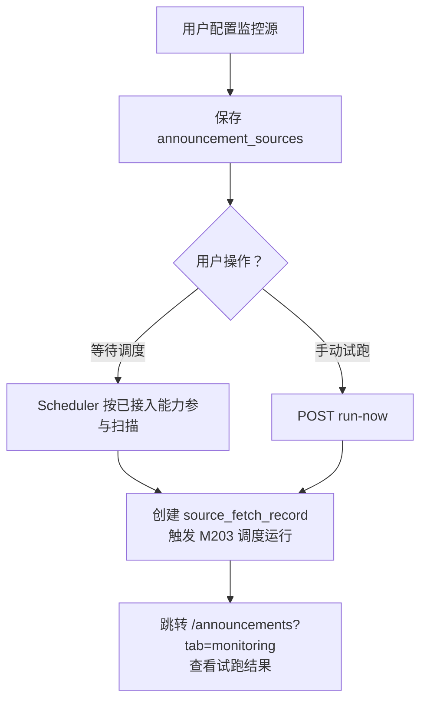

# 安全公告监控源管理功能设计

> **安全公告监控源详细功能设计文档**

---

## 📋 模块概述

**模块名称**：安全公告监控源管理  
**模块编号**：M202  
**优先级**：P0  
**负责人**：AI + 开发团队  
**状态**：最小管理与试跑闭环已落地，自动调度仍持续完善

---

## 🎯 功能目标

### 业务目标
允许用户在前端管理首批监控源，配置抓取参数、调度频率、启停状态和通知策略。

### 用户价值
- 不需要改配置文件就能管理监控源。
- 可以手动试跑某个源，确认抓取是否正常。

---

## 👥 使用场景

### 场景1：新增监控源
**场景描述**：用户要新增一个 Openwall 或 NCC 源配置。

### 场景2：启停监控
**场景描述**：某个源临时不稳定，需要停用。

### 场景3：手动试跑
**场景描述**：修改配置后，用户希望立即验证抓取是否成功。

---

## 🔄 业务流程

### 主流程



---

## 📊 功能清单

| 功能点 | 功能描述 | 优先级 | 状态 |
|--------|---------|--------|------|
| 源列表 | 展示启用状态与类型 | P0 | 🟢 已实现 |
| 新增/编辑 | 支持三类源的配置 | P0 | 🟡 当前以最小配置展示为主 |
| 启停 | 快速启用/禁用 | P0 | 🟡 文档保留目标语义，不夸大当前实现 |
| 立即试跑 | 手动触发单个源 | P0 | 🟢 已实现 |

---

## 🎨 界面设计

### 页面1：监控源管理页
**页面路径**：`/announcements/sources`

**页面元素**：
- 源列表表格
- 新增按钮
- 状态开关
- 立即试跑按钮

**交互说明**：
- 选择源类型后切换不同配置表单
- 试跑后跳转工作台中的本次运行结果视图

---

## 🗺️ 页面映射

- 主页面规格：`../13-界面设计/P202-安全公告监控源管理页面设计.md`
- 试跑落点：`../13-界面设计/P203-安全公告监控批次与结果页面设计.md`
- 横向导航约束：`../13-界面设计/U001-信息架构与导航设计.md`

**页面边界**：
- 本模块负责监控源配置对象、CRUD 与 `run-now` 契约。
- `P202` 负责列表、抽屉、启停与试跑反馈的页面组织。
- 试跑结果统一承接到 `/announcements?tab=monitoring`，不新增独立批次路由。

---

## 💾 数据设计

### 涉及的数据表
- `announcement_sources`
- `delivery_targets`

### 核心数据字段

#### AnnouncementSource
| 字段名 | 类型 | 必填 | 说明 |
|--------|------|------|------|
| source_id | uuid | 是 | 主键 |
| source_type | string | 是 | wechat/openwall/nccsec |
| name | string | 是 | 名称 |
| schedule_cron | string | 是 | 调度表达式 |
| config_json | object | 是 | 抓取配置 |
| delivery_policy_json | object | 否 | 通知策略 |
| enabled | boolean | 是 | 是否启用 |

---

## 🔌 接口设计

### 接口1：查询监控源列表
**接口路径**：`GET /api/v1/announcements/sources`

### 接口2：新增监控源
**接口路径**：`POST /api/v1/announcements/sources`

### 接口3：更新监控源
**接口路径**：`PATCH /api/v1/announcements/sources/{source_id}`

### 接口4：立即试跑
**接口路径**：`POST /api/v1/announcements/sources/{source_id}/run-now`

**业务规则**：
- `run-now` 只创建一次手动监控任务
- 试跑成功后先进入 `/announcements?tab=monitoring` 视图，再从批次详情进入对应公告结果

---

## 📦 前端状态对象

#### MonitorSourceEditorState
| 字段名 | 类型 | 必填 | 说明 |
|--------|------|------|------|
| mode | string | 是 | `create/edit` |
| source_type | string | 否 | 当前源类型 |
| dirty | boolean | 是 | 是否已修改 |
| saving | boolean | 是 | 是否正在保存 |
| validation_errors | object | 否 | 字段级校验错误 |

---

## 🔁 子流程/状态机

### 监控源管理状态机
```text
list_ready
  -> drawer_open
  -> validating
  -> saving
  -> save_failed
  -> run_now_pending
  -> run_now_created
```

**状态说明**：
- `drawer_open` 用于新增或编辑。
- `run_now_created` 表示已经拿到本次 `fetch_id`，可跳转批次视图。

---

## ✅ 业务规则

### 规则1：v1 只支持三类源
**规则描述**：首批只承诺微信文章源、Openwall、NCC 三类真实适配。

### 规则2：源配置和通知策略可分离
**规则描述**：抓取参数属于源配置，是否通知和通知到谁属于策略配置。

### 规则3：禁用源不参与调度
**规则描述**：`enabled=false` 的源不会被 Scheduler 扫描。

**当前阶段说明**：
- 这里的 Scheduler 应理解为当前已接入的最小公告监控闭环能力。
- 文档不把它扩写为覆盖所有源、所有策略、所有频率控制的完整自动调度平台。

---

## 🚨 异常处理

### 异常1：cron 配置非法
**触发条件**：不合法的 cron 表达式

**错误提示**：`调度表达式无效`

**处理方案**：保存前校验

---

### 异常2：试跑失败
**触发条件**：源配置错误或外部站点异常

**错误提示**：`试跑失败，请检查配置和网络`

**处理方案**：记录到运行详情和抓取记录中

---

## 🔐 权限控制

### 访问权限
- v1 全局可访问

### 数据权限
- 单租户共享源配置

---

## 📝 开发要点

### 技术难点
1. 三类源配置结构不同，表单必须动态化。
2. 试跑入口要与定时调度共用后台任务逻辑。

### 性能要求
- 源列表接口目标 < 300ms

### 注意事项
- 不在 v1 做通用插件市场
- 只做固定类型 + 可扩展配置结构

---

## 🧪 测试要点

### 功能测试
- [ ] 三类源都能保存
- [ ] 禁用源不会被调度
- [ ] 试跑可创建任务

### 边界测试
- [ ] 非法 cron 被阻止
- [ ] 源配置缺字段时报错明确

---

## 📅 开发计划

| 阶段 | 任务 | 预计工时 | 负责人 | 状态 |
|------|------|---------|--------|------|
| 设计 | 完成监控源管理设计 | 0.5天 | AI | ✅ |
| 开发 | 数据模型与 CRUD | 1天 | - | ⚪ |
| 开发 | 动态表单与 run-now | 1.5天 | - | ⚪ |
| 测试 | 三类源配置测试 | 1天 | - | ⚪ |

---

## 📖 相关文档

- `M203-安全公告调度运行与结果功能设计.md`
- `M206-安全公告来源适配器功能设计.md`
- `M003-平台投递目标与投递记录功能设计.md`
- `../13-界面设计/P202-安全公告监控源管理页面设计.md`
- `../13-界面设计/P203-安全公告监控批次与结果页面设计.md`

---

## 🔄 变更记录

### v1.0 - 2026-04-09
- 初始化安全公告监控源管理设计

### v1.1 - 2026-04-09
- 回填监控源页面映射、编辑状态对象与试跑状态机

### v1.2 - 2026-04-23
- 同步当前代码事实：源列表与 `run-now` 已形成最小闭环，试跑结果落到 `/announcements?tab=monitoring`。
- 收口 scheduler 语义，避免把当前公告场景能力写成完整自动调度平台。

---

**文档版本**：v1.2  
**创建日期**：2026-04-09  
**最后更新**：2026-04-23  
**维护人**：AI + 开发团队
