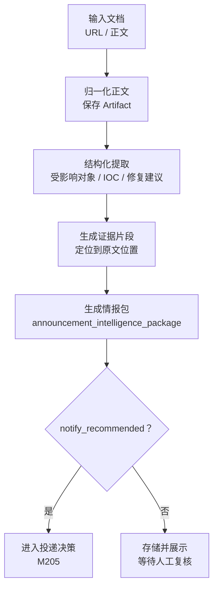

# 安全公告结构化情报包功能设计

> **安全公告结果模型详细功能设计文档**

---

## 📋 模块概述

**模块名称**：安全公告结构化情报包  
**模块编号**：M204  
**优先级**：P0  
**负责人**：AI + 开发团队  
**状态**：设计中

---

## 🎯 功能目标

### 业务目标
定义安全公告场景的标准输出对象，让手动提取和监控提取都输出同一结构化结果。

### 用户价值
- 用户面对的不是原始公告，而是可复用、可投递、可比对的情报包。
- 后续投递、检索和二次处理都基于统一结果对象。

---

## 👥 使用场景

### 场景1：人工阅读结果
**场景描述**：分析师需要快速读懂一篇公告的关键结论。

### 场景2：自动投递
**场景描述**：系统需要从情报包中提取摘要，发往邮件、微信或 Webhook。

---

## 🔄 业务流程

### 主流程



---

## 📊 功能清单

| 功能点 | 功能描述 | 优先级 | 状态 |
|--------|---------|--------|------|
| 标准字段定义 | 统一输出结构 | P0 | ⚪ 未开始 |
| 证据片段 | 记录结构化字段的出处 | P0 | ⚪ 未开始 |
| 通知建议标记 | 给出是否建议投递 | P1 | ⚪ 未开始 |

---

## 🎨 界面设计

### 页面1：情报包详情页
**页面路径**：`/announcements/runs/:runId`

**页面元素**：
- 摘要卡片
- 风险级别
- 受影响对象
- IOC 列表
- 修复建议
- 证据片段

---

## 🗺️ 页面映射

- 主页面规格：`../13-界面设计/P204-安全公告情报包详情页面设计.md`
- 上游手动入口：`../13-界面设计/P201-安全公告手动提取页面设计.md`
- 上游监控批次：`../13-界面设计/P203-安全公告监控批次与结果页面设计.md`

**页面边界**：
- 本模块负责情报包字段定义与结果页接口返回。
- `P204` 负责摘要优先、结构化字段区和证据区的页面组织。

---

## 💾 数据设计

### 涉及的数据表
- `announcement_intelligence_packages`
- `announcement_documents`

### 核心数据字段

#### AnnouncementIntelligencePackage
| 字段名 | 类型 | 必填 | 说明 |
|--------|------|------|------|
| package_id | uuid | 是 | 主键 |
| title | string | 是 | 公告标题 |
| source_name | string | 是 | 来源 |
| source_url | string | 否 | 原始地址 |
| published_at | string | 否 | 发布时间 |
| severity | string | 否 | 风险级别 |
| confidence | number | 是 | 提取置信度 |
| analyst_summary | string | 是 | 面向人的摘要 |
| affected_products | array | 否 | 受影响对象 |
| iocs | array | 否 | IOC 列表 |
| remediation | array | 否 | 修复建议 |
| evidence | array | 是 | 证据片段 |
| notify_recommended | boolean | 是 | 是否建议投递 |

---

## 🔌 接口设计

### 接口1：获取公告运行详情
**接口路径**：`GET /api/v1/announcements/runs/{run_id}`

**响应数据**：
```json
{
  "code": 0,
  "message": "success",
  "data": {
    "run_id": "uuid",
    "status": "succeeded",
    "stage": "finalized",
    "package": {
      "title": "OpenSSL 安全公告",
      "severity": "high",
      "confidence": 0.92,
      "analyst_summary": "该公告影响 OpenSSL 某版本...",
      "affected_products": [],
      "iocs": [],
      "remediation": [],
      "evidence": []
    }
  }
}
```

---

## 📦 前端状态对象

#### AnnouncementPackageView
| 字段名 | 类型 | 必填 | 说明 |
|--------|------|------|------|
| run_id | string | 是 | 运行 ID |
| status | string | 是 | 当前状态 |
| stage | string | 是 | 当前阶段 |
| package | object | 否 | 情报包主体 |
| duplicate_hint | object | 否 | 重复提示 |

---

## 🔁 子流程/状态机

### 情报包详情页状态机
```text
loading
  -> ready
  -> partial_ready
  -> empty
```

**状态说明**：
- `ready`：情报包主体与证据片段完整可见。
- `partial_ready`：允许 IOC 为空、部分字段缺失或证据定位不完整。
- `empty`：run 不存在或结果尚未生成。

---

## ✅ 业务规则

### 规则1：情报包是场景标准输出
**规则描述**：安全公告场景的所有结果展示和投递都以情报包为中心。

### 规则4：一个 run 只产出一个情报包
**规则描述**：安全公告场景的 `announcement_run` 是单文档提取 run，因此一个 run 只能对应一个 `announcement_intelligence_package`。

### 规则2：证据片段必须能回到原文
**规则描述**：每条结构化结论至少要能指向原文片段、位置或引用。

### 规则3：IOC 为空是合法结果
**规则描述**：不是所有公告都有 IOC，不能因为没有 IOC 就判定提取失败。

---

## 🚨 异常处理

### 异常1：结构化字段不完整
**触发条件**：模型未能提取全部目标字段

**错误提示**：展示部分结果并标注低置信度

**处理方案**：允许部分结果落库

---

### 异常2：证据片段定位失败
**触发条件**：抽取到字段，但无法映射回原文

**错误提示**：结果可显示，但标记“证据定位不完整”

**处理方案**：保留摘要，后续优化抽取链

---

## 🔐 权限控制

### 访问权限
- v1 全局可访问

### 数据权限
- 单租户共享情报包结果

---

## 📝 开发要点

### 技术难点
1. 要兼顾“结构统一”与“字段不是每次都完整”。
2. 证据片段设计既要给人看，也要能支撑后续投递摘要。

### 性能要求
- 情报包结果页接口目标 < 500ms

### 注意事项
- 情报包是公告场景的一等对象
- 不是通知模板，也不是原文缓存的替代品

---

## 🧪 测试要点

### 功能测试
- [ ] URL 与正文模式都能生成情报包
- [ ] 结果页能展示摘要、IOC、修复建议和证据

### 边界测试
- [ ] 无 IOC 时结果仍可成功
- [ ] 部分字段缺失时页面正常渲染

---

## 📅 开发计划

| 阶段 | 任务 | 预计工时 | 负责人 | 状态 |
|------|------|---------|--------|------|
| 设计 | 完成情报包模型设计 | 0.5天 | AI | ✅ |
| 开发 | 提取结果模型与存储 | 1天 | - | ⚪ |
| 开发 | 详情页展示 | 1天 | - | ⚪ |
| 测试 | 结构完整性与降级测试 | 1天 | - | ⚪ |

---

## 📖 相关文档

- `M201-安全公告手动提取功能设计.md`
- `M203-安全公告调度运行与结果功能设计.md`
- `M205-安全公告投递触发与通知策略功能设计.md`
- `../13-界面设计/P204-安全公告情报包详情页面设计.md`

---

## 🔄 变更记录

### v1.0 - 2026-04-09
- 初始化安全公告情报包设计

### v1.1 - 2026-04-09
- 回填情报包详情页面映射、前端视图对象与状态机

---

**文档版本**：v1.1  
**创建日期**：2026-04-09  
**最后更新**：2026-04-09  
**维护人**：AI + 开发团队
