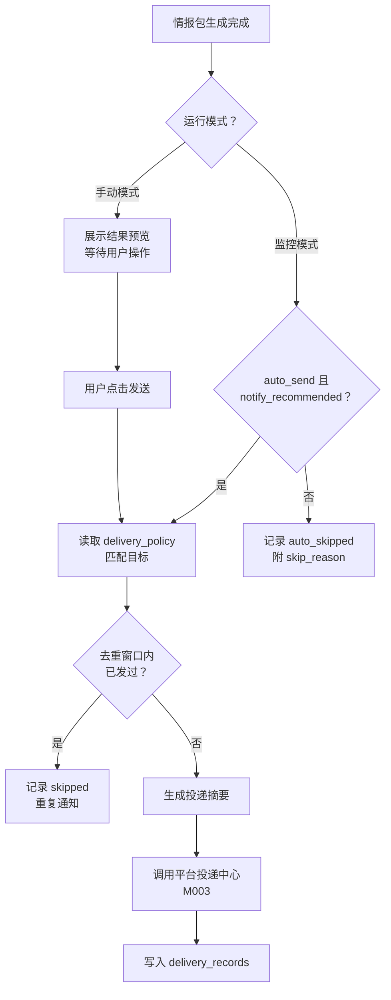

# 安全公告投递触发与通知策略功能设计

> **安全公告通知策略详细功能设计文档**

---

## 📋 模块概述

**模块名称**：安全公告投递触发与通知策略  
**模块编号**：M205  
**优先级**：P1  
**负责人**：AI + 开发团队  
**状态**：部分实现

---

## 🎯 功能目标

### 业务目标
定义安全公告场景何时触发投递、投递哪些内容、哪些渠道和策略生效。

### 用户价值
- 监控型运行可以自动推送，手动型运行可以先预览后推送。
- 通知行为有规则，不会因为每次成功提取就盲目刷屏。

---

## 👥 使用场景

### 场景1：监控结果自动通知
**场景描述**：某个监控源抓到一篇重要公告，系统自动通知团队。

### 场景2：手动提取后手动发送
**场景描述**：用户先看结果，确认后再点“发送到目标”。

---

## 🔄 业务流程

### 主流程



---

## 📊 功能清单

| 功能点 | 功能描述 | 优先级 | 状态 |
|--------|---------|--------|------|
| 自动触发规则 | 监控模式下自动投递 | P0 | ⚪ 未开始 |
| 手动发送 | 手动模式下用户确认发送 | P0 | 🟡 已实现按目标生成平台内投递记录 |
| 频率控制 | 避免重复通知 | P1 | ⚪ 未开始 |
| 内容模板 | 统一公告摘要结构 | P1 | ⚪ 未开始 |

---

## 🎨 界面设计

### 页面1：运行详情内的投递区块
**页面路径**：`/announcements/runs/:runId`

**页面元素**：
- 是否建议发送
- 已匹配的目标
- 目标勾选框
- 生成记录按钮
- 最近投递记录

**交互说明**：
- 手动模式下允许用户勾选目标子集，再点击“生成投递记录”
- 自动模式下显示“已自动发送/跳过原因”

---

## 🗺️ 页面映射

- 详情区块规格：`../13-界面设计/P205-安全公告结果投递区块设计.md`
- 详情页主体：`../13-界面设计/P204-安全公告情报包详情页面设计.md`
- 平台投递中心：`../13-界面设计/P003-平台投递中心页面设计.md`

**页面边界**：
- 本模块负责“是否该发、发给谁、为什么跳过”的场景语义。
- `P205` 负责在详情页内表达发送建议、目标匹配和最近投递记录。

---

## 💾 数据设计

### 涉及的数据表
- `announcement_intelligence_packages`
- `announcement_sources`
- `delivery_targets`
- `delivery_records`

### 核心数据字段

#### DeliveryPolicy
| 字段名 | 类型 | 必填 | 说明 |
|--------|------|------|------|
| auto_send | boolean | 是 | 是否自动发送 |
| target_ids | array | 是 | 投递目标列表 |
| severity_threshold | string | 否 | 严重级别阈值 |
| dedup_window_minutes | int | 否 | 去重时间窗 |

---

## 🔌 接口设计

### 接口1：手动为公告结果生成投递记录
**接口路径**：`POST /api/v1/announcements/runs/{run_id}/deliveries`

**请求参数**：
```json
{
  "target_ids": ["uuid-1", "uuid-2"]
}
```

### 接口2：查询运行相关投递记录
**接口路径**：`GET /api/v1/announcements/runs/{run_id}`

**说明**：
- 当前详情页通过运行详情接口中的 `delivery` 区块获取推荐状态、匹配目标和最近记录
- 手动动作当前只生成平台内 `delivery_records`，未触发真实渠道发送

---

## 📦 前端状态对象

#### AnnouncementDeliveryPanelView
| 字段名 | 类型 | 必填 | 说明 |
|--------|------|------|------|
| run_id | string | 是 | 运行 ID |
| notify_recommended | boolean | 是 | 是否建议发送 |
| auto_send_applied | boolean | 是 | 是否应用自动发送规则 |
| skip_reason | string | 否 | 自动跳过原因 |
| matched_targets | array | 是 | 目标摘要 |
| recent_records | array | 是 | 最近投递记录 |

---

## 🔁 子流程/状态机

### 投递区块状态机
```text
loading
  -> manual_ready
  -> auto_sent
  -> auto_skipped
  -> manual_sending
  -> manual_sent
  -> manual_failed
```

**状态说明**：
- `manual_ready` 只用于手动模式或允许用户补发的场景。
- `auto_sent/auto_skipped` 表示监控模式的自动路径已经决策完成。

---

## ✅ 业务规则

### 规则1：监控模式可自动发送
**规则描述**：如果来源配置 `auto_send=true`，且结果 `notify_recommended=true`，则自动触发投递。

### 规则2：手动模式默认不自动发送
**规则描述**：用户手动分析的结果默认只展示，不自动通知。

### 规则3：通知内容必须摘要化
**规则描述**：投递内容以标题、风险、受影响对象、修复建议和链接为主，不直接发送全量原文。

---

## 🚨 异常处理

### 异常1：目标不存在或被禁用
**触发条件**：手动发送时目标 ID 无效，或目标被禁用

**错误提示**：`投递目标不可用`

**处理方案**：阻止发送并提示用户重新选择

---

### 异常2：重复通知
**触发条件**：同一文档在短时间内重复触发

**错误提示**：无用户提示，后台自动跳过

**处理方案**：记录 `skipped` 投递记录

---

## 🔐 权限控制

### 访问权限
- v1 全局可访问

### 数据权限
- 单租户共享通知策略

---

## 📝 开发要点

### 技术难点
1. 自动发送与手动发送的行为必须明确区分。
2. 重复通知控制需要同时参考文档指纹、目标和时间窗。

### 性能要求
- 投递触发决策必须轻量，避免阻塞主提取流程

### 注意事项
- 公告场景只负责“是否该发”和“发什么摘要”
- 实际渠道发送由平台投递中心负责

---

## 🧪 测试要点

### 功能测试
- [ ] 自动策略满足时能自动发送
- [x] 手动模式能按目标子集生成投递记录
- [x] 详情页能看到投递记录

### 边界测试
- [ ] 重复发送会被跳过
- [ ] 禁用目标不可选

---

## 📅 开发计划

| 阶段 | 任务 | 预计工时 | 负责人 | 状态 |
|------|------|---------|--------|------|
| 设计 | 完成通知策略设计 | 0.5天 | AI | ✅ |
| 开发 | 场景到平台投递接缝 | 1天 | - | 🟡 |
| 开发 | 手动发送与记录展示 | 1天 | - | 🟡 |
| 测试 | 自动/手动/跳过逻辑测试 | 1天 | - | ⚪ |

---

## 📖 相关文档

- `M003-平台投递目标与投递记录功能设计.md`
- `M204-安全公告结构化情报包功能设计.md`
- `../13-界面设计/P205-安全公告结果投递区块设计.md`
- `../13-界面设计/P003-平台投递中心页面设计.md`

---

## 🔄 变更记录

### v1.0 - 2026-04-09
- 初始化安全公告通知策略设计

### v1.1 - 2026-04-10
- 回填投递区块页面映射、前端视图对象与状态机

### v1.2 - 2026-04-16
- 把手动动作更新为“按目标子集生成投递记录”的当前实现
- 修正详情区块的数据来源与手动动作接口路径
- 标记详情页投递区块和最近记录展示已落地的最小闭环

---

**文档版本**：v1.2
**创建日期**：2026-04-09
**最后更新**：2026-04-16
**维护人**：AI + 开发团队
