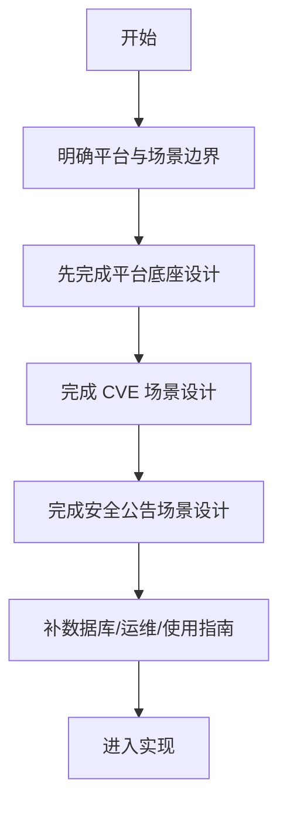

# 功能模块关系与开发顺序设计

> **平台与双场景的横向设计文档**

> 读前建议：先阅读 `../00-总设计/总体项目设计.md`。本文负责模块关系与开发顺序，不承担系统总纲职责。

---

## 📋 模块概述

**模块名称**：功能模块关系与开发顺序  
**模块编号**：M901  
**优先级**：P0  
**负责人**：AI + 开发团队  
**状态**：设计中

---

## 🎯 功能目标

### 业务目标
用一份横向文档说明“哪些模块必须先做、哪些模块依赖哪些底座、哪些能力不应提前实现”，避免开发时跨层乱接。

### 用户价值
- 开发者能快速理解平台和两个场景的边界。
- 后续实现能按顺序推进，不会先做前台壳、后补核心能力。

---

## 👥 使用场景

### 场景1：新成员接手项目
**场景描述**：新成员进入仓库，需要知道先读什么、先做什么。

**用户操作流程**：
1. 阅读 `../00-总设计/总体项目设计.md`
2. 阅读 `README.md`
3. 阅读本文档
4. 根据本文档进入对应模块设计
5. 按依赖顺序进入实现

---

### 场景2：拆分开发任务
**场景描述**：需要把平台、CVE、公告三个方向拆成可并行或可串行的任务。

**用户操作流程**：
1. 先看平台底座依赖
2. 判断场景功能是否依赖平台模块
3. 再确定开发顺序与验证顺序

---

## 🔄 业务流程

### 主流程
```text
确定产品边界
  -> 拆分平台模块
  -> 锁定场景依赖
  -> 先平台后场景
  -> 先文档后实现
```

### 流程图


### 实现阶段顺序
1. 平台最小底座（`M002/M003/M004`）
2. CVE 补丁获取最小闭环（`M101/M103`，首个可运行垂直切片）
3. CVE 运行详情与证据展开（`M102`，进入 graph-ready 扩展）
4. 监控、投递、完整观测
5. 安全公告 URL 模式
6. 安全公告手动提取（当前最低优先级业务切片）

---

## 📊 功能清单

| 功能点 | 功能描述 | 优先级 | 状态 |
|--------|---------|--------|------|
| 模块分层 | 平台与场景的编号和边界 | P0 | ✅ 已定义 |
| 依赖顺序 | 模块开发先后顺序 | P0 | ✅ 已定义 |
| 非目标约束 | 明确哪些历史语义不再进入主线 | P0 | ✅ 已定义 |

---

## 🎨 界面设计

### 页面1：功能设计总索引
**页面路径**：文档入口页，无实际前端页面

**页面元素**：
- 模块编号
- 模块层级
- 模块说明
- 依赖关系

**交互说明**：
- 点击模块名：进入对应模块文档
- 按层级阅读：平台 -> CVE -> 安全公告

---

## 💾 数据设计

### 涉及的数据表
- 无直接业务表

### 核心数据字段

#### 模块依赖关系
| 字段名 | 类型 | 必填 | 说明 |
|--------|------|------|------|
| module_id | string | 是 | 模块编号 |
| layer | string | 是 | 所属层级 |
| depends_on | array | 是 | 依赖模块列表 |
| priority | string | 是 | 优先级 |

---

## 🔌 接口设计

### 接口1：无运行时接口
本文档属于横向设计文档，不定义直接业务 API。

**业务规则**：
- 任何 API 设计必须先落到对应模块文档，再进入实现。
- 平台 API 与场景 API 不得混写。

---

## ✅ 业务规则

### 规则1：先平台后场景
**规则描述**：任何场景能力上线前，必须先具备最小平台能力支撑。

**触发条件**：开发新的场景页面、场景 API 或场景任务时

**规则处理**：
- 先确认是否已有 `M002/M003/M004` 支撑
- 没有则先补平台模块

---

### 规则2：CVE 与公告不共享领域结果模型
**规则描述**：两个场景可以共享任务底座和 Artifact 基座，但不能强行共用同一个 run/result schema。

**触发条件**：设计数据库、接口和详情页时

**规则处理**：
- 公共能力下沉到平台
- 领域结果保留在各自场景表和 API 下

---

### 规则3：不复活 legacy
**规则描述**：不再以旧 `pipeline/product/diagnostics` 语义作为新主线。

**触发条件**：设计管理后台、列表页或结果页时

**规则处理**：
- 统一改用“平台首页 + 场景工作台”
- 旧语义只作为历史参考，不进入新设计

---

## 🚨 异常处理

### 异常1：场景先于平台落地
**触发条件**：开始设计场景接口，但平台任务/Artifact/投递尚未定义

**错误提示**：设计顺序错误，可能导致重复实现

**处理方案**：先回到 `M002/M003/M004` 补足平台文档

---

### 异常2：公告场景滑向旧监控脚本模式
**触发条件**：只讨论爬虫和通知，不收敛到“公告文档 -> 结构化情报包”

**错误提示**：场景边界漂移

**处理方案**：回到 `M201/M204`，重新以标准处理对象为中心梳理流程

---

## 🔐 权限控制

### 访问权限
- 当前文档阶段不涉及用户权限控制

### 数据权限
- 当前 v1 按单租户假设设计

---

## 📝 开发要点

### 技术难点
1. **共享底座与场景边界同时成立**：平台既要复用，又不能统一掉两个场景的领域语义。
2. **公告场景双入口**：手动提取与监控抓取都要成立，但最终必须收敛到同一种情报包对象。

### 性能要求
- 文档阶段无性能指标
- 实现阶段以后台任务可扩展为前提

### 注意事项
- 先做 M002/M003/M004，再做两个场景
- 当前首个可运行垂直切片改为 CVE 补丁获取 fast-first 主链
- 公告场景整体后置，其中手动提取为当前最低优先级业务切片
- 任何“为了抽象而抽象”的模块都不进入 v1

---

## 🧪 测试要点

### 功能测试
- [ ] 模块依赖顺序在所有文档中一致
- [ ] 平台模块与场景模块的职责没有冲突

### 边界测试
- [ ] 没有出现 legacy 主路径回流
- [ ] 没有把 CVE 和公告硬合并成统一 run schema

---

## 📅 开发计划

| 阶段 | 任务 | 预计工时 | 负责人 | 状态 |
|------|------|---------|--------|------|
| 设计 | 完成横向顺序设计 | 0.5天 | AI | ✅ |
| 设计 | 完成平台模块文档 | 1天 | AI | ⚪ |
| 设计 | 完成场景模块文档 | 1天 | AI | ⚪ |
| 实现 | 按模块顺序落地 | 待拆分 | - | ⚪ |

---

## 📖 相关文档

- 总索引：`README.md`
- 架构设计：`../03-系统架构/架构设计.md`
- 技术选型：`../03-系统架构/技术选型.md`

---

## 🔄 变更记录

### v1.0 - 2026-04-09
- 初始化模块边界与开发顺序设计
- 固定“平台先行、场景跟进”的实施路径

### v1.1 - 2026-04-10
- 明确首个可运行垂直切片为安全公告手动提取正文模式
- 固定“平台底座 -> 公告正文模式 -> 公告 URL -> CVE -> 监控/投递”的实现顺序

### v1.2 - 2026-04-13
- 将首个可运行垂直切片调整为 CVE 补丁获取 fast-first
- 固定“平台底座 -> CVE 补丁获取 -> CVE 证据展开 -> 监控/投递 -> 公告 URL -> 公告手动提取”的实现顺序

---

**文档版本**：v1.2
**创建日期**：2026-04-09
**最后更新**：2026-04-13
**维护人**：AI + 开发团队
