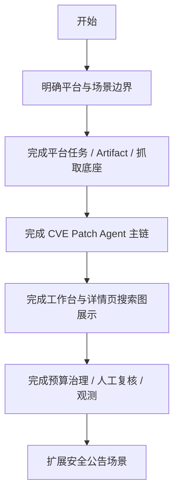

# 功能模块关系与开发顺序设计

> **平台与双场景的横向设计文档**

> 读前建议：先阅读 `../00-总设计/总体项目设计.md`。本文负责模块关系与开发顺序，不承担系统总纲职责。

---

## 📋 模块概述

**模块名称**：功能模块关系与开发顺序  
**模块编号**：M901  
**优先级**：P0  
**负责人**：AI + 开发团队  
**状态**：已切换到 Patch Agent 路线

---

## 🎯 功能目标

### 业务目标

用一份横向文档说明：

- 哪些模块必须先做
- 哪些模块依赖哪些底座
- 哪些能力应该围绕 Patch Agent 主链优先落地
- 哪些平台能力必须围绕搜索图、预算和证据体系组织

### 用户价值

- 开发者能快速理解平台、CVE Patch Agent 和公告场景的边界
- 后续实现可以围绕“先底座、再 Agent 主链、再展示与治理”推进

---

## 👥 使用场景

### 场景1：新成员接手项目

**场景描述**：新成员进入仓库，需要知道 Agent 路线下先读什么、先做什么。

**用户操作流程**：

1. 阅读 `../00-总设计/总体项目设计.md`
2. 阅读 `README.md`
3. 阅读本文档
4. 进入 `M002/M004/M103`
5. 再进入 `M101/M102`

### 场景2：拆分开发任务

**场景描述**：需要把平台底座、Agent 主链、详情展示和治理能力拆成可执行任务。

**用户操作流程**：

1. 先看平台底座依赖
2. 再看 Agent 运行时与工具层
3. 再看工作台与详情页
4. 最后进入监控、投递和人工复核

---

## 🔄 业务流程

### 主流程

```text
确定系统边界
  -> 锁定 Patch Agent 为 CVE 主线
  -> 先补平台任务 / Artifact / 抓取底座
  -> 再落图运行时与搜索预算
  -> 再补工作台 / 详情页图展示
  -> 最后扩展治理与公告场景
```

### 流程图



### 实现阶段顺序

1. 平台任务执行与调度中心（`M002`）
2. 公共文档采集与 Artifact 基座（`M004`）
3. CVE Patch Agent 搜索主链（`M103`）
4. CVE 检索工作台（`M101`）
5. CVE 运行详情与补丁证据（`M102`）
6. 平台投递、观测、健康与系统工具（`M003/M005`）
7. 安全公告场景接入（`M201-M206`）

---

## 📊 功能清单

| 功能点 | 功能描述 | 优先级 | 状态 |
|--------|---------|--------|------|
| 模块分层 | 平台与场景的编号和边界 | P0 | ✅ 已定义 |
| Agent 主线优先级 | 明确 CVE Patch Agent 是首个核心执行主线 | P0 | ✅ 已定义 |
| 依赖顺序 | 统一平台、Agent、页面和治理的实施顺序 | P0 | ✅ 已定义 |
| 非目标约束 | 明确哪些旧叙事和旧原型不再进入主文档口径 | P0 | ✅ 已定义 |

---

## 💾 数据设计

本文档不定义直接业务表，但定义模块依赖对象：

| 字段名 | 类型 | 必填 | 说明 |
|--------|------|------|------|
| module_id | string | 是 | 模块编号 |
| layer | string | 是 | 所属层级 |
| depends_on | array | 是 | 依赖模块列表 |
| priority | string | 是 | 优先级 |

---

## 🔌 接口设计

本文档属于横向设计文档，不定义直接业务 API。

**业务规则**：

- 任何 API 设计必须先落到对应模块文档，再进入实现
- 平台 API 与场景 API 不得混写
- Agent 运行时相关接口必须围绕 `run / search_graph / budget / decision_history` 组织

---

## ✅ 业务规则

### 规则1：先平台后 Agent，再页面

**规则描述**：任何 Patch Agent 能力上线前，必须先具备平台任务、Artifact 和抓取底座。

### 规则2：CVE 场景主线是 Patch Agent

**规则描述**：CVE 场景后续所有设计默认以 `LangGraph Patch Agent` 为中心，不再以规则流水线为主叙事。

### 规则3：详情与工作台服务于搜索图

**规则描述**：工作台与详情页不是孤立 UI，而是 Agent 搜索过程与结果的阅读面。

### 规则4：安全公告场景复用平台与图运行时思路

**规则描述**：公告场景可以有不同的数据模型，但应尽量复用平台任务、Artifact 和图运行时能力。

---

## 📝 开发要点

### 技术难点

1. 平台底座要足够中立，既能支撑 CVE Patch Agent，也能支撑公告场景。
2. 页面展示和执行内核要同步推进，避免再次出现“后端是旧规则链、前端又开始围绕旧规则链设计”的偏差。

### 注意事项

- 不再把 `fast-first` 作为横向开发顺序的长期锚点
- 不复活旧 `pipeline/product/diagnostics` 语义
- 任何模块如果引用旧 spec，必须显式注明其已被新的 Agent 方案取代

---

## 🧪 测试要点

- [ ] 模块依赖顺序在所有主文档中一致
- [ ] CVE 场景文档不再传播 `fast-first` 主线口径
- [ ] 平台文档、场景文档和页面文档对 `search_graph / budget / decision_history` 的表达一致

---

## 📅 开发计划

| 阶段 | 任务 | 预计工时 | 负责人 | 状态 |
|------|------|---------|--------|------|
| 设计 | 完成横向顺序设计 | 0.5天 | AI | ✅ |
| 设计 | 完成平台底座文档同步 | 1天 | AI | ✅ |
| 设计 | 完成 CVE Patch Agent 文档同步 | 1天 | AI | ✅ |
| 设计 | 完成页面文档同步 | 0.5天 | AI | 🚧 |
| 实现 | 按模块顺序落地 | 待拆分 | - | 🚧 |

---

## 📖 相关文档

- 总索引：`README.md`
- 架构设计：`../03-系统架构/架构设计.md`
- 技术链设计：`../03-系统架构/技术链设计.md`
- 数据库设计：`../03-系统架构/数据库设计.md`

---

## 🔄 变更记录

### v2.0 - 2026-04-20

- 将横向顺序从“平台 -> fast-first -> 详情增强”改为“平台 -> Patch Agent -> 搜索图展示 -> 治理”
- 不再把 `fast-first` 作为首个可运行垂直切片的长期口径

---

**文档版本**：v2.0
**创建日期**：2026-04-09
**最后更新**：2026-04-20
**维护人**：AI + 开发团队
