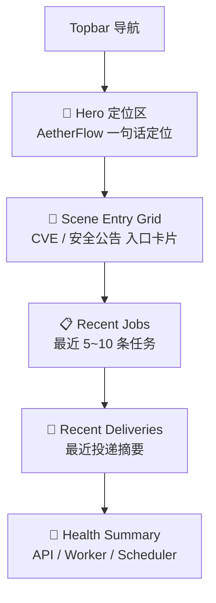

# P001 平台首页页面设计

> **对应模块：M001 平台首页与场景入口**

---

## 🎯 页面目标

平台首页是整个 v1 平台壳的统一入口，负责在一屏内回答三个问题：

1. 这套系统是什么。
2. 当前有哪些真实场景可进入。
3. 最近发生了哪些任务、投递和系统状态变化。

目标用户：

- 第一次进入系统的分析师
- 想快速感知最近运行情况的工程人员
- 需要从首页跳入具体场景的日常使用者

---

## 🚪 入口与出口

### 入口

- 浏览器直接访问 `/`
- 其他页面点击顶部 `首页`

### 出口

- 点击 `进入 CVE 补丁检索` -> `/cve`
- 点击 `进入安全公告提取` -> `/announcements`
- 点击最近任务 -> 对应场景详情页
- 点击最近投递 -> 投递筛选视图或后续平台页

---

## 🧱 页面布局

### 区块1：Hero 定位区

- 平台名称 `AetherFlow`
- 一句话定位：把原始安全信号处理成可复查的结构化情报
- 简短说明：当前承载 `CVE 补丁检索` 与 `安全公告提取`

### 区块2：场景入口卡片

- 两张主卡片：CVE、公告
- 卡片内固定包含：
  - 场景标题
  - 一句话能力描述
  - 主按钮
  - 最近一次运行状态摘要

### 区块3：最近任务

- 仅展示最近 5 到 10 条
- 默认优先展示运行中与失败项
- 每条显示：
  - 场景
  - 摘要标题
  - 状态
  - 开始时间/更新时间

### 区块4：最近投递

- 仅展示最近摘要，不做分页表格
- 每条显示：
  - 渠道
  - 来源对象
  - 状态
  - 发送时间

### 区块5：系统健康摘要

- API / Worker / Scheduler 三项状态
- 当存在异常时显示醒目但克制的状态胶囊

---

## 🖱️ 关键交互

- 场景卡片主按钮是首页最强主动作。
- 点击最近任务时，不进入平台任务后台，而是直接跳到场景结果页。
- 首页摘要接口失败时，场景卡片仍然保留可点击入口。
- 健康摘要只做概览，不在首页展开日志和诊断细节。

---

## 🎭 状态稿

### 默认态

- Hero、两个场景卡片、最近任务摘要、最近投递摘要、健康摘要全部可见。

### 加载态

- 场景卡片先显示静态文案。
- 最近任务、最近投递、健康区显示骨架屏或占位卡。

### 空态

- 最近任务为空：展示“还没有运行记录，可从下方场景开始”。
- 最近投递为空：展示“当前还没有发送记录”。

### 降级态

- 聚合摘要接口失败时：
  - 场景入口正常显示
  - 最近任务/投递显示降级提示
  - 健康区显示“摘要暂不可用”

### 异常态

- 任一健康项异常时，首页仍可用，但健康卡片置顶显示异常胶囊与简短说明。

---

## 📦 页面视图对象

### `HomeDashboardSummary`

| 字段名 | 类型 | 说明 |
|--------|------|------|
| `platform_name` | string | 平台名称 |
| `platform_tagline` | string | 一句话定位 |
| `scenes` | array | 场景入口卡片列表 |
| `recent_jobs` | array | 最近任务摘要 |
| `recent_deliveries` | array | 最近投递摘要 |
| `health` | object | 健康状态摘要 |

### `SceneEntryCardView`

| 字段名 | 类型 | 说明 |
|--------|------|------|
| `scene_name` | string | `cve` 或 `announcement` |
| `title` | string | 卡片标题 |
| `description` | string | 一句话说明 |
| `path` | string | 跳转路径 |
| `recent_status` | string | 最近状态摘要 |

---

## 🔌 API 与字段映射

| 页面区块 | API | 主要字段 |
|----------|-----|----------|
| Hero/场景入口 | `GET /api/v1/platform/home-summary` | `platform_name`、`scenes` |
| 最近任务 | `GET /api/v1/platform/home-summary` | `recent_jobs` |
| 最近投递 | `GET /api/v1/platform/home-summary` | `recent_deliveries` |
| 健康摘要 | `GET /api/v1/platform/home-summary` | `health` |

如果后续首页需要拆分接口，页面层仍保持同一视图对象，不改变页面结构。

---

## 🪞 参考资产与约束

- 参考 `../../../aetherflow.bak/docs/13-界面设计/STYLE_GUIDE.md` 的浅色层级和卡片分区。
- 首页不继承旧后台壳的信息密度，不出现菜单型管理入口作为主焦点。
- 首页卡片布局允许大胆，但必须保持“场景入口是主焦点”这一优先级。

---

## 🔄 变更记录

### v1.0 - 2026-04-09
- 新增平台首页页面规格

---

**文档版本**：v1.0  
**创建日期**：2026-04-09  
**最后更新**：2026-04-09  
**维护人**：AI + 开发团队
