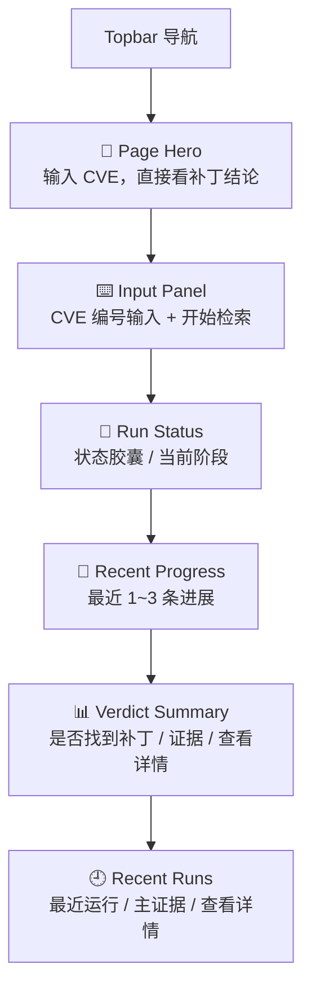

# P101 CVE 检索工作台页面设计

> **对应模块：M101 CVE 检索工作台**

---

## 🎯 页面目标

`/cve` 是 CVE 场景的主输入页。页面必须让用户在不理解执行细节的前提下，完成：

1. 输入或粘贴一个 CVE 编号。
2. 发起一次运行。
3. 在当前页直接看到运行状态、最近进展与结论摘要。
4. 回看最近几次运行的结果。
5. 必要时跳转到详情页继续看证据。

---

## 🚪 入口与出口

### 入口

- 首页点击 `进入 CVE 补丁检索`
- 直接访问 `/cve`

### 出口

- 点击 `查看详情` -> `/cve/runs/{run_id}`
- 顶部导航返回 `/`

---

## 🧱 页面布局

### 区块1：Page Hero

- 标题：`输入 CVE，直接看补丁结论`
- 副标题：强调“先给补丁结论，再给证据页”

### 区块2：输入区

- 单一主输入框：CVE 编号
- 主按钮：`开始检索`
- 辅助提示：合法格式示例

### 区块3：运行状态区

- 当前状态胶囊
- 当前阶段
- 最近进展摘要

### 区块4：最近进展区

- 只展示最近 1 到 3 条有效进展
- 不直接展示完整 trace JSON

### 区块5：结论摘要区

- 是否找到补丁
- 主证据 URL
- 失败时展示 stop reason
- 主动作：`查看详情`

### 区块6：最近运行

- 展示最近几次 run
- 每条显示 CVE、状态、失败原因或主证据
- 若存在主 family 摘要，额外显示来源 host 提示
- 支持直接跳详情

---

## 🖱️ 关键交互

- 输入非法格式时立即给出前端提示，不发请求。
- 每次提交都创建新的 run，不做 `reuse_running`。
- 运行中页面持续轮询，刷新状态区、最近进展与结论摘要区。
- 页面初始化时加载最近运行列表，便于快速回看。
- 终态后保留当前结果，不自动清空输入框。

---

## 🎭 状态稿

### 默认态

- 只显示 Hero 与输入区。
- 状态区和结论区显示引导文案：`输入一个 CVE 开始检索`。

### 校验失败态

- 输入框下方出现格式提示。
- 提交按钮不可用。

### 创建中

- 主按钮变为 `创建中...`
- 运行状态区切换为加载态。

### 运行中

- 页面展示当前阶段与最近进展。
- 结论区可显示“尚在检索中”的中间摘要。

### 成功终态

- 结论区展示：
  - 是否找到补丁
  - 主证据链接
  - 查看详情入口

### 失败终态

- 显示失败原因摘要
- 失败进度保留真实失败阶段
- 提供重新提交入口

---

## 📦 页面视图对象

### `CVEWorkbenchRunSummary`

| 字段名 | 类型 | 说明 |
|--------|------|------|
| `run_id` | string | 运行 ID |
| `cve_id` | string | CVE 编号 |
| `status` | string | 运行状态 |
| `phase` | string | 当前阶段 |
| `stop_reason` | string | 终止原因 |
| `summary` | object | 结论摘要 |
| `progress` | object | 进度摘要 |
| `recent_progress` | array | 最近 1 到 3 条进展 |

### `CVEWorkbenchPageState`

| 字段名 | 类型 | 说明 |
|--------|------|------|
| `query` | string | 当前输入 |
| `validation_message` | string | 校验提示 |
| `loading` | boolean | 是否正在创建运行 |
| `active_run` | object | 当前运行摘要 |
| `recent_runs` | array | 最近运行列表 |

---

## 🔌 API 与字段映射

| 页面动作/区块 | API | 主要字段 |
|---------------|-----|----------|
| 创建运行 | `POST /api/v1/cve/runs` | `run_id`、`status`、`phase` |
| 轮询运行摘要 | `GET /api/v1/cve/runs/{run_id}` | `status`、`phase`、`summary`、`progress`、`recent_progress` |
| 最近运行列表 | `GET /api/v1/cve/runs` | `run_id`、`cve_id`、`status`、`phase`、`stop_reason`、`summary.primary_patch_url`、`summary.primary_family_source_host`、`summary.primary_family_evidence_source_count`、`created_at` |

页面只消费摘要字段。完整证据、patch 与 diff 延迟到 `P102`。

---

## 🪞 参考资产与约束

- 当前仓库已落地的视觉方向为“以 A 为底，吸收 C 的视觉表达”。
- 工作台必须比详情页更轻，强调输入、状态和结论，不把 trace 细节堆进首页。
- 不把备份仓里偏开发者细节的字段原样堆在首屏。

---

## 🔄 变更记录

### v1.0 - 2026-04-09
- 新增 CVE 工作台页面规格

### v1.1 - 2026-04-13
- 回填最小闭环真实页面结构，确认当前为输入区、运行状态、最近进展、结论卡片四块组合
- 删除 `reuse_running` 和耗时展示等未落地交互
- 同步当前轮询策略与详情页跳转行为

### v1.2 - 2026-04-15
- 增加最近运行区块，允许从工作台直接回看最近几次 run
- 同步失败原因可读化表达和最近运行列表接口

### v1.3 - 2026-04-16
- 为最近运行列表增加主 family 来源摘要表达。
- 当存在多来源共指时，列表只展示 host 级提示，如“来源：www.openwall.com 等 3 个关联来源”。

---

**文档版本**：v1.3
**创建日期**：2026-04-09  
**最后更新**：2026-04-16
**维护人**：AI + 开发团队
