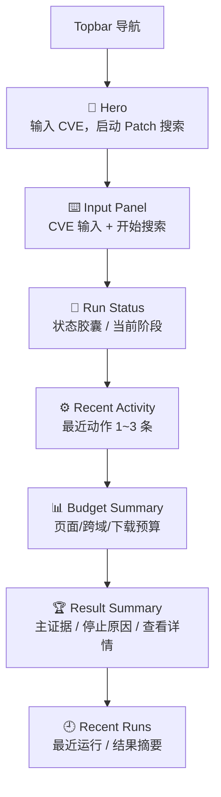
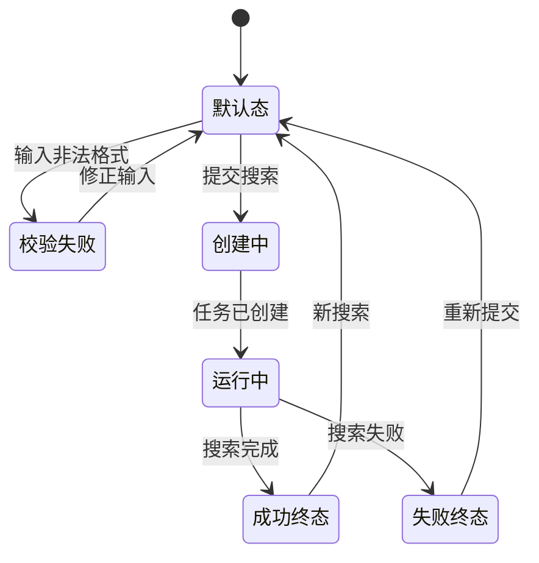

# P101 CVE 检索工作台页面设计

> **对应模块：M101 CVE 检索工作台**

---

## 🎯 页面目标

`/patch` 是 CVE Patch Agent 的主输入页。页面必须让用户在不理解底层图运行时的前提下，完成：

1. 输入一个 CVE 编号
2. 发起一次 Patch 搜索
3. 看到当前运行状态、最近动作和预算推进
4. 回看最近几次运行
5. 必要时进入详情页查看完整搜索图

---

## 🚪 入口与出口

### 入口

- 首页点击 `进入 CVE Patch 搜索`
- 直接访问 `/patch`

### 出口

- 点击 `查看详情` -> `/patch/runs/{run_id}`
- 顶部导航返回 `/`

---

## 🧱 页面布局

---

## 🖱️ 关键交互

- 输入非法格式时立即给出前端提示，不发请求
- 每次提交都创建新的 run
- 运行中页面持续轮询，刷新状态、动作和预算
- 工作台只显示最小搜索图摘要，不显示完整节点图
- 详情图阅读统一在 `/patch/runs/{run_id}` 完成

---

## 🎭 状态稿

### 默认态

- 显示 Hero 与输入区
- 状态区显示引导文案：`输入一个 CVE 开始搜索`

### 运行中

- 显示当前阶段
- 显示最近动作
- 显示预算摘要

### 成功终态

- 展示主结论
- 展示主 patch 或主证据
- 提供详情页入口

### 失败终态

- 显示停止原因
- 提供详情页入口，允许继续查看搜索图

---

## 📦 页面视图对象

### `CVEWorkbenchRunSummary`

| 字段名 | 类型 | 说明 |
|--------|------|------|
| `run_id` | string | 运行 ID |
| `cve_id` | string | CVE 编号 |
| `status` | string | 运行状态 |
| `phase` | string | 当前阶段 |
| `stop_reason` | string | 终止原因 |
| `summary` | object | 结论摘要 |
| `progress` | object | 进度摘要 |
| `recent_progress` | array | 最近动作 |
| `budget_status` | object | 预算摘要 |

---

## 🔌 API 与字段映射

| 页面动作/区块 | API | 主要字段 |
|---------------|-----|----------|
| 创建运行 | `POST /api/v1/cve/runs` | `run_id`、`status`、`phase` |
| 轮询运行摘要 | `GET /api/v1/cve/runs/{run_id}` | `status`、`phase`、`summary`、`progress`、`recent_progress`、`budget_status` |
| 最近运行列表 | `GET /api/v1/cve/runs` | `run_id`、`cve_id`、`status`、`phase`、`stop_reason`、`summary`、`created_at` |

---

## 🪞 参考资产与约束

- 工作台必须比详情页更轻，强调输入、状态、动作和结果
- 不把完整搜索图堆到首屏
- 工作台不是调试页，而是智能体运行摘要页

---

## 🔄 变更记录

### v2.1 - 2026-04-23

- 将页面承接路由同步为 `/patch`
- 将详情跳转路由同步为 `/patch/runs/{run_id}`

### v2.0 - 2026-04-20

- 将工作台从“运行状态 + 结果摘要”升级为“Patch Agent 搜索摘要页”
- 引入预算摘要与最近动作表达
- 详情页承担完整搜索图阅读职责

---

**文档版本**：v2.1
**创建日期**：2026-04-09  
**最后更新**：2026-04-23
**维护人**：AI + 开发团队
