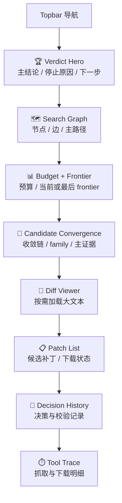
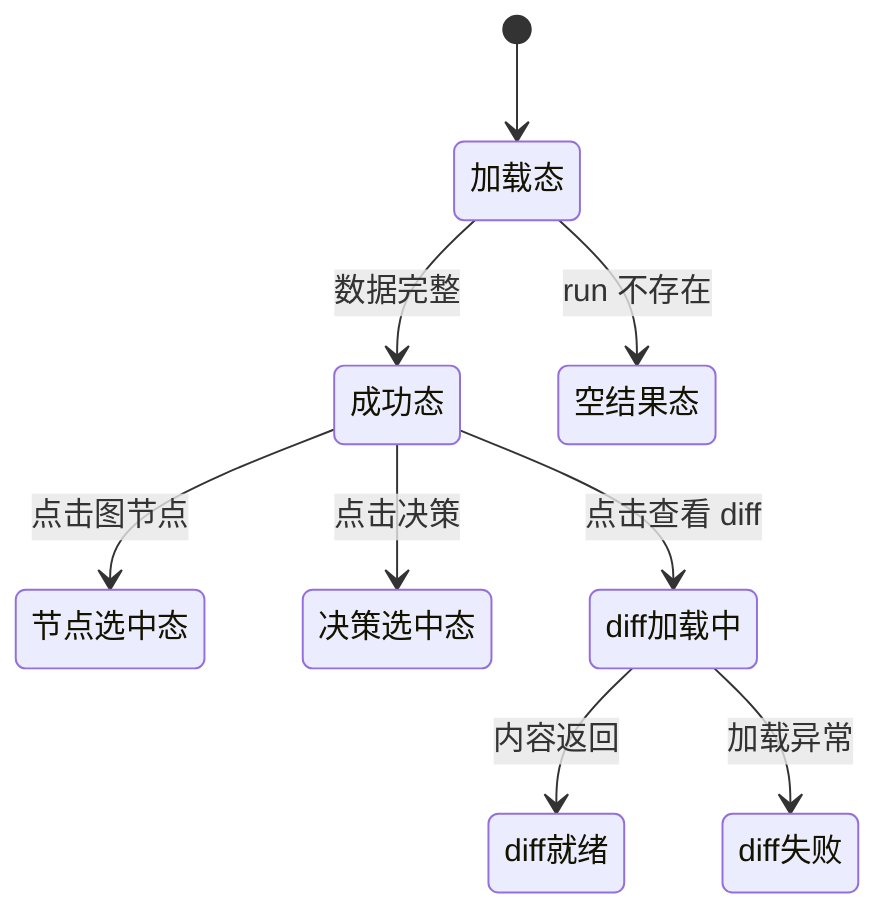

# P102 CVE 运行详情页面设计

> **对应模块：M102 CVE 运行详情与补丁证据**

---

## 🎯 页面目标

`/patch/runs/{run_id}` 是 CVE Patch Agent 的详情页，负责把一次搜索运行的结论、搜索图、预算、patch 收敛和 diff 组织为可复核页面。

它必须优先回答：

1. 是否找到可信 patch
2. 为什么走到了这个结果
3. 如果要继续复核，应从哪条路径看起

---

## 🚪 入口与出口

### 入口

- `P101` 点击 `查看详情`
- 直接访问 `/patch/runs/{run_id}`

### 出口

- 返回 `/patch`
- 打开外部证据页
- 打开 patch diff 查看区

---

## 🧱 页面布局

---

## 🖱️ 关键交互

- 页面首屏默认显示 Verdict Hero 和 Search Graph，不需要滚动就能读到主结论与主路径
- 点击图节点，右侧展示页面角色、URL 和摘要
- 点击决策记录，展示该轮输入摘要、动作和 validator 结果
- `查看 Diff` 是页内动作，不跳新页面
- Patch List 与 Search Graph 双向联动

---

## 🎭 状态稿

---

## 📦 页面视图对象

### `CVERunDetailView`

| 字段名 | 类型 | 说明 |
|--------|------|------|
| `run_id` | string | 运行 ID |
| `cve_id` | string | CVE 编号 |
| `status` | string | 状态 |
| `phase` | string | 当前阶段 |
| `stop_reason` | string | 停止原因 |
| `summary` | object | 运行摘要 |
| `progress` | object | 阶段进度 |
| `search_graph` | object | 搜索图 |
| `budget_status` | object | 预算 |
| `frontier_status` | object | frontier 摘要 |
| `fix_families` | array | 收敛族视图 |
| `patches` | array | 补丁记录 |
| `decision_history` | array | 决策记录 |
| `source_traces` | array | 工具级抓取证据 |

---

## 🔌 API 与字段映射

| 页面区块 | API | 主要字段 |
|----------|-----|----------|
| Verdict Hero / Search Graph / Budget / Patch / Trace | `GET /api/v1/cve/runs/{run_id}` | `summary`、`progress`、`search_graph`、`budget_status`、`frontier_status`、`fix_families`、`patches`、`decision_history`、`source_traces` |
| Diff Viewer | `GET /api/v1/cve/runs/{run_id}/patch-content?patch_id=...` | diff 文本内容 |

---

## 🪞 参考资产与约束

- 详情页必须以“结果 + 图 + 收敛”组织，而不是单纯的 trace 时间线页
- 页面不能把模型决策和规则事实混成同一层
- 未命中 patch 时，也必须保留完整搜索图阅读价值

---

## 🔄 变更记录

### v2.1 - 2026-04-23

- 将详情页前端路由同步为 `/patch/runs/{run_id}`
- 将返回工作台路径同步为 `/patch`

### v2.0 - 2026-04-20

- 将详情页从“结论 + family + diff + trace”升级为“搜索图 + 预算 + 收敛 + diff + 决策历史”
- Search Graph 成为详情页主结构之一
- 预算与 frontier 被提升为一等展示对象

---

**文档版本**：v2.1
**创建日期**：2026-04-09  
**最后更新**：2026-04-23
**维护人**：AI + 开发团队
