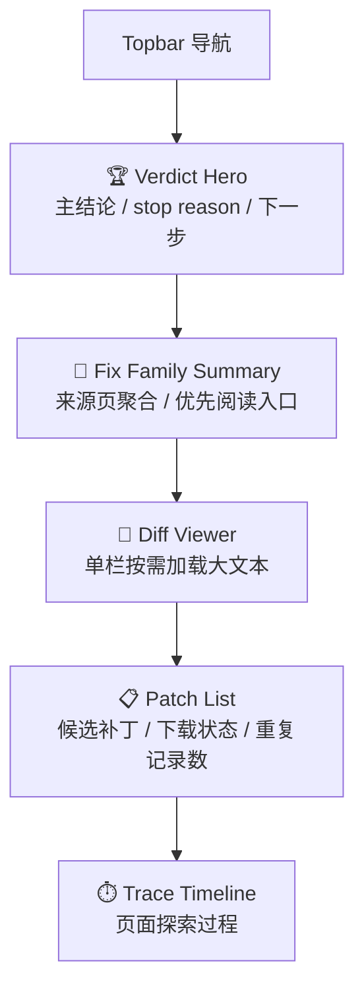
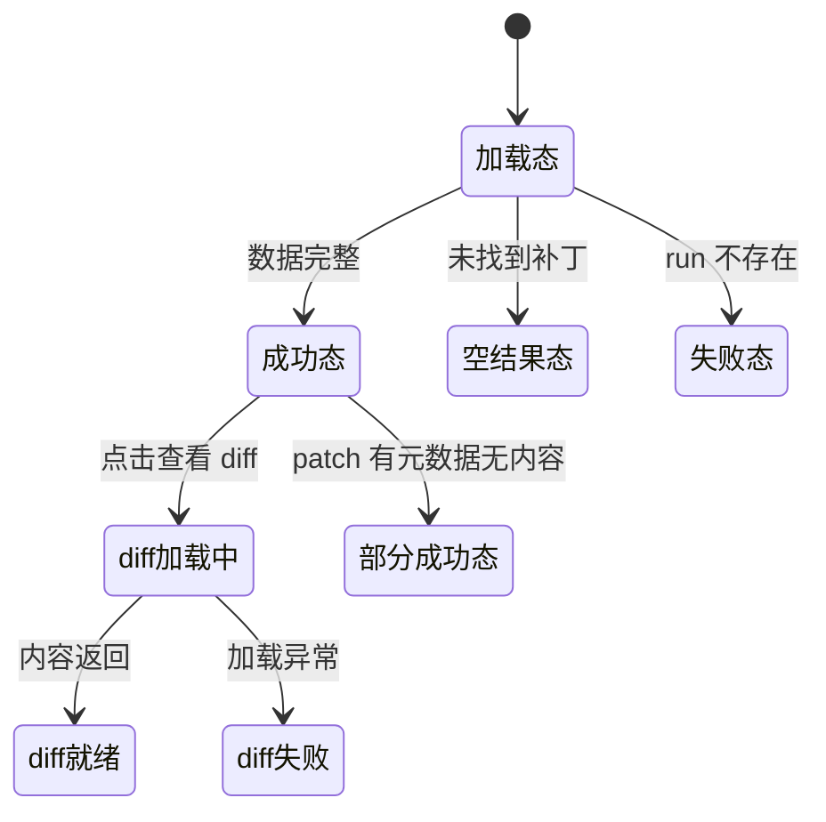

# P102 CVE 运行详情页面设计

> **对应模块：M102 CVE 运行详情与补丁证据**

---

## 🎯 页面目标

`/cve/runs/{run_id}` 是 CVE 场景的证据页，负责把一次 run 的结论、证据链、patch 与 diff 组织为可复核页面。

它必须优先回答：

1. 是否找到可信补丁。
2. 为什么认为它可信。
3. 如果用户要复核，应从哪里看起。

---

## 🚪 入口与出口

### 入口

- `P101` 点击 `查看详情`
- 直接访问 `/cve/runs/{run_id}`

### 出口

- 返回 `/cve`
- 打开外部证据页
- 打开 patch diff 查看区

---

## 🧱 页面布局

### 区块1：Verdict Hero

- 状态胶囊
- CVE 编号
- 主结论标题
- stop reason
- 下一步建议
- 失败时显示错误摘要
- 存在 `summary.llm_fallback_triggered` 时，额外展示受限 LLM 建议提示与最小审计信息

### 区块2：Fix Family Summary

- 按来源页聚合展示 patch family
- 显示来源 host、候选补丁数量、下载成功数量
- `source_url` 既可能是 advisory 页面，也可能是 seed 中直接命中的 commit / patch 引用
- 只做最小 summary，不做图谱或多跳关系图

### 区块3：Diff Viewer

- 单栏展示 diff
- 新增/删除行分色
- 只有用户点击查看时才加载

### 区块4：Patch 列表

- 展示候选补丁、下载状态、类型和是否可查看内容
- 若同一 URL 被重复发现或重复落表，则显示 `共 N 条记录`
- 详情页内部选中与 diff 读取优先使用稳定的 `patch_id`

### 区块5：Trace 时间线

- 以可读时间线展示页面探索过程
- 每步包含来源、状态、URL 与错误信息
- 若存在失败步骤，标题切换为“最近失败步骤”

---

## 🖱️ 关键交互

- 页面首屏默认显示 Verdict Hero，不需要滚动就能读到主结论。
- Fix Family Summary 位于 Patch List 之前，先回答“这些 patch 是从哪类来源页发现的”。
- `查看 Diff` 是页内动作，不跳新页面。
- Trace 默认展示步骤摘要，不展开原始 JSON。
- Patch 列表与 Trace 时间线在右侧 rail 分层，Diff Viewer 占主列。
- 前端点击 patch 后，按 `patch_id` 触发 diff 加载。

---

## 🎭 状态稿

### 加载态

- Hero、Patch、Trace、Diff Viewer 都显示骨架或占位。

### 成功态

- 按结论 -> Fix Family Summary -> Diff Viewer -> Patch -> Trace 的顺序展示。

### 空结果态

- 明确显示“未找到可信补丁”，但保留 trace 与来源信息，便于复核。

### 部分成功态

- 有 patch 元数据但无 diff 内容：patch 区可见，diff 查看区提示不可用。
- 即使运行失败，也保留 trace 与中间证据。

### 失败态

- run 不存在：展示空态并允许返回工作台。
- diff 加载失败：局部提示，不影响主页面其他区块。
- 运行失败：Hero 需要明确展示停止原因、错误摘要和建议先看的失败步骤。
- 存在 LLM fallback 时：Hero 只展示“建议人工复核”的辅助提示，不改写主结论标题和主证据卡片。

---

## 📦 页面视图对象

### `CVERunDetailView`

| 字段名 | 类型 | 说明 |
|--------|------|------|
| `run_id` | string | 运行 ID |
| `cve_id` | string | CVE 编号 |
| `status` | string | 状态 |
| `phase` | string | 当前阶段 |
| `stop_reason` | string | 停止原因 |
| `summary` | object | 运行摘要 |
| `progress` | object | 阶段进度 |
| `fix_families` | array | 来源页聚合视图 |
| `patches` | array | 补丁记录 |
| `source_traces` | array | 页面探索证据 |

### `PatchDiffPanelState`

| 字段名 | 类型 | 说明 |
|--------|------|------|
| `patch_id` | string | 当前查看的补丁标识 |
| `loading` | boolean | 是否正在加载 diff |
| `content_available` | boolean | 是否存在 diff 内容 |
| `error_message` | string | diff 读取错误 |

---

## 🔌 API 与字段映射

| 页面区块 | API | 主要字段 |
|----------|-----|----------|
| Verdict Hero / Family / Patch / Trace | `GET /api/v1/cve/runs/{run_id}` | `summary`、`progress`、`fix_families`、`patches`、`source_traces` |
| Diff Viewer | `GET /api/v1/cve/runs/{run_id}/patch-content?patch_id=...` | diff 文本内容 |

---

## 🪞 参考资产与约束

- 视觉方向沿用“以 A 为底，吸收 C 的视觉表达”。
- 详情页信息重心是结论优先，当前只实现最小 family summary，不实现 graph 级关系图。
- Family Summary 需要显示关联来源数量，并允许用户直接阅读额外来源 URL。
- 不把原始 trace JSON 作为默认展示方式。
- LLM fallback 属于受限建议层，必须明确标记来源，不得和规则链结论混排成同一层级。

---

## 🔄 变更记录

### v1.0 - 2026-04-09
- 新增 CVE 运行详情页面规格

### v1.1 - 2026-04-13
- 回填实际已落地的两栏详情布局：Hero、Diff Viewer、Patch List、Trace Timeline
- 移除未落地的 fix family 和独立 `/patches` 接口设计
- 增加 `duplicate_count`、失败态进度和单栏 diff 展示约束

### v1.2 - 2026-04-15
- 把详情页补丁选中键从 `candidate_url` 收敛为稳定的 `patch_id`
- 同步 diff 接口查询方式和页面状态对象

### v1.3 - 2026-04-15
- 为失败 run 增加排障表达：建议动作、错误摘要和“最近失败步骤”视图
- 同步失败 trace 的视觉强调要求

### v1.4 - 2026-04-16
- 在右侧 rail 中新增 Fix Family Summary，位置先于 Patch List。
- 收口当前 family 表达边界：只做来源页聚合 summary，不引入图谱或持久化 family 语义。

### v1.5 - 2026-04-16
- 同步 family `source_url` 可以直接来自 seed 中命中的 commit / patch 引用。
- 补充 direct seed candidate 场景下的页面表达边界。

### v1.6 - 2026-04-16
- 为 Fix Family Summary 增加多来源共指表达：关联来源数量与额外来源列表。
- 明确这仍属于详情聚合视图增强，不引入 family 独立页面或图谱视图。

---

**文档版本**：v1.6
**创建日期**：2026-04-09  
**最后更新**：2026-04-16
**维护人**：AI + 开发团队
