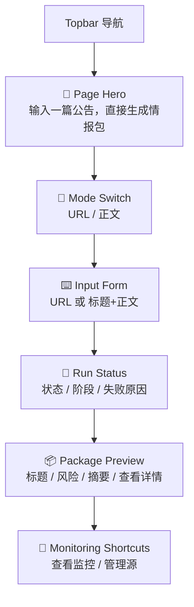
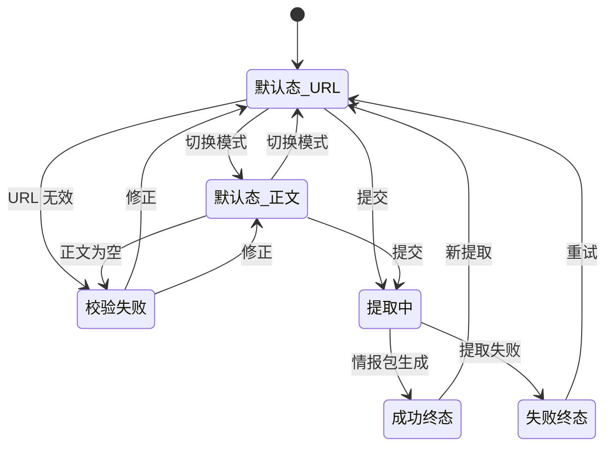

# P201 安全公告手动提取页面设计

> **对应模块：M201 安全公告手动提取**

---

## 🎯 页面目标

`/announcements` 是公告场景的主工作台，负责承载两类手动输入：

1. URL 提取
2. 正文粘贴提取

页面必须在同一工作台内完成输入、提交、运行态展示和结果预览，并把详情页留给完整情报包复核。

---

## 🚪 入口与出口

### 入口

- 首页点击 `进入安全公告提取`
- 直接访问 `/announcements`

### 出口

- 点击 `查看详情` -> `/announcements/runs/{run_id}`
- 切换 `监控视图` -> `/announcements?tab=monitoring`
- 点击 `监控源管理` -> `/announcements/sources`

---

## 🧱 页面布局

### 区块1：Page Hero

- 标题：`输入一篇公告，直接生成情报包`
- 副标题：说明支持 URL 与正文两种入口

### 区块2：模式切换

- `URL 提取`
- `正文提取`

切换时只改变表单和校验，不离开当前页面。

### 区块3：输入表单

- URL 模式：
  - URL 输入框
- 正文模式：
  - 标题提示输入框
  - 正文文本域

### 区块4：运行状态

- 当前状态
- 当前阶段
- 失败原因
- 创建时间/更新时间

### 区块5：结果预览

- 标题
- 风险级别
- 分析师摘要
- 重复提示
- 查看详情按钮

### 区块6：监控快捷入口

- `查看监控批次`
- `管理监控源`

---

## 🖱️ 关键交互

- 切换输入模式时保留未提交内容，但提交动作只读取当前模式字段。
- 正文模式下标题可为空，但正文不能为空。
- 成功后当前页先展示情报包预览，不强制立刻跳详情页。
- 手动模式默认不自动投递，只提供手动继续动作。

---

## 🎭 状态稿

### 默认态

- 展示模式切换和当前模式输入区。
- 结果预览区显示引导文案。

### URL 模式校验失败

- URL 输入框下方显示校验提示。

### 正文模式校验失败

- 正文为空时阻止提交。

### 创建中/提取中

- 运行状态区显示当前阶段。
- 结果区显示“正在生成情报包”。

### 成功终态

- 结果预览显示标题、风险、摘要和查看详情入口。
- 如命中重复内容，只显示提示，不阻断结果。

### 失败终态

- 运行状态区显示失败原因。
- 保留原输入，允许修改后重试。

---

## 📦 页面视图对象

### `AnnouncementManualRunView`

| 字段名 | 类型 | 说明 |
|--------|------|------|
| `run_id` | string | 运行 ID |
| `input_mode` | string | `url/text` |
| `status` | string | 运行状态 |
| `stage` | string | 当前阶段 |
| `error_message` | string | 错误摘要 |
| `package_preview` | object | 情报包预览 |
| `duplicate_hint` | object | 重复提示 |

### `AnnouncementInputDraft`

| 字段名 | 类型 | 说明 |
|--------|------|------|
| `input_mode` | string | 当前输入模式 |
| `source_url` | string | URL 输入值 |
| `title_hint` | string | 标题提示 |
| `raw_text` | string | 正文内容 |

---

## 🔌 API 与字段映射

| 页面动作/区块 | API | 主要字段 |
|---------------|-----|----------|
| 创建手动提取 | `POST /api/v1/announcements/runs` | `run_id`、`status`、`stage` |
| 获取运行详情 | `GET /api/v1/announcements/runs/{run_id}` | `status`、`stage`、`package`、重复提示 |

---

## 🪞 参考资产与约束

- 沿用 Patch 搜索工作台的“输入区 + 运行态 + 结果预览”节奏，但不照搬字段布局。
- 页面主轴必须是“单篇公告提取”，不能和批次监控视图混成一个后台总页。

---

## 🔄 变更记录

### v1.0 - 2026-04-09
- 新增安全公告手动提取页面规格

---

**文档版本**：v1.0  
**创建日期**：2026-04-09  
**最后更新**：2026-04-09  
**维护人**：AI + 开发团队
