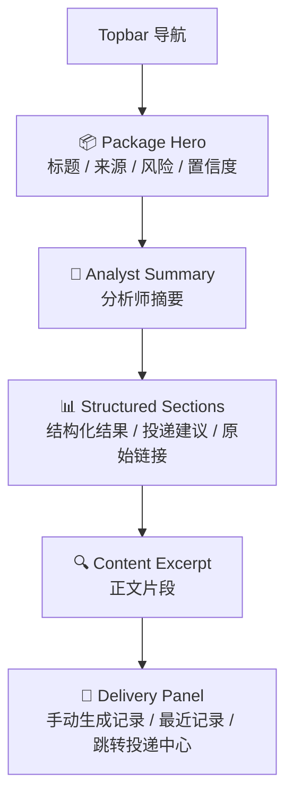
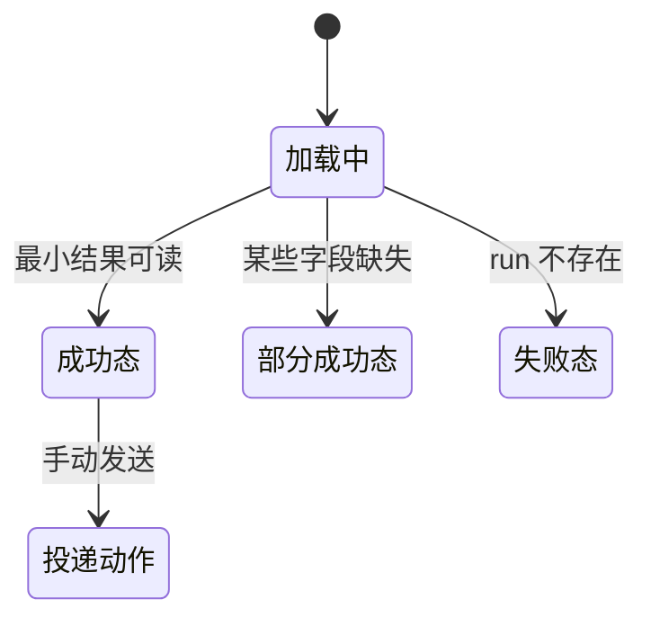

# P204 安全公告情报包详情页面设计

> **对应模块：M204 安全公告结构化情报包**

---

## 🎯 页面目标

`/announcements/runs/{run_id}` 是公告场景的结果详情页，当前实际合并承接一篇公告的结构化情报包与投递区块，负责把结果组织成可阅读、可复核、可继续处理的详情页。

页面必须优先展示：

1. 分析师摘要
2. 风险级别与置信度
3. 基础结构化结果与原文片段
4. 投递建议、匹配目标与最近记录

---

## 🚪 入口与出口

### 入口

- `P201` 手动提取成功后点击 `查看详情`
- `P203` 监控批次中的 run 列表点击详情
- 直接访问 `/announcements/runs/{run_id}`

### 出口

- 返回 `/announcements`
- 返回 `/announcements?tab=monitoring`
- 在当前详情页内继续触发手动投递动作

---

## 🧱 页面布局

### 区块1：Package Hero

- 公告标题
- 来源信息
- 发布时间
- 风险级别
- 置信度
- 运行状态

### 区块2：Analyst Summary

- 面向人的摘要卡片
- 当前实现优先展示摘要本身，重复提示等增强信息保持可选，不预设必须首屏出现

### 区块3：Structured Sections

- 风险级别
- 置信度
- 是否建议投递
- 原始链接

当前实现先保留最小结构化字段集合；更细的受影响对象、IOC、修复建议与证据分组不在本轮文档里超前展开。

### 区块4：Content Excerpt

- 展示原文摘要或正文片段
- 作为当前详情页中最小可见的内容复核区

### 区块5：Delivery Panel

- 详情页内固定包含 `P205` 投递区块
- 支持勾选目标并生成平台内投递记录
- 提供跳转投递中心的动作入口

---

## 🖱️ 关键交互

- 页面首屏先展示分析师摘要，不先展示投递动作。
- 投递动作在当前详情页内承接，不再设计第二个结果操作页。
- 当前结果字段允许是最小集合；若部分字段为空，仍正常展示已有结果。
- `#delivery` 作为详情页内锚点存在，用于页内跳转投递区块。

---

## 🎭 状态稿

### 成功态

- 标题、风险、摘要、结构化字段、正文片段和投递区块按顺序展示。

### 部分成功态

- 某些结构化字段为空：页面继续展示已有结果，不退回失败页。
- 没有正文片段或投递记录时，区块显示空态文案。

### 失败态

- run 不存在或结果未生成：展示空态并允许返回工作台。

---

## 📦 页面视图对象

### `AnnouncementPackageView`

| 字段名 | 类型 | 说明 |
|--------|------|------|
| `run_id` | string | 运行 ID |
| `status` | string | 运行状态 |
| `stage` | string | 当前阶段 |
| `package` | object | 情报包主体 |
| `delivery_anchor` | string | 详情页内投递区块锚点，固定为 `#delivery` |

### `AnnouncementPackageBody`

| 字段名 | 类型 | 说明 |
|--------|------|------|
| `title` | string | 公告标题 |
| `source_name` | string | 来源名 |
| `source_url` | string | 原始地址 |
| `published_at` | string | 发布时间 |
| `severity` | string | 风险级别 |
| `confidence` | number | 置信度 |
| `analyst_summary` | string | 分析师摘要 |
| `notify_recommended` | boolean | 是否建议投递 |

---

## 🔌 API 与字段映射

| 页面区块 | API | 主要字段 |
|----------|-----|----------|
| 整个详情页 | `GET /api/v1/announcements/runs/{run_id}` | `status`、`stage`、`document`、`package`、`delivery` |

约束：

- 当前详情页已经合并承接 `P204` 与 `P205`，投递数据不再通过独立详情层承接。
- 后续如果补充更丰富字段，应在同一路由详情页内增量扩展，不新增平级结果页。

---

## 🪞 参考资产与约束

- 页面节奏参考 CVE 详情页的“摘要先行”，但内容结构完全围绕公告情报包。
- 当前详情页同时承接结果复核与投递动作，是公告场景前端最小闭环的汇总页。
- 情报包详情页不是原文缓存页，也不是通知模板页。
- 大文本正文仍以 Artifact 为 canonical source，页面只做结果与区块组织。

---

## 🔄 变更记录

### v1.0 - 2026-04-09
- 新增安全公告情报包详情页面规格

### v1.1 - 2026-04-23
- 收口为当前实现：详情页已合并承接情报包与 `#delivery` 投递区块。
- 去除超前的细粒度结构化字段分区描述，保留当前最小结果闭环语义。

---

**文档版本**：v1.1  
**创建日期**：2026-04-09  
**最后更新**：2026-04-23  
**维护人**：AI + 开发团队
