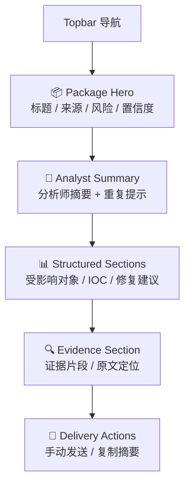
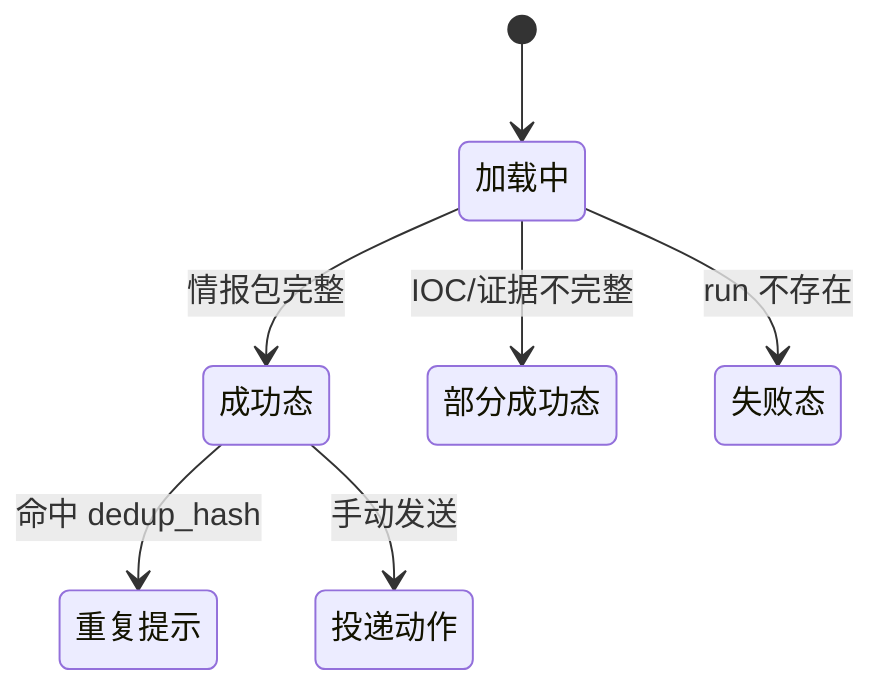

# P204 安全公告情报包详情页面设计

> **对应模块：M204 安全公告结构化情报包**

---

## 🎯 页面目标

`/announcements/runs/{run_id}` 是公告场景的结果页，负责把一篇公告的结构化情报包组织成可阅读、可复核、可继续处理的详情页。

页面必须优先展示：

1. 分析师摘要
2. 风险级别与置信度
3. 受影响对象、IOC、修复建议
4. 证据片段与重复提示

---

## 🚪 入口与出口

### 入口

- `P201` 手动提取成功后点击 `查看详情`
- `P203` 监控批次中的 run 列表点击详情
- 直接访问 `/announcements/runs/{run_id}`

### 出口

- 返回 `/announcements`
- 返回 `/announcements?tab=monitoring`
- 触发手动投递动作

---

## 🧱 页面布局

### 区块1：Package Hero

- 公告标题
- 来源信息
- 发布时间
- 风险级别
- 置信度
- 运行状态

### 区块2：Analyst Summary

- 面向人的摘要卡片
- 如果有重复提示，在此处邻近展示

### 区块3：Structured Sections

- 受影响对象
- IOC 列表
- 修复建议
- 其他扩展字段

每个区块都允许为空，但页面结构不变。

### 区块4：Evidence Section

- 证据片段列表
- 原文定位信息
- 对应字段来源

### 区块5：Delivery Actions

- 默认展示 `手动发送` 或 `复制摘要`
- 手动模式默认不自动发送

---

## 🖱️ 关键交互

- 页面首屏先展示分析师摘要，不先展示结构化明细表。
- IOC、受影响对象、修复建议都支持折叠，但默认展示摘要数量。
- 证据片段点击后可跳到原文定位说明或 Artifact 片段。
- 若结果为部分成功，页面仍展示可用字段，不因为某个字段为空就退回失败页。

---

## 🎭 状态稿

### 成功态

- 标题、风险、摘要、结构化字段、证据片段全部按顺序展示。

### 部分成功态

- IOC 为空：显示 `未提取到 IOC`，不是错误。
- 某些字段证据不完整：字段正常显示，并标记 `证据定位不完整`。

### 重复提示态

- 如果 `content_dedup_hash` 命中相似内容，在摘要区显示 `可能与既有文档重复`。
- 提示只做信息提醒，不改写主结果。

### 失败态

- run 不存在或结果未生成：展示空态并允许返回工作台。

---

## 📦 页面视图对象

### `AnnouncementPackageView`

| 字段名 | 类型 | 说明 |
|--------|------|------|
| `run_id` | string | 运行 ID |
| `status` | string | 运行状态 |
| `stage` | string | 当前阶段 |
| `package` | object | 情报包主体 |
| `duplicate_hint` | object | 重复提示 |

### `AnnouncementPackageBody`

| 字段名 | 类型 | 说明 |
|--------|------|------|
| `title` | string | 公告标题 |
| `source_name` | string | 来源名 |
| `source_url` | string | 原始地址 |
| `published_at` | string | 发布时间 |
| `severity` | string | 风险级别 |
| `confidence` | number | 置信度 |
| `analyst_summary` | string | 分析师摘要 |
| `affected_products` | array | 受影响对象 |
| `iocs` | array | IOC 列表 |
| `remediation` | array | 修复建议 |
| `evidence` | array | 证据片段 |
| `notify_recommended` | boolean | 是否建议投递 |

---

## 🔌 API 与字段映射

| 页面区块 | API | 主要字段 |
|----------|-----|----------|
| 整个详情页 | `GET /api/v1/announcements/runs/{run_id}` | `status`、`stage`、`package`、重复提示 |

如果后续需要单独的投递试发接口，本页面只增加动作区，不改变主体结构。

---

## 🪞 参考资产与约束

- 页面节奏参考 CVE 详情页的“摘要先行”，但内容结构完全围绕公告情报包。
- 情报包详情页不是原文缓存页，也不是通知模板页。
- 大文本正文仍以 Artifact 为 canonical source，页面只做结果与证据组织。

---

## 🔄 变更记录

### v1.0 - 2026-04-09
- 新增安全公告情报包详情页面规格

---

**文档版本**：v1.0  
**创建日期**：2026-04-09  
**最后更新**：2026-04-09  
**维护人**：AI + 开发团队
