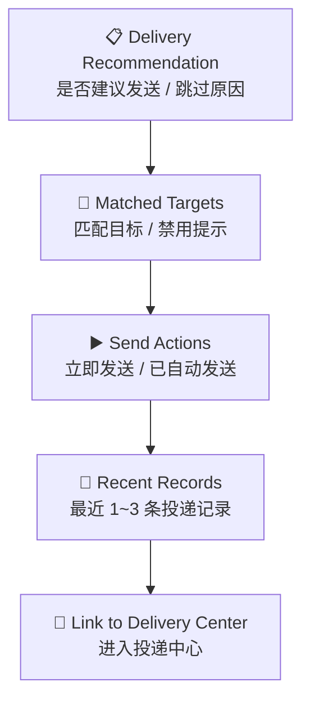

# P205 安全公告结果投递区块设计

> **对应模块：M205 安全公告投递触发与通知策略**

---

## 🎯 设计目标

`P205` 不是独立路由页，而是公告结果详情页中的一个固定区块，路径锚点为 `/announcements/runs/{run_id}#delivery`。

这个区块负责把“是否建议发送、会发给谁、发过没有、能否手动发送”明确展示出来。

---

## 🚪 入口与出口

### 入口

- `P204` 情报包详情页中的 `Delivery Actions`

### 出口

- 手动发送当前结果
- 跳转 `P003` 投递中心查看完整记录

---

## 🧱 区块布局

### 区块1：发送建议

- 是否建议发送
- 自动发送是否已执行
- 如果跳过，显示跳过原因

### 区块2：目标摘要

- 已匹配目标数量
- 目标名称与渠道类型
- 禁用目标提示

### 区块3：发送动作

- 手动模式：`立即发送`
- 自动模式：显示 `已自动发送` 或 `已跳过`

### 区块4：最近记录

- 最近 1~3 条投递记录
- 状态、时间、失败原因

### 区块5：平台跳转

- `进入投递中心`

---

## 🖱️ 关键交互

- 手动模式下允许用户重新选择一组目标后发送。
- 自动模式下不重复显示主发送按钮，只展示结果和跳过原因。
- 点击投递记录可跳转 `P003` 的 `records` 视图。

---

## 🎭 状态稿

### 手动待发送态

- 展示推荐说明、目标列表和 `立即发送` 按钮。

### 手动发送中

- 发送按钮进入 loading。

### 手动发送成功

- 当前区块显示最新成功记录。

### 自动已发送态

- 显示自动发送结果，不重复渲染主按钮。

### 自动跳过态

- 显示跳过原因，例如未达到阈值、频率窗命中、未推荐发送。

### 发送失败态

- 保留失败原因和再次发送入口。

---

## 📦 区块视图对象

### `AnnouncementDeliveryPanelView`

| 字段名 | 类型 | 说明 |
|--------|------|------|
| `run_id` | string | 当前运行 ID |
| `notify_recommended` | boolean | 是否建议投递 |
| `auto_send_applied` | boolean | 是否走过自动投递规则 |
| `skip_reason` | string | 跳过原因 |
| `matched_targets` | array | 匹配到的目标列表 |
| `recent_records` | array | 最近投递记录 |

---

## 🔌 API 与字段映射

| 区块动作/区域 | API | 主要字段 |
|---------------|-----|----------|
| 区块初始数据 | `GET /api/v1/announcements/runs/{run_id}/deliveries` | 推荐状态、目标、最近记录 |
| 手动发送 | `POST /api/v1/announcements/runs/{run_id}/deliver` | 发送结果 |

---

## 🪞 参考约束

- 投递区块属于结果页的次级动作区，不能抢过分析师摘要和结构化结果。
- 区块必须与 `P003` 投递中心的记录口径一致。

---

## 🔄 变更记录

### v1.0 - 2026-04-10
- 新增安全公告结果投递区块规格

---

**文档版本**：v1.0  
**创建日期**：2026-04-10  
**最后更新**：2026-04-10  
**维护人**：AI + 开发团队
