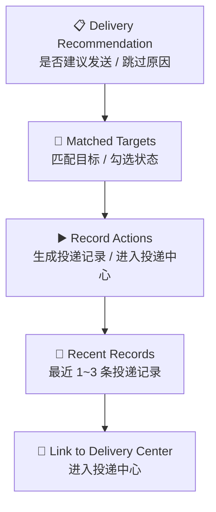

# P205 安全公告结果投递区块设计

> **对应模块：M205 安全公告投递触发与通知策略**

---

## 🎯 设计目标

`P205` 不是独立路由页，而是 `P204` 公告结果详情页中的一个固定区块，路径锚点为 `/announcements/runs/{run_id}#delivery`。

这个区块负责把“是否建议发送、会发给谁、发过没有、能否手动生成平台内投递记录”明确展示出来。

---

## 🚪 入口与出口

### 入口

- `P204` 情报包详情页中的投递区块锚点或页内跳转动作

### 出口

- 为当前结果手动生成投递记录
- 跳转 `P003` 投递中心查看完整记录

---

## 🧱 区块布局

### 区块1：发送建议

- 是否建议发送
- 自动发送是否已执行
- 如果跳过，显示跳过原因

### 区块2：目标摘要

- 已匹配目标数量
- 目标勾选状态
- 目标名称与渠道类型
- 匹配原因

### 区块3：记录动作

- 手动模式：勾选目标后点击 `生成投递记录`
- 当前实现生成的是平台内 `delivery_records`，不是直接触发真实渠道发送
- 自动模式相关语义保留为后续策略扩展，不在本区块中超前承诺完整自动发送能力

### 区块4：最近记录

- 最近 1~3 条投递记录
- 状态、时间、失败原因

### 区块5：平台跳转

- `进入投递中心`

---

## 🖱️ 关键交互

- 手动模式下允许用户重新选择一组目标后生成投递记录。
- 自动模式下不重复显示主发送按钮，只展示结果和跳过原因。
- 点击“进入投递中心”可跳转 `P003` 的 `records` 视图。
- 当前区块和详情页共享同一次 `GET /api/v1/announcements/runs/{run_id}` 返回的数据，不再定义额外详情接口层。

---

## 🎭 状态稿

### 手动待发送态

- 展示推荐说明、目标列表、勾选框和 `生成投递记录` 按钮。

### 手动发送中

- 发送按钮进入 loading。

### 手动发送成功

- 当前区块显示最新成功记录。

### 自动已发送态

- 当前版本不把它写成默认已落地态；若后续接入，再在本区块内增量补充结果表达。

### 自动跳过态

- 显示跳过原因，例如未达到阈值、频率窗命中、未推荐发送。
- 当前文档只保留语义占位，不把它表述成已完整上线能力。

### 发送失败态

- 保留失败原因和再次发送入口。

---

## 📦 区块视图对象

### `AnnouncementDeliveryPanelView`

| 字段名 | 类型 | 说明 |
|--------|------|------|
| `run_id` | string | 当前运行 ID |
| `notify_recommended` | boolean | 是否建议投递 |
| `auto_send_applied` | boolean | 是否走过自动投递规则 |
| `skip_reason` | string | 跳过原因 |
| `matched_targets` | array | 匹配到的目标列表 |
| `recent_records` | array | 最近投递记录 |

---

## 🔌 API 与字段映射

| 区块动作/区域 | API | 主要字段 |
|---------------|-----|----------|
| 区块初始数据 | `GET /api/v1/announcements/runs/{run_id}` | `delivery` 区块、最近记录 |
| 手动生成记录 | `POST /api/v1/announcements/runs/{run_id}/deliveries` | `target_ids`、创建结果 |

---

## 🪞 参考约束

- 投递区块属于结果页的次级动作区，不能抢过分析师摘要和结构化结果。
- 区块必须与 `P003` 投递中心的记录口径一致。
- 当前区块与 `P204` 同页承接，是详情页内的固定组成部分，不单独升级为页面。

---

## 🔄 变更记录

### v1.0 - 2026-04-10
- 新增安全公告结果投递区块规格

### v1.1 - 2026-04-16
- 把手动动作更新为“按目标子集生成投递记录”
- 修正区块初始数据与手动动作的实际 API 路径

### v1.2 - 2026-04-23
- 明确 `P205` 是 `P204` 详情页的固定内嵌区块，不存在独立结果承接层。
- 收口“发送”语义为当前真实实现的“生成平台内投递记录”，避免超前表述真实渠道自动发送。

---

**文档版本**：v1.2
**创建日期**：2026-04-10
**最后更新**：2026-04-23
**维护人**：AI + 开发团队
