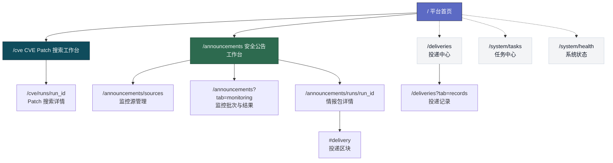

# U001 信息架构与导航设计

> **平台首页 + 场景工作台的页面关系总图**

> 本文固定 v1 的页面层级、主导航与跳转路径，不重新定义系统总边界。

---

## 🎯 设计目标

当前 UI 信息架构必须服务于一个明确前提：
AetherFlow 的核心是安全情报处理引擎，而 `CVE Patch Agent` 是当前首要主线。

因此页面结构遵循三个原则：

1. 入口围绕场景智能体，而不是围绕后台模块。
2. 主路径围绕“输入 -> 搜索 -> 结论 -> 搜索图与证据”。
3. 平台页只负责承载和摘要，不重新抽象场景结果为统一后台表格。

---

## 🗺️ 页面总图

约束：

- 平台首页只承担摘要与入口。
- 场景页承担真实工作流。
- 结果详情页承担可复查证据与搜索图回放。

---

## 🧭 全局导航规则

### 一级导航

- `首页`
- `Patch 搜索`
- `安全公告`

### 工具导航

- `投递中心`
- `系统`

约束：

- 工具导航允许出现在顶栏右侧或次级导航区。
- 工具导航不能在视觉层级上压过三个主场景入口。

一级导航不出现以下入口作为主菜单：

- `任务中心`
- `诊断中心`
- `平台模块列表`
- `订阅中心`

这些能力如果需要出现，只能作为页内二级链接或摘要入口，不得压过场景主路径。

### 二级导航

二级导航只在页面内部出现：

- Patch 搜索场景：`运行详情` 属于结果页，不单独挂顶级菜单。
- 公告场景：`手动提取`、`监控源管理`、`监控批次`
  通过页内 tab 或场景级次导航切换。

---

## 🔁 核心跳转关系

| 当前页面 | 触发动作 | 跳转页面 | 说明 |
|----------|----------|----------|------|
| `/` | 点击 Patch 搜索卡片 | `/cve` | 从首页进入 Patch Agent 主链 |
| `/` | 点击公告卡片 | `/announcements` | 从首页进入公告主链 |
| `/` | 点击最近任务 | 场景详情页 | 按 `scene_name + result_ref` 决定落点 |
| `/cve` | 创建 run | `/cve` 当前页刷新 | 工作台展示运行摘要、预算和结论 |
| `/cve` | 点击查看详情 | `/cve/runs/{run_id}` | 进入搜索图与证据详情页 |
| `/announcements` | 提交 URL / 正文 | `/announcements` 当前页刷新 | 先展示运行状态与结果预览 |
| `/announcements` | 点击查看详情 | `/announcements/runs/{run_id}` | 进入情报包详情 |
| `/announcements` | 切换监控视图 | `/announcements?tab=monitoring` | 切到批次视角 |
| `/announcements` | 点击监控源管理 | `/announcements/sources` | 管理监控源 |
| `/announcements/sources` | 点击立即试跑 | `/announcements?tab=monitoring` | 默认落到本次批次视图 |
| `/announcements?tab=monitoring` | 点击批次 | 批次详情抽屉或页内展开 | 不单独新增路由 |
| 批次详情 | 点击某个 run | `/announcements/runs/{run_id}` | 查看单文档情报包 |
| `/announcements/runs/{run_id}` | 点击投递区块 | `/announcements/runs/{run_id}#delivery` | 跳到结果页内投递区块 |
| `/` | 点击最近投递 | `/deliveries?tab=records` | 进入投递记录 |
| `/` | 点击健康摘要 | `/system/health` | 进入系统状态页 |
| `/system/health` | 点击任务异常 | `/system/tasks` | 进入任务中心 |

---

## 🧱 页面分区原则

### 平台页

- 上方：系统定位与场景入口
- 中部：最近任务与最近投递摘要
- 下方：系统健康与辅助入口

### 工具页

- 投递中心与系统页属于工具页
- 信息密度可高于首页，但仍不退回旧后台壳

### 场景工作台页

- 上方：输入区或主控制区
- 中部：当前运行状态与预算摘要
- 下方：结果摘要或最近结果

### 结果详情页

- 上方：结论卡片
- 中部：搜索图 / 结构化结果主体
- 下方：证据、时间线、原始材料入口

---

## 📱 响应式约束

- 桌面端优先双栏或三栏卡片布局。
- 移动端降为单栏堆叠，主结论卡片始终位于最上方。
- 监控源配置表单与批次详情在移动端改为抽屉式或顺序展开。

---

## 🪞 备份仓资产映射

| 备份资产 | 新仓用途 | 处理策略 |
|----------|----------|----------|
| `docs/13-界面设计/README.md` | 视觉理念参考 | 继承视觉方向，不照搬表述 |
| `docs/13-界面设计/STYLE_GUIDE.md` | 视觉基线 | 提炼为新仓视觉基线 |
| `frontend/src/routes/CVELookupPage.tsx` | Patch 搜索工作台结构参考 | 继承“输入 + 运行 + 结论”布局 |
| `frontend/src/components/CVELookupCard.tsx` | Patch 结论卡与证据区参考 | 继承“摘要先行”组织方式 |
| `frontend/src/components/PatchDiffViewer.tsx` | Diff 查看器参考 | 继承详情页中的大文本阅读模式 |

不进入新仓主线的内容：

- 旧后台模块化菜单
- 纯 diagnostics 导向页面命名
- 以原始 JSON 或调试字段为主视图的页面

---

## ✅ 页面层验收标准

- 从首页出发，用户最多 2 次跳转就能进入 Patch 搜索详情页。
- 任何结果页都能回到一个明确的场景输入页。
- 没有任何页面把平台内部模块名称放在用户主路径之前。
- 公告监控批次与单文档情报包两个层级在导航上显式区分。

---

## 🔄 变更记录

### v2.0 - 2026-04-20

- 将 `/cve` 与 `/cve/runs/{run_id}` 统一定义为 Patch 搜索主路径
- 将一级导航统一为 `Patch 搜索`
- 将结果页定位更新为“搜索图与证据详情页”

---

**文档版本**：v2.0  
**创建日期**：2026-04-09  
**最后更新**：2026-04-20  
**维护人**：AI + 开发团队
