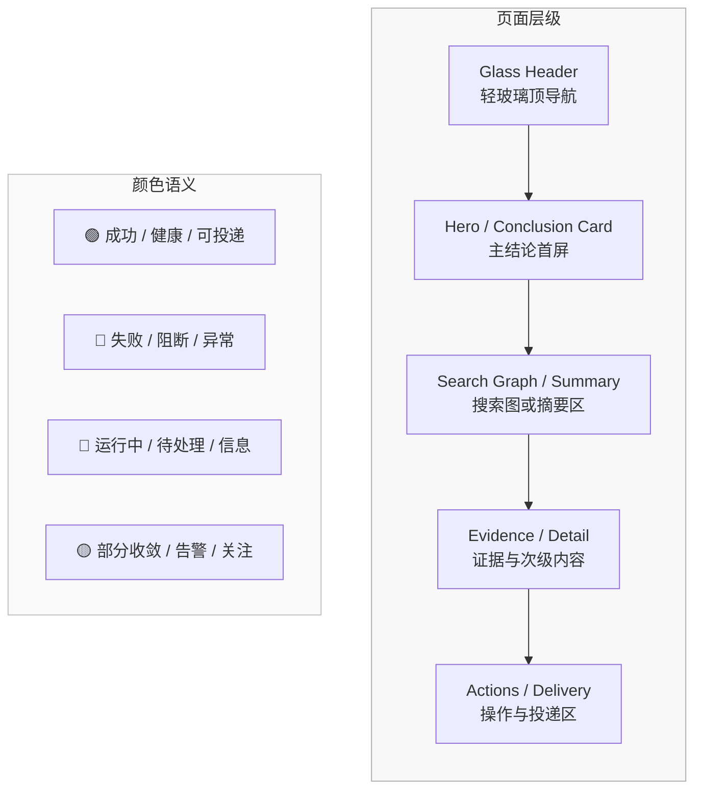

# U002 视觉基线与继承策略

> **基于备份仓 UI 资产的视觉方向收口文档**

> 本文只固定“页面规格应遵循的视觉方向”，不输出高保真视觉稿或完整设计 token。

---

## 🎯 目标

当前页面设计需要继承备份仓已经验证过的 UI 优点，但必须服务于新的产品主线：
`Patch Agent + 搜索图 + 证据回放`。

这轮视觉策略固定为：**继承增强**。

含义：

- 继承备份仓的轻玻璃、浅色层级、Manrope 排版和结论优先卡片结构。
- 保留 Patch Agent 场景中“先讲结论，再给搜索图与证据”的页面组织。
- 按新仓“平台首页 + 场景工作台 + 详情页”的边界重写页面，
  不把旧实现直接伪装成现成页面。

---

## 🪞 已继承的视觉原则

来自备份仓 `docs/13-界面设计/README.md` 和 `STYLE_GUIDE.md` 的方向如下：

1. **Tonal Surfaces**：用浅色层级区分卡片与区域，不依赖重边框。
2. **Glass Header**：顶部导航可以使用轻玻璃风格，但不压过内容。
3. **Hyper Typography**：标题、摘要、标签之间要有明确字号和字重差。
4. **Semantic States**：鲜明颜色只用于状态与关键结论，不用于大面积铺底。
5. **Conclusion First**：主结论卡优先于搜索图、证据列表和原始文本。

---

## 🎨 当前 v1 的视觉基线

### 1. 整体气质

- 浅色底，不走深色安全看板路线。
- 精准、克制、偏分析台，而不是炫技式监控大屏。
- 页面默认以卡片和区块分层，不以大表格为主界面。

### 2. 排版基线

- 主字体继续使用 `Manrope` 方向。
- 页面首屏必须有一句话结论或定位，不允许一进页就是参数表。
- 状态标签使用短标签，避免长句挤占视觉焦点。

### 3. 颜色基线

- 主背景：浅灰白系。
- 主文案：高对比黑 / 深灰。
- 状态色只用于关键节点：
  - 绿色：成功、健康、可投递
  - 红色：失败、阻断、异常
  - 蓝灰：运行中、待处理、信息态
  - 黄色：部分收敛、预算告警、人工关注

### 4. 组件基线

- 首选卡片化布局，而不是大段表格。
- 输入控件采用厚实浅灰底 + 聚焦强化边界的方式。
- 搜索图、diff、大文本、证据片段使用独立阅读区，不与摘要混在同一卡片。

---

## 🏗️ 视觉层级总图

---

## 🧱 各页面的视觉要求

### 平台首页

- 首屏必须同时出现平台定位和两个场景入口。
- `Patch Agent` 入口是主视觉焦点，安全公告入口是并列场景。
- 不把首页做成运维面板。

### Patch 搜索工作台与详情

- 工作台首屏聚焦输入、当前运行和结果摘要。
- 工作台展示最小搜索图摘要与预算提示，但不承载完整图阅读。
- 详情页首屏聚焦主结论、可信原因、停止原因和下一步建议。
- 搜索图、frontier、决策历史、patch 收敛和 diff 作为主体内容分区展开。

### 公告工作台与详情

- 手动提取页首屏聚焦输入模式切换和当前结果预览。
- 监控页面聚焦批次摘要，不把单文档详情混进批次主表。
- 情报包详情页首屏聚焦分析师摘要、风险级别和受影响对象。

### 平台工具页

- 投递中心和系统页允许更高信息密度，但仍保持卡片层级和浅色基底。
- 工具页使用次级导航语义，不把自己做成系统后台首页。
- 任务中心、投递记录和系统状态都要强调“可行动的信息”，而不是裸数据墙。

---

## 🚫 明确不继承的方向

- 旧后台壳的多级系统菜单
- 以工程调试字段为主的首页
- 一屏塞满表格、筛选器和管理控件的后台审计式界面
- 紫色、荧光色、重阴影、重金属暗色风格

---

## 🔁 参考资产到新仓页面的映射

| 参考资产 | 新仓继承点 | 新仓改写点 |
|----------|------------|------------|
| `REFERENCE_PROTOTYPE.html` | 浅色层级、玻璃导航、Manrope 字体方向 | 去掉原型级 Tailwind 表述，改为页面规格 |
| `CVELookupPage.tsx` | 输入区与工作流首屏节奏 | 改成 Patch 搜索工作台区块与状态稿 |
| `CVELookupCard.tsx` | 主结论卡、可信原因、下一步建议 | 删除与旧数据结构深耦合的实现细节 |
| `PatchDiffViewer.tsx` | Diff 独立阅读区 | 作为 `P102` 的大文本查看约束 |

---

## ✅ 设计落地标准

- 任一页面首屏都能在 3 秒内回答“这里能做什么”和“当前结果是什么”。
- 主结论卡片始终早于搜索图、证据和工程细节区块。
- 页面视觉分层主要靠背景层级和间距，而不是依赖 1px 边框堆叠。
- 同一场景内的页面在标题、状态胶囊和操作区布局上保持一致语言。

---

## 🔄 变更记录

### v2.0 - 2026-04-20

- 将视觉主线统一为“Patch 搜索工作台与搜索图详情”
- 将 `搜索图 / 收敛 / 证据回放` 纳入正式视觉层级
- 删除旧叙事中的单一路径表达，改为搜索图与证据回放结构

---

**文档版本**：v2.0  
**创建日期**：2026-04-09  
**最后更新**：2026-04-20  
**维护人**：AI + 开发团队
