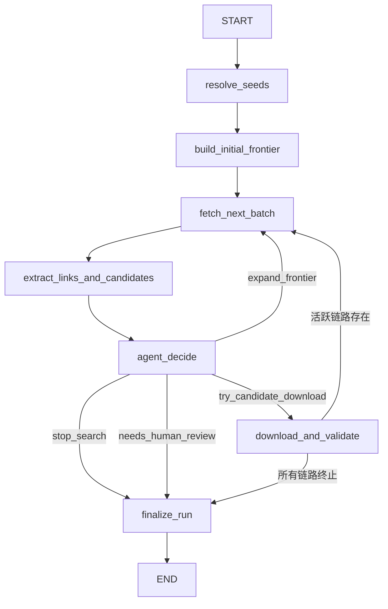

# CVE Patch 浏览器驱动型 AI Agent 设计规格

> Status: completed
>
> Current use: 浏览器 Agent 重设计阶段的规格说明与历史背景；当前长期功能定义以 `docs/04-功能设计/M103-CVE数据源与页面探索规则功能设计.md`、当前代码实现和 active spec 为准。
>
> **对应范围**：CVE Patch 获取主链从 `LangGraph 混合式 httpx Agent` 重设计为 `Playwright 浏览器驱动型 AI Agent`
>
> **本文档取代**：`2026-04-20-cve-patch-agent-graph-design.md`（旧规格定义的方案 B 已被本文档全量替代）
>
> **架构定位**：只保留一条路径——**LangGraph 图 + Playwright 浏览器**，作为 CVE Patch Agent 的唯一实现。旧的 httpx 抓取逻辑、fast-first 路径、feature flag 分叉全部废弃。
>
> **当前文档定位**：本文档保留为浏览器 Agent 重设计阶段的规格说明与历史背景。当前长期功能定义主落点已经收口到 `docs/04-功能设计/M103-CVE数据源与页面探索规则功能设计.md`；如与当前主文档存在表述差异，以主文档和当前代码实现为准。

---

## 1. 偏差根因与重设计动机

当前 CVE Patch Agent 实现偏离了初衷。系统定位应当是**浏览器驱动型 AI Agent**——真正用浏览器打开页面、让 LLM 理解页面语义并做导航决策。但实际落地的是 **HTTP 文本抓取 + 规则打分 + 局部 LLM 策略器**，三个结构性偏差导致系统在真实 CVE 场景下链路断裂。

### 1.1 偏差诊断

| 偏差 | 当前实现 | 导致的问题 |
|------|---------|-----------|
| **抓取层** | `page_fetcher.py` 用 `httpx.get()` | 无 JS 执行、无 DOM、无浏览器语义，大量动态页面无法获取有效内容 |
| **LLM 输入** | `agent_llm.py` 给 LLM 4000 字符 HTML 截断 | LLM 看不到页面结构，无法理解链接语义上下文 |
| **导航策略** | `navigation.py` 用关键词权重打分 + 同域限制 | 跨域链路（advisory→tracker→commit）被截断，核心 patch 获取路径被阻断 |

### 1.2 真实案例

以 CVE-2022-2509 为例：

- Debian security-tracker 页面明确包含指向上游 GitLab commit 的 patch 链接
- 当前系统从未导航到该 tracker 页面，因为 `navigation.py` 的同域限制阻断了 NVD → Debian → GitLab 的跨域链路
- 即使到达该页面，4000 字符 HTML 截断也会丢失关键链接上下文

### 1.3 重设计目标

保留 LangGraph 图运行时作为编排框架，将抓取层从 `httpx` 替换为 `Playwright 浏览器`，将 LLM 输入从 HTML 截断替换为可访问性树 + 结构化链接，将导航策略从规则打分替换为 LLM 驱动的链路感知决策。

---

## 2. 目标定义

> 在有限搜索预算内，由浏览器驱动的受控 AI Agent 从 CVE seed references 出发，通过真实浏览器打开页面、用可访问性树理解页面语义、由 LLM 做链路感知的导航决策，找到可复核的 patch 结果。

### 2.1 核心约束（继承并强化）

1. 必须是多跳搜索，且能跨域追踪完整链路（advisory→tracker→commit→patch）。
2. 必须用真实浏览器获取页面，而非 HTTP 文本抓取。
3. LLM 必须看到页面的结构化语义表示（可访问性树），而非 HTML 截断。
4. 导航决策必须由 LLM 在链路上下文中做出，而非关键词打分。
5. 必须运行在受控工具和预算边界内。
6. 必须保留节点、边、决策和候选收敛证据。
7. 必须支持后续工作台和详情页读取搜索图。

### 2.2 单路径架构

**只有一条执行路径**：

```
CVE ID → seed 解析 → 浏览器 Agent 搜索图 → patch 结果
```

不存在以下路径：
- ~~fast-first 规则执行器~~
- ~~httpx Agent Graph~~
- ~~feature flag 切换~~
- ~~LLM fallback 降级~~

> 历史语义说明：
> 本节反对的是 fast-first、httpx Agent、feature flag 和旧的多执行器/多主链分叉。
> 当前代码中的 rule fallback 与 URL fallback 属于同一浏览器 Agent 架构内部的受限鲁棒性保底机制，
> 不代表重新引入新的执行路径，也不改变 LLM 作为导航主决策器的定位。

---

## 3. 浏览器层设计

### 3.1 抽象接口（为 Lightpanda 预留切换路径）

新增 `backend/app/cve/browser/base.py`：

```python
@dataclass(frozen=True)
class BrowserPageSnapshot:
    url: str
    final_url: str
    status_code: int
    title: str
    raw_html: str
    accessibility_tree: str       # Playwright a11y snapshot，经裁剪
    markdown_content: str         # Readability 提取后的纯文本 markdown
    links: list[PageLink]         # 结构化链接列表（含上下文）
    page_role_hint: str           # 启发式页面角色
    fetch_duration_ms: int

@dataclass(frozen=True)
class PageLink:
    url: str
    text: str
    context: str                  # a11y 树中相邻节点的文本
    is_cross_domain: bool
    estimated_target_role: str    # 根据 URL 模式推断的目标页面角色

@runtime_checkable
class BrowserBackend(Protocol):
    async def start(self) -> None: ...
    async def stop(self) -> None: ...
    async def navigate(self, url: str, *, timeout_ms: int = 30000) -> BrowserPageSnapshot: ...
```

**Lightpanda 切换路径**：Lightpanda 暴露 CDP 端点，Playwright 可通过 `browser.connect_over_cdp(endpoint)` 无缝切换——`BrowserBackend` 协议是两者共用的唯一接缝。

### 3.2 Playwright 实现

新增 `backend/app/cve/browser/playwright_backend.py`：

**BrowserContext 池**：

```python
class PlaywrightPool:
    """BrowserContext 池，复用浏览器进程"""
    def __init__(self, *, pool_size: int = 3, headless: bool = True): ...
    async def start(self) -> None: ...

    @asynccontextmanager
    async def acquire(self) -> AsyncIterator[BrowserContext]:
        ctx = await asyncio.wait_for(self._available.get(), timeout=60)
        try:
            yield ctx
        finally:
            for page in ctx.pages:
                await page.close()
            await self._available.put(ctx)

    async def stop(self) -> None: ...
```

设计要点：

- 固定数量的 `BrowserContext`（默认 3 个），共享浏览器进程，隔离 cookie/storage
- 通过 `asyncio.Queue` 管理上下文池
- 页面快照构建流程：`page.goto()` → `page.accessibility.snapshot()` → `page.content()` → JS 注入提取结构化链接 → Readability 提取 markdown → 页面角色分类

### 3.3 同步桥接

新增 `backend/app/cve/browser/sync_bridge.py`：

```python
class SyncBrowserBridge:
    """同步桥接层，供 LangGraph 同步节点调用"""
    def navigate(self, url: str, **kwargs) -> BrowserPageSnapshot: ...
    def stop(self) -> None: ...
```

当前 LangGraph 是同步执行的，Playwright 是 async。用独立事件循环线程 + `run_coroutine_threadsafe` 做同步桥接，避免改造整条 LangGraph 管线。

### 3.4 页面角色分类器

新增 `backend/app/cve/browser/page_role_classifier.py`，基于 URL 模式的启发式分类（零 LLM 消耗）：

| 角色 | URL 特征 |
|------|----------|
| `advisory_page` | nvd.nist.gov, GHSA, vendor advisory, vuln/detail |
| `tracker_page` | security-tracker.debian.org, errata |
| `mailing_list_page` | oss-security, debian-security-announce |
| `bugtracker_page` | bugzilla, show_bug |
| `commit_page` | /commit/, /pull/, /merge_requests/ |
| `download_page` | .patch, .diff, .debdiff |
| `repository_page` | 代码仓库根目录或文件浏览器 |

LLM 在决策输出中可以**纠正**启发式分类结果。

### 3.5 可访问性树裁剪器

新增 `backend/app/cve/browser/a11y_pruner.py`：

- 只保留语义相关的节点角色：`link, heading, text, list, listitem, paragraph, table, row, cell`
- 序列化后截断到 6000 字符
- 输出格式为缩进文本树，LLM 可直接阅读

### 3.6 Markdown 提取器

新增 `backend/app/cve/browser/markdown_extractor.py`：

- 在浏览器内执行 Readability.js 或等价逻辑
- 提取纯文本 markdown，作为 a11y 树的补充（适用于 a11y 树稀疏的页面）
- 截断到 2000 字符

### 3.7 配置

`config.py` 新增：

```python
cve_browser_backend: str = "playwright"     # "playwright" | "lightpanda"（未来）
cve_browser_pool_size: int = 3
cve_browser_headless: bool = True
cve_browser_timeout_ms: int = 30000
cve_browser_cdp_endpoint: str = ""          # Lightpanda 切换时使用
```

**废弃配置**：`cve_agent_graph_enabled`、`cve_llm_fallback_enabled` 及其关联的 fallback 配置项。

---

## 4. 页面观察模型

### 4.1 LLM 看到什么

新增 `backend/app/cve/browser_agent_llm.py`，构建 `LLMPageView`：

```python
@dataclass(frozen=True)
class LLMPageView:
    url: str
    page_role: str                          # 启发式分类结果
    title: str
    accessibility_tree_summary: str         # 裁剪后的 a11y 树（≤6000字符）
    key_links: list[LLMLink]               # 前 15 个相关链接（含上下文）
    patch_candidates: list[dict[str, str]]  # page_analyzer 已识别的候选
    page_text_summary: str                  # markdown 提取（≤2000字符）

@dataclass(frozen=True)
class LLMLink:
    url: str
    text: str
    context: str                            # 周围文本（a11y 相邻节点）
    is_cross_domain: bool
    estimated_target_role: str              # URL 推断的目标角色
```

### 4.2 a11y 树 vs Markdown 的取舍

**选择：a11y 树为主 + markdown 为辅。**

| 维度 | a11y 树 | Markdown | 原始 DOM |
|------|---------|----------|----------|
| 语义密度 | 高（天然过滤装饰性元素） | 中 | 低 |
| Token 效率 | 高（通常比 HTML 小 10-20 倍） | 中 | 低 |
| 链接上下文 | 结构化 | 丢失结构 | 冗余 |
| 用途 | LLM 主输入 | 可读性补充 | 不用于 LLM |

---

## 5. 导航决策设计

### 5.1 链路意识模型（Chain Awareness）

这是整个重设计的核心创新点。新增 `backend/app/cve/chain_tracker.py`：

```python
@dataclass
class NavigationChain:
    chain_id: str
    chain_type: str             # "advisory_to_patch", "tracker_to_commit", "mailing_list_to_fix"
    steps: list[ChainStep]
    status: str                 # "in_progress", "completed", "dead_end"
    expected_next_roles: list[str]

@dataclass
class ChainStep:
    url: str
    page_role: str
    depth: int
```

典型链路模式：

```
模式1: advisory_page → tracker_page → commit_page → download_page
模式2: mailing_list_page → commit_page → download_page
模式3: advisory_page → bugtracker_page → commit_page → download_page
```

### 5.2 LLM 导航上下文（"从哪来、在哪里、要去哪"）

每次 LLM 调用接收 `NavigationContext`：

```python
@dataclass(frozen=True)
class NavigationContext:
    cve_id: str
    budget_remaining: dict[str, int]
    # 从哪来
    navigation_path: list[str]          # ["advisory_page: nvd.nist.gov", "tracker_page: debian"]
    parent_page_summary: str | None
    # 在哪里
    current_page: LLMPageView
    # 链路状态
    active_chains: list[NavigationChain]
    # 已有发现
    discovered_candidates: list[dict]
    visited_domains: list[str]
```

### 5.3 跨域导航策略

**关键改变**：废除 `navigation.py` 中的同域限制。

- LLM 被显式允许选择跨域链接，只需在 `reason_summary` 中说明理由
- `agent_policy.py` 仍保留跨域预算控制，但预算从 4 提升到 8
- 现有的 `navigation.py` 关键词评分逻辑降级为 `key_links` 排序的辅助因子

---

## 6. 停止条件设计

### 6.1 链路完成判定

替换当前"无 frontier 则停"的简单逻辑：

```python
def evaluate_stop_condition(state: AgentState) -> StopEvaluation:
    active_chains = [c for c in chains if c["status"] == "in_progress"]
    # 规则1：有活跃链路且预算未耗尽 → 不停
    if active_chains and not budget_exhausted:
        return StopEvaluation(should_stop=False, reason="active_chains_in_progress")
    # 规则2：有候选且所有链路已终止 → 停
    if candidates and all_chains_terminal:
        return StopEvaluation(should_stop=True, reason="all_chains_resolved")
    # 规则3：模糊情况 → 交 LLM 判断
    return _llm_stop_evaluation(state)
```

### 6.2 needs_human_review 语义收紧

`needs_human_review` 仅在以下条件**全部满足**时接受：

1. 没有活跃链路（`in_progress`）
2. 没有未扩展的 frontier
3. 没有从链路上下文推导出的跨域候选链接

否则系统强制覆盖为继续探索。

### 6.3 搜索预算

```python
BROWSER_AGENT_BUDGET = {
    "max_pages_total": 20,              # 12→20（浏览器页面信息更丰富）
    "max_depth": 6,                     # 4→6（链路更长）
    "max_cross_domain_expansions": 8,   # 4→8（链路跨域）
    "max_children_per_node": 5,         # 3→5
    "max_parallel_frontier": 3,
    "max_agent_iterations": 15,         # 8→15
    "max_llm_calls": 15,               # 8→15
    "max_download_attempts": 8,         # 6→8
    "max_chains": 5,                    # 新增：最大并行链路数
}
```

预算提升理由：浏览器页面快照包含完整 a11y 树和结构化链接，单页信息量远高于 httpx 4000 字符截断，因此同等预算下探索效率更高，可以支撑更长链路。

---

## 7. 状态机改造

### 7.1 LangGraph 拓扑

基本拓扑不变，增加一条条件边：

```
START → resolve_seeds → build_initial_frontier → fetch_next_batch
  → extract_links_and_candidates → agent_decide
  →(条件)→ fetch_next_batch | download_and_validate | finalize_run → END
```

**关键改变**：`download_and_validate` 的出边从固定 `→ finalize_run` 改为条件路由——如果仍有活跃链路且预算未尽，路由回 `fetch_next_batch` 继续探索。



### 7.2 新增状态字段

在 `AgentState` 中追加：

```python
navigation_chains: list[dict[str, object]]    # NavigationChain 列表
current_chain_id: str | None                   # 当前活跃链路 ID
page_role_history: list[dict[str, str]]        # [{url, role, title, depth}]
cross_domain_hops: int                         # 已用跨域次数
browser_snapshots: dict[str, dict]             # URL → BrowserPageSnapshot 序列化
```

### 7.3 各节点改造明细

| 节点 | 改动级别 | 改动内容 |
|------|----------|----------|
| `resolve_seeds_node` | **不变** | 种子解析走 API，无需浏览器 |
| `build_initial_frontier_node` | **小改** | 种子 URL 分类页面角色，初始化链路 |
| `fetch_next_batch_node` | **重写** | `httpx.get()` → `browser.navigate()`，存储 BrowserPageSnapshot |
| `extract_links_and_candidates_node` | **重写** | 从 BrowserPageSnapshot 提取结构化链接，保留 page_analyzer + reference_matcher |
| `agent_decide_node` | **重写** | 用 `browser_agent_llm` 替代 `agent_llm`，传入 NavigationContext，更新链路状态 |
| `download_and_validate_node` | **小改** | 增加条件路由出边（活跃链路时回到 fetch） |
| `finalize_run_node` | **小改** | summary_json 包含链路摘要 |

---

## 8. LLM 提示词架构

### 8.1 系统提示词核心

新增 `backend/app/cve/prompts/browser_agent_navigation.md`：

```markdown
你是 CVE Patch Agent 的浏览器导航决策器。你正在通过浏览器逐页浏览互联网，寻找 CVE 的安全补丁。

## 核心能力
1. 页面理解：你看到页面的可访问性树和关键链接，理解页面语义角色
2. 链路追踪：你知道自己在哪条 advisory→tracker→commit 链上
3. 导航决策：你选择下一步要访问的链接，可以跨域
4. 停止判断：只有所有有价值链路都走完才停止

## 页面角色
- advisory_page: 安全公告页（NVD、GHSA、vendor advisory）
- tracker_page: 安全追踪器（Debian security-tracker、Red Hat errata）
- mailing_list_page: 安全邮件列表（oss-security）
- bugtracker_page: Bug 追踪器（Bugzilla）
- commit_page: 代码提交页（GitHub/GitLab commit）
- pull_request_page: PR/MR 页面
- download_page: 直接下载页（.patch/.diff/.debdiff）

## 典型链路模式
1. advisory_page → tracker_page → commit_page (append .patch)
2. mailing_list_page → commit_page → download_page
3. advisory_page → bugtracker_page → commit_page

## 硬性约束
1. 只能从 key_links 列表中选择 URL
2. 跨域导航必须说明理由
3. 到达 commit_page 或 download_page 时优先 try_candidate_download
4. 所有活跃链路终止前不得 stop_search
5. needs_human_review 仅用于真正无法自动判断的死胡同
```

### 8.2 每轮输入结构

```json
{
  "cve_id": "CVE-2022-2509",
  "navigation_context": {
    "step_index": 3,
    "budget_remaining": {"pages": 17, "llm_calls": 12, "cross_domain": 6},
    "navigation_path": [
      "advisory_page: nvd.nist.gov/vuln/detail/CVE-2022-2509",
      "tracker_page: security-tracker.debian.org/tracker/CVE-2022-2509"
    ],
    "active_chains": [
      {
        "chain_id": "chain-1",
        "type": "advisory_to_patch",
        "steps": ["advisory_page:nvd", "tracker_page:debian"],
        "status": "in_progress",
        "expected_next": ["commit_page", "download_page"]
      }
    ],
    "discovered_candidates": [],
    "visited_domains": ["nvd.nist.gov", "security-tracker.debian.org"]
  },
  "current_page": {
    "url": "https://security-tracker.debian.org/tracker/CVE-2022-2509",
    "page_role": "tracker_page",
    "title": "CVE-2022-2509",
    "accessibility_tree_summary": "...(裁剪后的 a11y 树)...",
    "key_links": [
      {
        "url": "https://gitlab.com/gnutls/gnutls/-/commit/ce37f9eb",
        "text": "upstream fix",
        "context": "Fixed in gnutls28 3.7.7-2, upstream commit ce37f9eb",
        "is_cross_domain": true,
        "estimated_target_role": "commit_page"
      }
    ],
    "patch_candidates": [],
    "page_text_summary": "..."
  }
}
```

### 8.3 输出 Schema

```json
{
  "action": "expand_frontier | try_candidate_download | stop_search | needs_human_review",
  "reason_summary": "Debian tracker 指向上游 GitLab commit ce37f9eb，需跨域获取 patch。",
  "confirmed_page_role": "tracker_page",
  "selected_urls": ["https://gitlab.com/gnutls/gnutls/-/commit/ce37f9eb"],
  "selected_candidate_keys": [],
  "cross_domain_justification": "从 Debian tracker 到上游 GitLab commit 是标准 patch 获取链路。",
  "chain_updates": [{"chain_id": "chain-1", "action": "extend", "new_step_role": "commit_page"}],
  "new_chains": []
}
```

---

## 9. 文件结构

### 9.1 新增文件

```
backend/app/cve/browser/
    __init__.py
    base.py                          # BrowserBackend 协议 + BrowserPageSnapshot + PageLink
    playwright_backend.py            # PlaywrightPool + PlaywrightBackend 实现
    sync_bridge.py                   # SyncBrowserBridge（async→sync 桥接）
    a11y_pruner.py                   # 可访问性树裁剪/序列化
    page_role_classifier.py          # URL 启发式页面角色分类
    markdown_extractor.py            # 浏览器内 HTML→Markdown 提取

backend/app/cve/chain_tracker.py     # NavigationChain 管理
backend/app/cve/browser_agent_llm.py # 浏览器 Agent 专用 LLM 接口（替代 agent_llm.py）
backend/app/cve/prompts/browser_agent_navigation.md  # 新提示词（替代 patch_navigation.md）
```

### 9.2 重写文件

```
backend/app/cve/agent_state.py       # 新增链路/浏览器状态字段
backend/app/cve/agent_graph.py       # download_and_validate 条件出边
backend/app/cve/agent_nodes.py       # 全部节点重写（browser + chain-aware LLM）
backend/app/cve/agent_policy.py      # 新预算 + 链路感知验证
backend/app/cve/runtime.py           # 精简为单路径（删除 fast-first + httpx agent 分叉）
backend/app/config.py                # 浏览器配置项，删除旧 flag
backend/pyproject.toml               # 添加 playwright>=1.40 依赖
```

### 9.3 废弃文件（可删除）

```
backend/app/cve/page_fetcher.py      # httpx 抓取 → 被 browser/ 替代
backend/app/cve/agent_llm.py         # 旧 LLM 接口 → 被 browser_agent_llm.py 替代
backend/app/cve/llm_fallback.py      # LLM fallback → 不再需要
backend/app/cve/navigation.py        # 关键词打分导航 → 逻辑并入 browser/ 链接排序
backend/app/cve/prompts/patch_navigation.md  # 旧提示词 → 被新提示词替代
```

### 9.4 保持不变

```
backend/app/cve/reference_matcher.py    # URL 模式匹配（继续复用）
backend/app/cve/page_analyzer.py        # 候选提取（从 raw_html 工作，继续复用）
backend/app/cve/canonical.py            # URL 规范化
backend/app/cve/seed_resolver.py        # 种子解析（API 调用，无需浏览器）
backend/app/cve/seed_sources.py         # 种子来源
backend/app/cve/patch_downloader.py     # 下载逻辑（httpx 下载 .patch 文件足够）
backend/app/cve/frontier_planner.py     # 初始 frontier 评分（仍用于 seed→frontier 排序）
backend/app/cve/search_graph_service.py # DB 持久化层
backend/app/cve/source_trace.py         # 审计追踪
```

---

## 10. 分阶段实施计划

### Phase 1：浏览器基础设施

**交付物**：
- `browser/` 完整包：base.py, playwright_backend.py, sync_bridge.py, a11y_pruner.py, page_role_classifier.py, markdown_extractor.py
- pyproject.toml 添加 `playwright>=1.40`
- config.py 替换旧配置为浏览器配置项

**验收**：
- 单测：PlaywrightPool 启动/导航/快照/停止
- 单测：a11y_pruner 输出 ≤6000 字符
- 单测：page_role_classifier 正确分类 Debian tracker / NVD / GitHub commit / GitLab MR
- 单测：SyncBrowserBridge 在同步上下文中正确返回快照

### Phase 2：LLM 接口 + 链路追踪

**交付物**：
- browser_agent_llm.py（构建 LLMPageView + NavigationContext，调用 LLM）
- chain_tracker.py（链路创建/扩展/关闭/查询）
- prompts/browser_agent_navigation.md
- agent_state.py 追加新字段

**验收**：
- 单测：LLM 请求载荷结构正确（含 a11y 树 + 链路上下文）
- 单测：链路状态机（in_progress → completed / dead_end）
- fake LLM 测试：给定 tracker 页面视图 + 活跃链路，LLM 选择跨域 commit 链接

### Phase 3：节点重写 + 图改造

**交付物**：
- agent_nodes.py 全部节点重写
- agent_graph.py 增加 download_and_validate 条件出边
- agent_policy.py 新预算 + 链路感知停止评估
- runtime.py 精简为单路径
- 删除废弃文件

**验收**：
- 端到端测试（fake browser + fake LLM）：Agent 走完 advisory→tracker→commit 链
- 测试：活跃链路存在时 agent 不早停
- 测试：跨域导航正常工作且扣减预算
- 测试：download_and_validate 后可回到 fetch_next_batch

### Phase 4：集成测试与调优

**交付物**：
- 5 个真实 CVE 场景的集成测试（可用录制的浏览器会话）
- 提示词调优
- 性能基准

**验收**：
- CVE-2022-2509：通过 debian tracker → GitLab commit 链路找到 patch
- CVE-2024-3094（xz-utils）：多链路多域
- 链路完成率 ≥ 80%
- 单次运行 ≤ 3 分钟

---

## 11. 数据兼容与迁移安全

### 11.1 DB Schema 零变更

现有 `cve_search_nodes / edges / decisions / candidate_artifacts` 的 JSONB 字段足够存储新数据：

- `page_role`、`chain_info` 存入 `heuristic_features_json`
- `NavigationContext` 存入 `input_json`
- `BrowserPageSnapshot` 元数据存入 `content_excerpt` + `heuristic_features_json`

### 11.2 旧数据兼容

已有的 CVERun 记录不受影响，`summary_json` 格式向前兼容。

### 11.3 Lightpanda 切换

设置 `cve_browser_backend=lightpanda` + `cve_browser_cdp_endpoint=ws://host:port`，Playwright 通过 CDP 连接 Lightpanda 实例，零代码改动。

### 11.4 测试策略

旧的 fast-first 测试直接删除或改写为浏览器 Agent 测试，不维护两套。

---

## 12. 风险与约束

### 风险 1：Playwright 资源消耗

**处理方式**：BrowserContext 池化，默认 3 个上下文，共享浏览器进程。单次运行结束后释放上下文。

### 风险 2：模型决策漂移

**处理方式**：
- 输出必须结构化 JSON
- 输出必须经 validator
- 超预算、越权、未知链接一律拒绝
- 链路感知停止条件防止过早收口

### 风险 3：异步/同步桥接复杂度

**处理方式**：SyncBrowserBridge 封装独立事件循环线程，LangGraph 节点只需调用同步方法。桥接层有独立单测覆盖。

### 风险 4：页面渲染耗时

**处理方式**：30 秒超时，超时后以当前已加载内容构建快照。a11y 树裁剪确保 LLM 输入不超限。

---

## 13. 结论

本规格确认：

1. CVE Patch Agent 的正式形态是 **Playwright 浏览器驱动型 AI Agent**。
2. **只有一条执行路径**：LangGraph 图 + Playwright 浏览器；不允许重新引入 fast-first、httpx Agent 或 feature flag 等并行主链。
3. LLM 看到的是**页面可访问性树 + 结构化链接**，而非 HTML 截断。
4. 导航决策由 LLM 在**链路上下文**中做出，支持跨域追踪完整链路。
5. 旧的 httpx 抓取、关键词打分导航、同域限制、fast-first 路径全部废弃。
6. 后续相关主文档、页面设计与数据设计都应围绕浏览器搜索图、链路追踪和候选收敛组织。

---

## 变更记录

### 2026-04-21

- 从"LangGraph 混合式 Patch Agent"（方案 B）全量重设计为"Playwright 浏览器驱动型 AI Agent"
- 废弃 httpx 抓取层、关键词打分导航、同域限制、fast-first 路径、feature flag 分叉
- 引入浏览器基础设施层（BrowserBackend Protocol + PlaywrightPool + SyncBrowserBridge）
- 引入链路意识模型（NavigationChain + ChainStep）
- 引入页面可访问性树作为 LLM 主输入
- 引入链路感知停止条件
- 提升搜索预算以匹配浏览器信息密度
